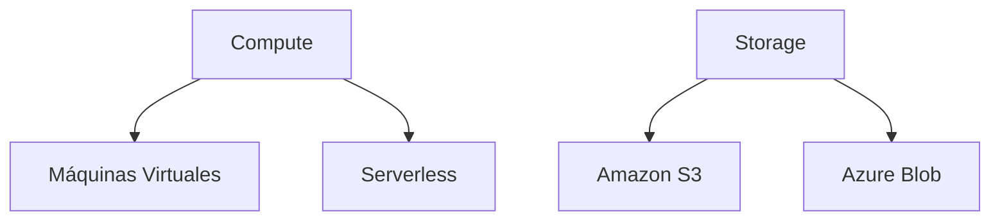

# 📚 Evolución de Modelos de Distribución de Software

## 🌐 **Evolución Histórica**
1. **On-Premise** (1990s)
   - Instalación local en cada equipo
   - Ejemplo: Windows 95, Office 2000
   - Limitaciones: Actualizaciones manuales, alto costo

2. **Descargas Digitales** (2000s)
   - Mejoró con internet
   - Ejemplo: Adobe Reader, Norton Antivirus

3. **Cloud/SaaS** (Actualidad)
   - Acceso vía navegador
   - Ejemplo: Salesforce, Office 365

## ⚖ **Comparativa Modelos**
| Característica       | On-Premise          | SaaS                |
|----------------------|---------------------|---------------------|
| Costos               | Altos (CAPEX+OPEX)  | Bajos (Suscripción) |
| Control              | Total               | Limitado            |
| Mantenimiento        | Usuario             | Proveedor           |
| Ejemplo              | Servidores locales  | Google Workspace    |

## ☁ **Cloud Computing Essentials**
### Componentes Clave

### Beneficios
- Escalabilidad automática (Auto Scaling)
- Distribución global (Regiones/AZs)
- Modelo pay-as-you-go

## 🏆 **Principales Proveedores**
1. **AWS** (Líder de mercado)
   - Servicio estrella: EC2, S3
2. **Azure** (Integración Microsoft)
   - Destaca: Azure SQL
3. **GCP** (Enfoque en datos/AI)
   - Fortaleza: BigQuery

## 💡 **Tendencias Actuales**
- Arquitecturas elásticas (Auto Scaling + Load Balancers)
- Multi-nube/híbrida
- Edge computing