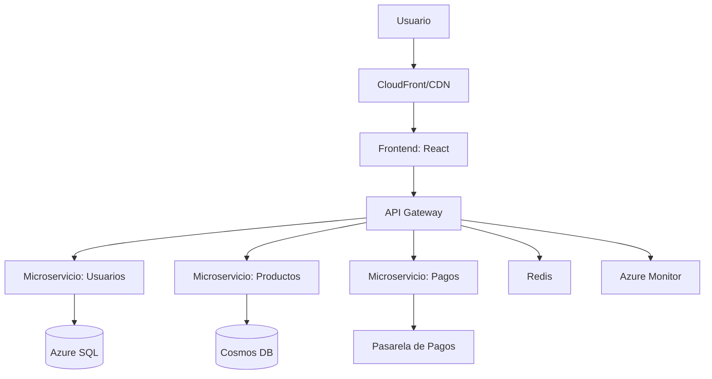

# 🛒 Arquitectura Cloud para E-commerce Adaptable

## 🔍 Atributos de Calidad Clave
| Atributo      | Escenarios (Ejemplos)                                                                 | Justificación                                                                 |
|---------------|---------------------------------------------------------------------------------------|-------------------------------------------------------------------------------|
| **Rendimiento** | 1. <2s en carga normal 2. <5s en Black Friday 3. Balanceo automático + caché    | Garantiza experiencia de usuario fluida y retención                           |
| **Seguridad**   | 1. Encriptación TLS 2. WAF + DDoS Protection 3. Auditorías trimestrales         | Cumple GDPR/PCI DSS y protege datos sensibles                                |
| **Escalabilidad** | 1. Auto-scaling (75% CPU) 2. Kubernetes + HPA 3. DB sharding automático         | Soporta crecimiento exponencial sin downtime                                  |

---

## 📐 Diagrama de Arquitectura

---

## 🔄 Integración con Metodología Ágil
### Rol del Arquitecto
- **Sprint Planning**: Define NFRs (Non-Functional Requirements) para cada historia
- **Refinamiento**: Valida viabilidad técnica de nuevas features
- **Retrospectivas**: Propone mejoras arquitectónicas basadas en métricas

### Prácticas Clave
- **Infraestructura como Código**: Terraform para gestionar recursos cloud
- **Feature Flags**: Despliegue progresivo sin romper funcionalidades
- **Chaos Engineering**: Pruebas de resiliencia en staging

---

## 🏗️ Stack Tecnológico Recomendado
| Capa               | Tecnología                  | Beneficio Clave                                  |
|--------------------|-----------------------------|--------------------------------------------------|
| **Frontend**       | Next.js + CDN               | Renderizado híbrido + edge caching               |
| **Backend**        | Node.js (Microservicios)    | Ecosistema modular + alta escalabilidad          |
| **Orquestación**   | Kubernetes (AKS/EKS)        | Auto-healing + escalado automático               |
| **CI/CD**          | GitHub Actions + ArgoCD     | Despliegues continuos con rollback automático    |

---
