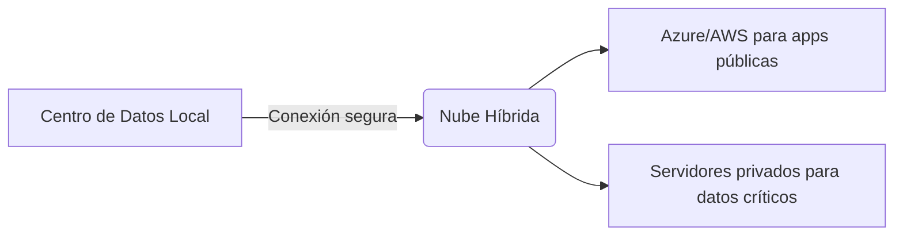

# 📄 Propuesta de Migración a la Nube  
**Empresa:** Empresa mediana Taller Electromecanico

---

## 1️⃣ **Definición de Computación en la Nube**  
> *"Modelo que ofrece servicios TI (almacenamiento, redes, software) bajo demanda vía internet, sin infraestructura física propia."*  

**Características clave:**  
- **Escalabilidad:** Ajuste dinámico de recursos.  
- **Autoservicio:** Acceso instantáneo vía portal/web.  
- **Pago por uso:** Costos basados en consumo.  
- **Accesibilidad:** Disponible desde cualquier dispositivo.  
- **Resiliencia:** Copias de seguridad y redundancia automática.  

---

## 2️⃣ **Beneficios de la Nube**  
✅ **Reducción de costos** (sin inversión en hardware).  
✅ **Agilidad:** Implementación rápida de servicios.  
✅ **Seguridad avanzada:** Cifrado y cumplimiento normativo.  
✅ **Disponibilidad 24/7:** Soporte global con SLAs garantizados.  
✅ **Innovación:** Acceso a IA, big data y herramientas emergentes.  

---

## 3️⃣ **Servicios Clave para la Empresa**  
| **Tipo**         | **Ejemplos**                  | **Uso Recomendado**            |  
|-------------------|-------------------------------|---------------------------------|  
| Almacenamiento    | Amazon S3, Azure Blob Storage | Backup, archivos colaborativos  |  
| Procesamiento     | AWS EC2, Google Compute Engine | Aplicaciones empresariales     |  
| Bases de Datos    | Amazon RDS, Azure Cosmos DB | Datos transaccionales/NoSQL   |  
| Redes             | AWS VPC, Azure Virtual Network | Conectividad segura entre sedes |  

---

## 4️⃣ **Modelos de Implementación**  
- **Nube Pública** (Ej: AWS/Azure): Ideal para escalabilidad y costos reducidos.  
- **Nube Privada** (Ej: VMware on-premise): Máximo control y seguridad.  
- **Nube Híbrida:** Combina lo mejor de ambos (recomendado para migraciones graduales).  

**Recomendación:**  
🔹 *"Nube híbrida durante la transición, migrando gradualmente a pública para cargas no críticas."*  

---

## 5️⃣ **Proveedores Líderes**  
1. **AWS** (40% mercado): Amplia gama de servicios y flexibilidad.  
2. **Microsoft Azure:** Ideal si usan Office 365/Windows Server.  
3. **Google Cloud:** Destaca en análisis de datos y machine learning.  

---

## 6️⃣ **Modelos de Costos**  
- **Facturación por:** Consumo de CPU, almacenamiento, transferencia de datos.  
- **Opciones:**  
  - **Pay-as-you-go:** Sin compromiso inicial.  
  - **Instancias reservadas:** Hasta 75% de descuento por pago anticipado.  
- **Factores clave:** Volumen de datos, tráfico, requisitos de compliance.  

---

## 7️⃣ **Caso de Éxito: Netflix**  
- **Desafío:** Escalabilidad para millones de usuarios simultáneos.  
- **Solución:** Migración completa a AWS.  
- **Resultados:**  
  - 100% disponibilidad durante picos de tráfico.  
  - Reducción de costos vs. infraestructura propia.  

---

## 📊 **Plus: Diagrama de Arquitectura Recomendada**  
