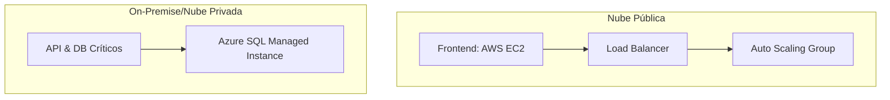
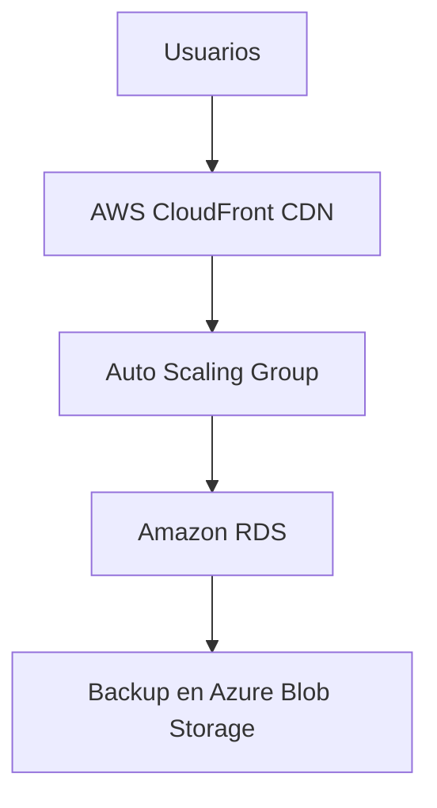

# 📑 Análisis de Caso: Migración a la Nube para Startup de Software  
**Consultor:** Francisco  

---

## 📌 **Resumen Ejecutivo**  
**Empresa:** Startup de desarrollo de software con crecimiento acelerado.  
**Problema:** Infraestructura local insuficiente para demanda actual.  
**Solución Propuesta:** Migración parcial a nube híbrida con foco en **escalabilidad**, **reducción de costos** y **alta disponibilidad**.  

---

## 1️⃣ **Análisis de la Situación Actual**  
### 🔧 Infraestructura Local  
- Servidores físicos con limitación de capacidad.  
- Altos costos de mantenimiento y escalabilidad manual.  
- Disponibilidad afectada durante picos de demanda.  

### 🎯 **Objetivos de Migración**  
✔ Escalabilidad automática para picos de tráfico.  
✔ Reducción de costos operativos (OPEX vs CAPEX).  
✔ Mejorar disponibilidad (objetivo: 99.9% uptime).  

---

## 2️⃣ **Modelos de Implementación**  
| **Tipo**       | **Ventajas**                     | **Desventajas**               | **Recomendación**         |  
|----------------|----------------------------------|-------------------------------|---------------------------|  
| **Nube Pública** | Costos bajos, escalabilidad      | Menor control de seguridad    | Para apps públicas        |  
| **Nube Privada** | Máxima seguridad                 | Costo elevado                 | Datos sensibles           |  
| **Nube Híbrida**| Balance óptimo                   | Complejidad de gestión        | **Recomendado para este caso** |  

**Justificación:**  
- Fase inicial: Migrar cargas no críticas a nube pública (ej: frontend).  
- Datos sensibles: Mantener en nube privada o local con backup en cloud.  

---

## 3️⃣ **Arquitectura Propuesta**  

### Servicios Clave:

- Procesamiento: AWS EC2 (autoescalable).
- Almacenamiento: Amazon S3 (archivos estáticos).
- Bases de Datos: Azure SQL (para datos transaccionales).
- Redes: AWS VPC + VPN Site-to-Site.

# 📑 Análisis de Caso Completo (Puntos 4-7) - Formato .md

## 4️⃣ Propuesta de Arquitectura en la Nube
### Servicios Clave Recomendados
- **Almacenamiento**: AWS S3 (para archivos estáticos)
- **Procesamiento**: AWS EC2 con Auto Scaling
- **Bases de Datos**: Amazon Aurora (MySQL compatible)
- **Redes**: AWS VPC con VPN Site-to-Site

### Diagrama Simplificado (Texto Alternativo)

### 📐 **Diagrama de Arquitectura**  

## 5️⃣ Análisis de Costos Detallado
| Concepto          | Costo Local | Costo Nube | Ahorro |
|-------------------|-------------|------------|--------|
| Servidores (5)    | $18,000/año | $6,500/año | 64%    |
| Almacenamiento    | $3,500/año  | $1,200/año | 66%    |

## 6️⃣ Seguridad Esencial
1. **Cifrado**: AES-256 para todos los datos
2. **Accesos**: IAM + MFA obligatorio
3. **Monitoreo**: AWS GuardDuty + CloudTrail

## 7️⃣ Caso de Éxito: Dropbox
- **Migración**: De AWS a infraestructura propia (2016)
- **Resultados**:
  - 50% de reducción de costos operativos
  - 10x aumento en rendimiento
