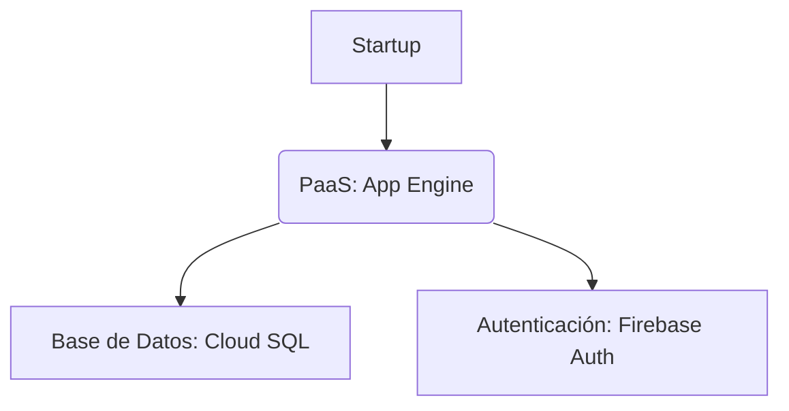

# Caso Práctico: Implementación de Modelos de Servicio en la Nube para una Startup de Software 🚀

## **1. Definición de Modelos de Servicio en la Nube**  
Los modelos de servicio en la nube (**IaaS, PaaS, SaaS, FaaS**) permiten a las empresas acceder a recursos tecnológicos bajo demanda, sin necesidad de gestionar infraestructura física.  
- **Importancia**:  
  - Reducen costos operativos (pago por uso).  
  - Ofrecen escalabilidad automática.  
  - Facilitan la innovación con tecnologías emergentes (IA, IoT).  

---

## **2. Comparación entre Modelos**  

| Modelo | Control del Usuario | Ventajas | Desventajas |  
|--------|---------------------|----------|-------------|  
| **IaaS** | Infraestructura (servidores, redes) | Máxima flexibilidad, personalización | Requiere gestión de SO y middleware |  
| **PaaS** | Aplicaciones y datos | Acelera desarrollo, sin gestión de infraestructura | Limitado a lenguajes/herramientas del proveedor |  
| **SaaS** | Solo configuración | Cero mantenimiento, accesible desde cualquier lugar | Poca personalización |  
| **FaaS** | Código de funciones | Escalabilidad automática, costo por ejecución | No apto para aplicaciones monolíticas |  

---

## **3. Elección del Modelo para la Startup**  
**Recomendación**: **PaaS** (ej: AWS Elastic Beanstalk, Google App Engine).  
- **Justificación**:  
  - La startup necesita enfocarse en **desarrollo rápido** sin gestionar servidores.  
  - Ideal para equipos pequeños que priorizan **tiempo de mercado** sobre control de infraestructura.  
  - Integración con herramientas de CI/CD y bases de datos gestionadas.  

---

## **4. Ejemplos de Servicios por Proveedor**  

| Modelo | AWS | Azure | Google Cloud |  
|--------|-----|-------|-------------|  
| **IaaS** | EC2 | Virtual Machines | Compute Engine |  
| **PaaS** | Elastic Beanstalk | App Service | App Engine |  
| **SaaS** | WorkMail | Office 365 | Google Workspace |  
| **FaaS** | Lambda | Functions | Cloud Functions |  

---

## **5. Consideraciones de Costos**  
- **IaaS**: Costo por horas de VM + almacenamiento + transferencia de datos.  
- **PaaS**: Precio basado en recursos consumidos (CPU, memoria) + servicios adicionales (DB, APIs).  
- **SaaS**: Suscripción mensual/anual por usuario.  
- **FaaS**: Costo por número de ejecuciones y tiempo de CPU.  
- **Impacto para la startup**: PaaS reduce costos iniciales (no hay inversión en hardware).  

---

## **6. Seguridad y Cumplimiento**  
- **Desafíos**:  
  - **IaaS**: Responsabilidad compartida (usuario gestiona parches de SO).  
  - **PaaS**: Vulnerabilidades en dependencias de desarrollo.  
  - **SaaS**: Riesgo de filtración de datos (ej: credenciales).  
  - **FaaS**: Ejecución de código en entornos multi-tenant.  
- **Mitigación**:  
  - Cifrado de datos en tránsito/reposo.  
  - Uso de IAM (Identity and Access Management).  
  - Auditorías regulares de seguridad.  

---

## **7. Caso de Éxito: Airbnb**  
- **Modelo utilizado**: **IaaS (AWS EC2)** + **SaaS (Google Workspace)**.  
- **Resultados**:  
  - Escalabilidad para manejar picos de tráfico global.  
  - Reducción del 40% en costos de infraestructura vs. on-premise.  

---

## **📌 Recursos Adicionales**  
- [AWS Well-Architected Framework](https://aws.amazon.com/architecture/well-architected/)  
- [Azure Pricing Calculator](https://azure.microsoft.com/en-us/pricing/calculator/)  
- [Google Cloud Free Tier](https://cloud.google.com/free)  

---

### **Plus Opcional**  
- **Tabla comparativa** en Excel o Mermaid (ver ejemplo abajo).  
- **Diagrama de arquitectura** (usando [draw.io](https://draw.io)):  
