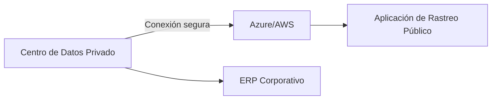

# Caso Práctico: Modelos de Implementación en la Nube para Empresa de Logística 🌍🚚

## **1. Definición de Modelos de Implementación**  
Los modelos de implementación en la nube determinan **dónde y cómo** se despliegan los recursos de TI. Son clave para:  
- **Flexibilidad**: Adaptarse a necesidades cambiantes.  
- **Optimización de costos**: Pago por lo que se usa.  
- **Cumplimiento normativo**: Especialmente en industrias reguladas (ej: logística con estándares ISO 28000).  

---

## **2. Comparativa entre Modelos**  

| Modelo       | Ventajas                      | Desventajas                  | Ejemplo de Uso                |
|--------------|------------------------------|------------------------------|-------------------------------|
| **Pública**  | Costos bajos, escalabilidad global | Menor control de seguridad | AWS S3 para tracking de paquetes |
| **Privada**  | Máxima seguridad, personalización | Alto costo inicial         | VMware en datacenter propio    |
| **Híbrida**  | Balance entre control y costo | Complejidad de gestión      | Azure Stack + AWS para datos críticos |

---

## **3. Recomendación para la Empresa de Logística**  
**Modelo elegido**: **Nube Híbrida** (ej: AWS Outposts + Google Cloud).  
**Justificación**:  
- **Datos sensibles** (rutas, clientes) en nube privada.  
- **Aplicaciones públicas** (seguimiento de envíos) en nube pública.  
- Cumplimiento con regulaciones internacionales (GDPR para Europa).  

---

## **4. Casos de Éxito Reales**  
- **Maersk (Pública)**: Usa Azure para IoT en contenedores refrigerados.  
- **DHL (Híbrida)**: Combina SAP HANA privado con APIs públicas de geolocalización.  
- **FedEx (Privada)**: Data centers propios para procesamiento de pagos.  

---

## **5. Impacto en Costos**  
| Modelo       | Estructura de Costos          | Ejemplo (USD/año) |  
|--------------|-------------------------------|-------------------|  
| **Pública**  | Pay-as-you-go + ancho de banda | $150,000         |  
| **Privada**  | Capex (hardware + mantenimiento) | $500,000+       |  
| **Híbrida**  | Mix de Capex + Opex           | $300,000         |  

---

## **6. Seguridad y Cumplimiento**  
**Principales desafíos**:  
- **Pública**: Riesgo de ataques DDoS → Mitigación: AWS Shield.  
- **Privada**: Actualizaciones manuales → Mitigación: Parches automatizados con Ansible.  
- **Híbrida**: Consistencia de políticas → Mitigación: Herramientas como Azure Arc.  

**Certificaciones clave**:  
- ISO 27001 (seguridad).  
- SOC 2 (auditoría).  
- HIPAA (si maneja datos médicos).  

---

## **7. Estrategia de Migración**  
**Fase 1**: Análisis (2 semanas)  
- Inventario de aplicaciones (uso herramienta como AWS Migration Hub).  
- Clasificar datos (críticos vs. públicos).  

**Fase 2**: Piloto (1 mes)  
- Migrar 1 aplicación no crítica a AWS EC2.  
- Monitorear con CloudWatch.  

**Fase 3**: Escalamiento (3-6 meses)  
- Migrar SAP a nube privada (VMware Cloud on AWS).  
- Implementar VPN site-to-site.  

---

## **📌 Recursos Adicionales**  
- [AWS Well-Architected Framework](https://aws.amazon.com/architecture/well-architected/)  
- [Microsoft Cloud Adoption Framework](https://azure.microsoft.com/es-es/solutions/azure-essentials/cloud-adoption-framework)  

---

### **Anexos Opcionales**  
1. **Diagrama de Arquitectura Híbrida**:  

2. **Checklist de Migración:**

- Inventario de activos
- Pruebas de rendimiento
- Plan de rollback

### ¿Cómo personalizarla?  
- **Para PYMEs logísticas**: Priorizar nube pública + ejemplos con Google Maps API.  
- **Para corporativos**: Añadir detalles de gobernanza con herramientas como AWS Control Tower.  
- **Incluir métricas**: Tiempo de migración estimado y ROI esperado.  
