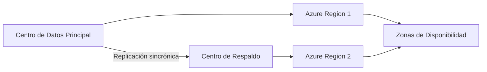

# Análisis de Caso: Migración a la Nube para Empresa Financiera 🏦☁️

## **1. Resumen Ejecutivo**  
**Recomendación**: Implementar un modelo de **nube híbrida** combinando:  
- **Nube privada** para datos sensibles (transacciones, KYC).  
- **Nube pública** para front-end y análisis de datos.  
**Beneficios**:  
✔ Cumplimiento normativo (PCI DSS, Basel III)  
✔ Reducción de costos vs. infraestructura on-premise (~35%)  
✔ Escalabilidad para temporadas altas (ej: declaración de renta)  

---

## **2. Análisis de la Situación Actual**  
**Problemas críticos**:  
- **Alto Capex**: Mantenimiento de servidores físicos.  
- **Single Point of Failure**: Sin redundancia geográfica.  
- **Escalabilidad limitada**: Picos de transacciones saturan sistemas.  
- **Riesgo de seguridad**: Datos sensibles expuestos a amenazas internas.  

**Requerimientos clave**:  
- Disponibilidad 99.99% (≤4.3m downtime/año).  
- Cifrado de datos en tránsito/reposo.  
- Auditorías trimestrales.  

---

## **3. Comparativa de Modelos**  

| Modelo       | Ventajas para Sector Financiero          | Desventajas                |  
|--------------|------------------------------------------|----------------------------|  
| **Pública**  | Bajo costo, escalabilidad global         | Cumplimiento normativo complejo |  
| **Privada**  | Máximo control, aislamiento de datos     | Alto costo inicial         |  
| **Híbrida**  | Balance ideal seguridad/costo            | Complejidad de integración |  

**Tabla de Adecuación**:  
| Criterio          | Pública | Privada | Híbrida |  
|-------------------|---------|---------|---------|  
| Seguridad         | ⭐⭐     | ⭐⭐⭐⭐⭐ | ⭐⭐⭐⭐  |  
| Costo             | ⭐⭐⭐⭐⭐ | ⭐⭐     | ⭐⭐⭐⭐  |  
| Escalabilidad     | ⭐⭐⭐⭐⭐ | ⭐⭐     | ⭐⭐⭐⭐  |  

---

## **4. Recomendación Técnica**  
**Arquitectura Propuesta**:  
```mermaid
graph TB
    A[Clientes] --> B[Azure Front Door (CDN)]
    B --> C{{Nube Pública: Azure App Service}} 
    C --> D[(Azure SQL DB)]
    B --> E{{Nube Privada: VMware on Azure}}
    E --> F[(SQL Server Always-On)]
    F --> G[APIs Core Bancario]
    G --> H[HSM: Thales payShield]
```


**Explicación del flujo**:
1. **Front-end**: Los clientes acceden a través de Azure Front Door (CDN global)
2. **Nube pública**: Aplicaciones no críticas en Azure App Service con base de datos Azure SQL
3. **Nube privada**: VMware on Azure para el core bancario, con alta disponibilidad (SQL Server Always-On)
4. **Seguridad**: HSM (Thales payShield) para protección de claves criptográficas

## **Anexos**  
**Diagrama de Alta Disponibilidad**:

