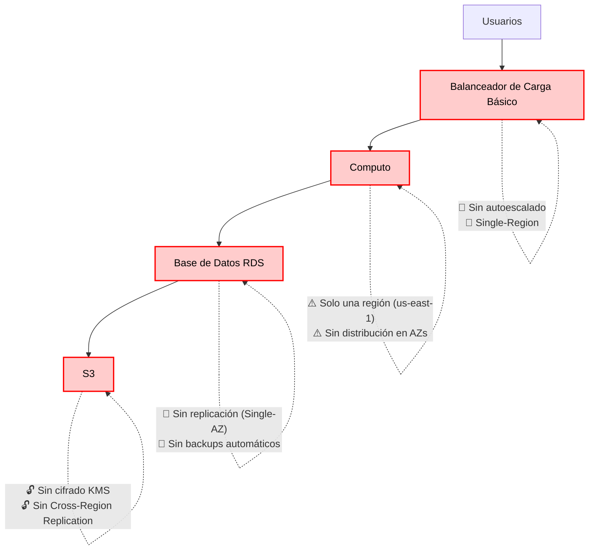

# 📝 Tarea

## 1. **Consigna**:

Una plataforma de reservas en línea ha experimentado **caídas del sistema durante fechas de alta demanda** (ej. feriados), **demoras en la recuperación ante fallos**, y **reportes de accesos no autorizados a datos de usuarios**. La arquitectura actual presenta las siguientes debilidades:

- Una sola región de despliegue (sin redundancia geográfica).
- Balanceador de carga básico sin autoescalado.
- Base de datos relacional sin replicación.
- Sin implementación de MFA ni cifrado de datos.

---

## 2. **Análisis del caso y propuesta de solución**

| **Atributos de calidad** | **Problemas detectados**       | **PaaS: Solución o estrategia recomendada (AWS)**                                                                 |
|--------------------------|--------------------------------|------------------------------------------------------------------------------------------------------------------|
| **Resiliencia**          | No hay distribución geográfica | - **RDS Multi-AZ** (réplica sincrónica en otra AZ). <br> - **Aurora Global Database** (réplicas en otras regiones). |
| **Escalabilidad**        | No hay autoescalado            | - **Auto Scaling integrado** en Elastic Beanstalk. <br> - **Aurora Serverless** (escalado automático para DB).    |
| **Seguridad**            | No hay MFA ni cifrado          | - **IAM + Cognito** (MFA para usuarios). <br> - **Cifrado nativo** en RDS/Aurora con KMS. <br> - **Certificados ACM** (HTTPS). |

---

## 3. **Diseño del esquema virtual**

- Problema


- Solucion

```mermaid
graph TD
    A[Usuarios] --> B[Route 53 Failover (con Health Checks)]
    B --> C1[Región A]
    B --> C2[Región B]

    subgraph Región A
        C1 --> A1[Elastic Beanstalk (AZ1+AZ2)]
        A1 --> B1[Aurora Global DB (Serverless v2 + Multi-AZ) Primary]
        A1 --> L1[Load Balancer ALB + ACM]
    end

    subgraph Región B
        C2 --> A2[Elastic Beanstalk (AZ1+AZ2)]
        A2 --> B2[Aurora Global DB (Serverless v2 + Multi-AZ) Secondary]
        A2 --> L2[Load Balancer ALB + ACM]
    end

    B1 --> S3[Amazon S3 (CRR) + KMS]
    B2 --> S3

    S3 --> Cognito[AWS Cognito + IAM + MFA]
    S3 --> CF[CloudFront Global]
    B1 --> CW[CloudWatch Metrics + Alarms + Logs]
```


---

## 4. **Compartir la solución con el grupo**
Explica cómo cada mejora propuesta contribuye a mejorar un atributo de calidad:

### 🔄 **Resiliencia**  
> Garantiza la disponibilidad del servicio ante fallos, incluso a nivel regional o de zona de disponibilidad.

- **Aurora Global Database** permite tener una réplica secundaria en otra región. Si la región principal falla, el tráfico puede redirigirse a la secundaria.
- **RDS Multi-AZ** proporciona replicación sincrónica automática entre zonas de disponibilidad (AZs) dentro de una misma región.
- **Amazon S3** con **CRR** (Cross-Region Replication) garantiza la duplicación automática de objetos en otra región.
- **Route 53 Failover** + **Health Checks** detecta fallos y redirige automáticamente el tráfico a la región disponible.
- **Elastic Beanstalk** desplegado en múltiples AZs distribuye las instancias de aplicación para tolerancia a fallos locales.

### 📈 **Escalabilidad**  
> Permite ajustar los recursos de cómputo y base de datos de acuerdo con la carga del sistema.

- **Elastic Beanstalk Auto Scaling** escalará las instancias EC2 de la aplicación automáticamente según el tráfico.
- **Aurora Serverless v2** adapta automáticamente la capacidad de la base de datos según la demanda, ideal para cargas variables.
- **CloudFront** actúa como una **CDN** global que entrega contenido en caché, reduciendo la presión sobre el backend.

### 🔒 **Seguridad**  
> Asegura que los datos estén protegidos y los accesos controlados.

- **AWS IAM** gestiona políticas de acceso interno para servicios y usuarios.
- **Amazon Cognito** permite autenticación con **MFA** (Multi-Factor Authentication) para usuarios externos.
- **AWS KMS** (Key Management Service) permite cifrado de datos en reposo y en tránsito para **RDS**, **S3** y más.
- **AWS ACM** habilita certificados TLS/HTTPS fácilmente para cifrado en tránsito.
- **S3 Bucket** Policies y Bloqueo de acceso público aseguran los objetos privados.
- **S3 Bucket** Policies y Bloqueo de acceso público aseguran los objetos privados.

### 💡 **Visibilidad y monitoreo**  
> Proporciona herramientas para detectar problemas y anticiparse a incidentes.

- **Amazon CloudWatch Alarms** notifica cuando una métrica excede los umbrales definidos (latencia, CPU, errores 5xx, etc.).
- **CloudWatch Logs** para registrar eventos del backend (Elastic Beanstalk) y errores de base de datos.
- **CloudTrail** registra todas las llamadas API para auditoría de seguridad.

### 💰 Optimización de costos
> Garantiza que solo se consuman recursos necesarios según demanda.

- **Aurora Serverless v2** cobra por capacidad usada por segundo.
- **Auto Scaling** en **Elastic Beanstalk** evita mantener instancias ociosas.
- **CloudFront** descarga recursos estáticos desde edge locations, reduciendo tráfico y uso de backend.

---

