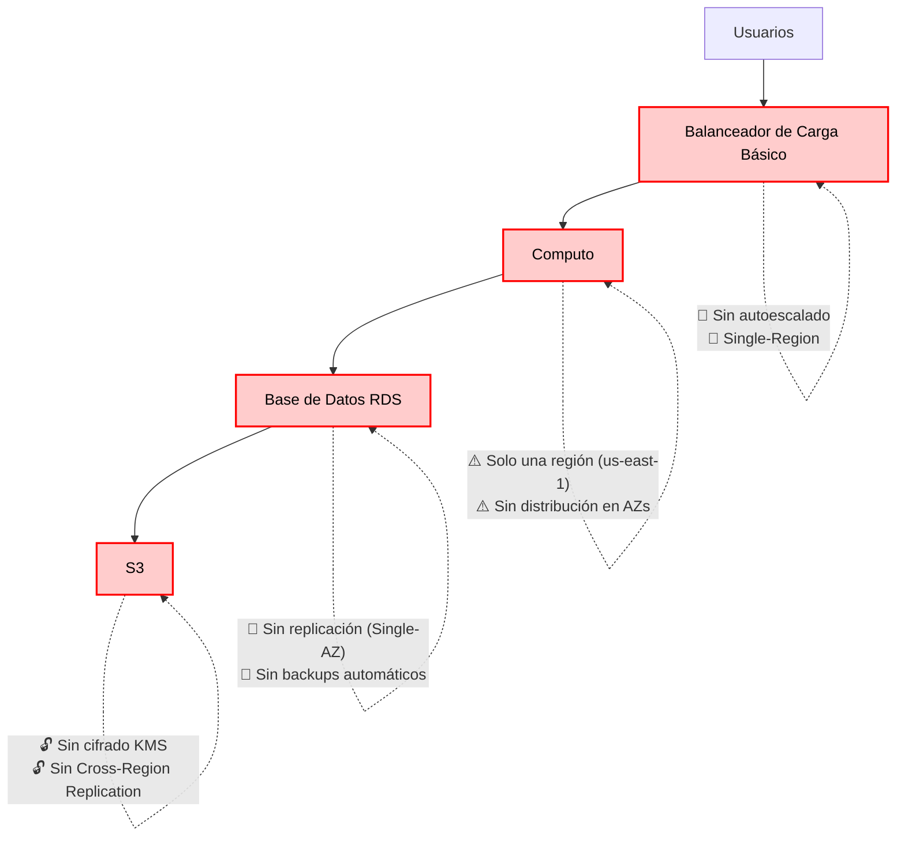
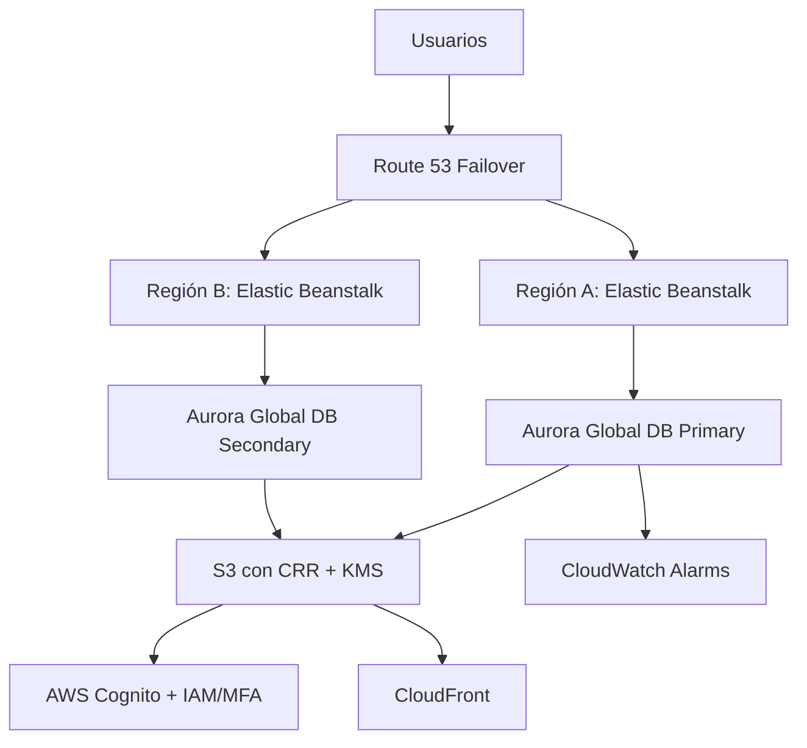

# 📝 Tarea

## 1. **Consigna**:

Una plataforma de reservas en línea ha experimentado **caídas del sistema durante fechas de alta demanda** (ej. feriados), **demoras en la recuperación ante fallos**, y **reportes de accesos no autorizados a datos de usuarios**. La arquitectura actual presenta las siguientes debilidades:

- Una sola región de despliegue (sin redundancia geográfica).
- Balanceador de carga básico sin autoescalado.
- Base de datos relacional sin replicación.
- Sin implementación de MFA ni cifrado de datos.

---

## 2. **Análisis del caso y propuesta de solución**

| **Atributos de calidad** | **Problemas detectados**       | **PaaS: Solución o estrategia recomendada (AWS)**                                                                 |
|--------------------------|--------------------------------|------------------------------------------------------------------------------------------------------------------|
| **Resiliencia**          | No hay distribución geográfica | - **RDS Multi-AZ** (réplica sincrónica en otra AZ).   - **Aurora Global Database** (réplicas en otras regiones). |
| **Escalabilidad**        | No hay autoescalado            | - **Auto Scaling integrado** en Elastic Beanstalk.   - **Aurora Serverless** (escalado automático para DB).    |
| **Seguridad**            | No hay MFA ni cifrado          | - **IAM + Cognito** (MFA para usuarios).   - **Cifrado nativo** en RDS/Aurora con KMS.   - **Certificados ACM** (HTTPS). |

---

## 3. **Diseño del esquema virtual**

- Problema

- Solucion

---

## 4. **Compartir la solución con el grupo**
Explica cómo cada mejora propuesta contribuye a mejorar un atributo de calidad:

- ✅ **Resiliencia**  
  Al implementar **Aurora Global Database** y **RDS Multi-AZ**, se garantiza alta disponibilidad incluso ante fallas regionales. Gracias a `Route 53 Failover`, el tráfico puede redirigirse automáticamente a otra región o instancia saludable, minimizando el tiempo de inactividad.

- 📈 **Escalabilidad**  
  El uso de **Elastic Beanstalk con Auto Scaling** permite que las instancias de aplicación aumenten o disminuyan según la demanda. Por su parte, **Aurora Serverless** ajusta automáticamente la capacidad de la base de datos, permitiendo un uso eficiente de los recursos en picos de tráfico como feriados o campañas.

- 🔒 **Seguridad**  
  Con **AWS Cognito**, se implementa autenticación multifactor (MFA) para usuarios finales, y con **IAM**, se refuerza el control de acceso interno. Además, el uso de **KMS** permite cifrar tanto datos en reposo (S3, Aurora) como en tránsito (mediante TLS/HTTPS con ACM), protegiendo la información sensible de los usuarios.

- 💡 **Visibilidad y monitoreo**  
  Gracias a **CloudWatch**, se pueden establecer alarmas, métricas personalizadas y monitoreo continuo, lo que permite detectar anomalías y responder proactivamente ante eventos inesperados.

---

Estas mejoras no solo corrigen las debilidades actuales, sino que preparan a la arquitectura para crecer de manera segura y estable frente a la demanda del negocio.
