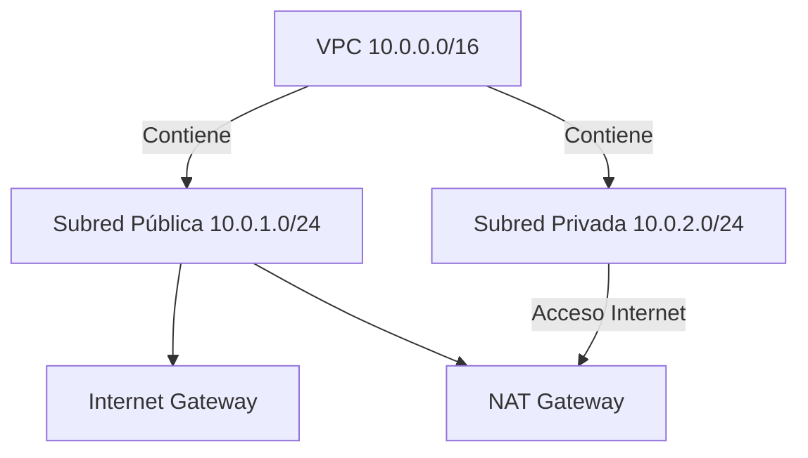
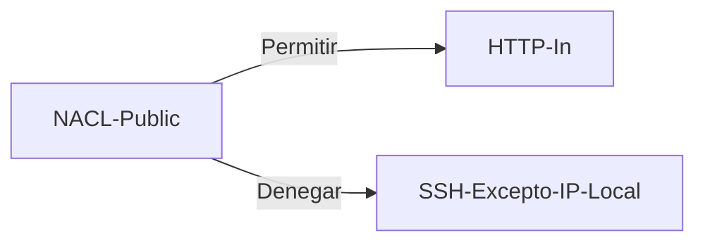

# 🛜 Análisis de Caso: Servicios de Red en la Nube para DataConnect

## 📍 Situación Inicial
**Empresa**: DataConnect  
**Necesidad**:  
- Migrar infraestructura on-premise a AWS  
- Aislamiento de recursos  
- Seguridad mejorada  
- Conexión híbrida futura  
**Recursos**: AWS Free Tier/AWS Academy  

---

## 🔧 Diseño de Solución

### 1. Diagrama de Arquitectura

### 2. Configuración de Red
| Componente           | Configuración                  |
|----------------------|--------------------------------|
| **VPC**              | 10.0.0.0/16                   |
| **Subred Pública**   | 10.0.1.0/24 (us-east-1a)      |
| **Subred Privada**   | 10.0.2.0/24 (us-east-1b)      |
| **Internet Gateway** | Asociado a VPC                |
| **NAT Gateway**      | En subred pública (Elastic IP) |

---

## 🔒 Configuración de Seguridad

### Security Groups
**SG-Public-Web** (Subred Pública):
- Entrada: HTTP(80)/HTTPS(443) desde 0.0.0.0/0  
- Entrada: SSH(22) solo desde IP local  
- Salida: All traffic  

**SG-Private-DB** (Subred Privada):
- Entrada: MYSQL(3306) solo desde SG-Public-Web  
- Salida: HTTP(80)/HTTPS(443) para actualizaciones  

### NACLs (Opcional)

---

## 🚀 Implementación

### 1. Crear VPC y Subredes
1. Ir a AWS Console > VPC
2. Crear VPC con CIDR 10.0.0.0/16
3. Crear subredes:
   - Pública: 10.0.1.0/24
   - Privada: 10.0.2.0/24

### 2. Configurar Gateways
1. Crear y asociar Internet Gateway
2. Crear NAT Gateway en subred pública
3. Configurar tablas de ruteo:
   - Pública: 0.0.0.0/0 → IGW
   - Privada: 0.0.0.0/0 → NAT

### 3. Lanzar Instancias
| Rol            | Tipo      | Subnet     | Security Group |
|----------------|-----------|------------|----------------|
| Bastion Host   | t2.micro  | 10.0.16.0/20| SG-Public-Web  |
| Database Server| t2.micro  | 10.0.2.0/24| SG-Private-DB  |

**Pruebas de conectividad**:
bash
ssh -i key.pem ec2-user@<IP-Pública>
mysql -h 10.0.2.100 -u admin -p

---

## 📈 Escalabilidad y Conexión Híbrida

### VPN Site-to-Site (Futuro)
1. **Componentes necesarios**:
   - Virtual Private Gateway
   - Customer Gateway
   - VPN Connection

### Control de Costos
- Monitorear con CloudWatch
- Terminar recursos no utilizados
- Usar NAT Instance para reducir costos

---

## 📬 Entregables

1. **Documentación técnica**:
   - Diagramas de arquitectura
   - Configuraciones de seguridad

2. **Evidencias de pruebas**:
   - Capturas de conexión SSH
   - Resultados de pruebas de conectividad

3. **Recomendaciones**:
   - Implementar VPN para conexión híbrida
   - Automatizar despliegues con Terraform
   - Plan de escalamiento futuro

> ✅ **Conclusión**: La solución implementada proporciona una base segura y escalable para la migración a la nube de DataConnect, optimizando costos mediante el uso de Free Tier.

---

# Desarrollo

