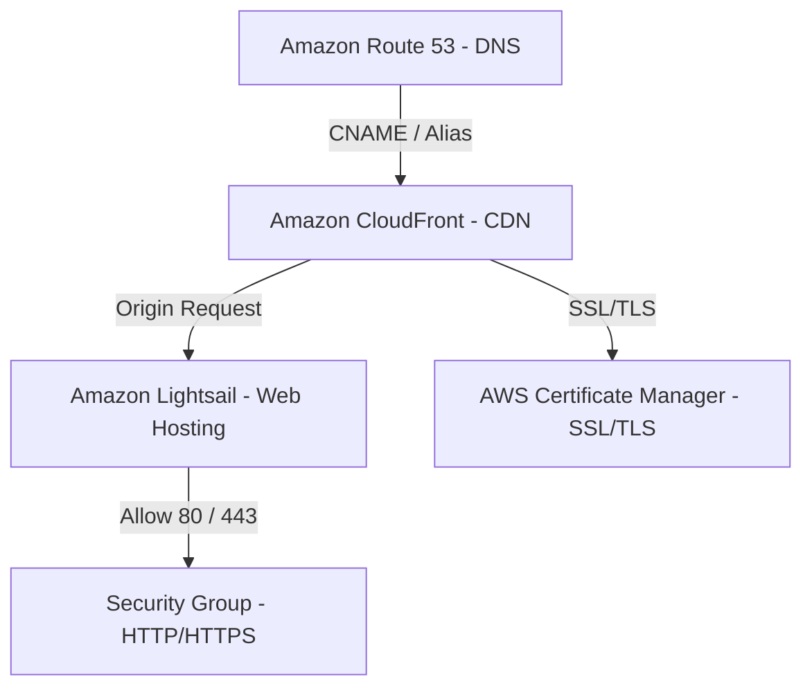
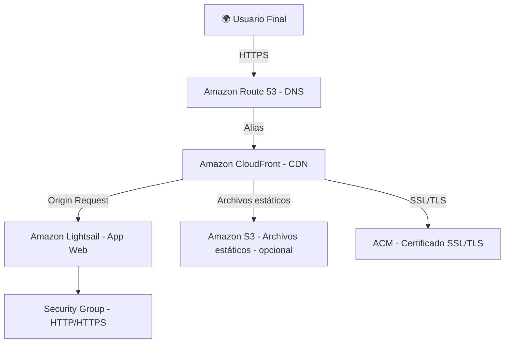

# 🧠 Caso: Servicios Simples de Alojamiento Web y Distribución de Contenidos en AWS

## 🏢 Situación Inicial
La empresa emergente **QuickMedia** desea lanzar rápidamente una página web para promocionar productos digitales. En el futuro, planean distribuir archivos estáticos y multimedia internacionalmente, por lo que requieren:

- Velocidad y confiabilidad global.
- Bajo costo.
- Fácil configuración en la nube.

## 🎯 Objetivo
Implementar una solución en la nube usando:
- **Amazon Lightsail** como hosting web.
- **Amazon CloudFront** como red de distribución de contenido (CDN).
- **AWS Free Tier** para mantener costos bajos.
- HTTPS para seguridad profesional.

---

## 📌 Rol del Especialista Cloud
### Tareas:
1. **Instancia en Amazon Lightsail**
   - Crear instancia (ej. WordPress o LAMP) para el sitio web.
2. **Almacenamiento de Contenido Estático**
   - Usar bucket S3 (Simple Storage Service) o almacenamiento local en la instancia.
3. **Integración con Amazon CloudFront (CDN)**
   - Distribuir contenido estático cacheado globalmente.

---

## 🛠 Instrucciones Técnicas

### 1. Creación del Hosting Web
- Accede a tu cuenta de **AWS Academy** o **AWS Free Tier**.
- En **Amazon Lightsail**, crea una instancia básica con stack preconfigurado (WordPress o LAMP).
- Configura un dominio:
  - Con **Amazon Route 53** o un proveedor externo.
  - Agrega registros DNS que apunten a la IP estática de Lightsail.

### 2. Seguridad y Certificados
- Abre puertos en el firewall de Lightsail:
  - HTTP (puerto 80)
  - HTTPS (puerto 443)
- Usa **AWS Certificate Manager (ACM)** o el sistema de certificados de Lightsail para habilitar SSL/TLS (HTTPS).

### 3. Distribución de Contenidos con CloudFront
- Crea una **CloudFront Distribution** con origen:
  - Tu instancia de Lightsail o un bucket S3.
- Configura el **cache behavior**:
  - Para servir imágenes,

### Modelo

---

## 🔁 Flujo de la Aplicación Web
### 🗺️ Arquitectura general:

## 🧩 Explicación del flujo
### 1. DNS con Route 53
- Tu dominio (ej. quickmedia.com) está registrado en Amazon Route 53.
- Route 53 dirige el tráfico al distribuidor de CloudFront (no directamente a Lightsail).

### 2. CloudFront (CDN)
- Es el punto de entrada para el usuario.
- Su función es servir contenido lo más cerca posible del usuario, reduciendo latencia.
- Tiene dos posibles "orígenes":
  - Tu instancia en Lightsail (HTML, backend dinámico, etc.)
  - Un bucket S3 (para archivos estáticos: imágenes, CSS, JS).

### 3. AWS Certificate Manager (ACM)
- CloudFront usa certificados SSL/TLS emitidos por ACM para cifrar la conexión con el usuario.
- Así, cuando alguien accede a https://quickmedia.com, la conexión es segura.

### 4. Lightsail (Hosting Web)
- Es donde vive tu aplicación web:
  - Código HTML, lógica PHP o backend (si usas WordPress, LAMP, etc.).
- CloudFront hace peticiones al Lightsail cuando no encuentra el contenido en su caché.

### 5. Security Group (Firewall)
- Protege tu instancia de Lightsail.
- Debe permitir tráfico entrante por los puertos 80 (HTTP) y 443 (HTTPS), para que CloudFront pueda comunicarse con Lightsail.

---

# Desarrollo

