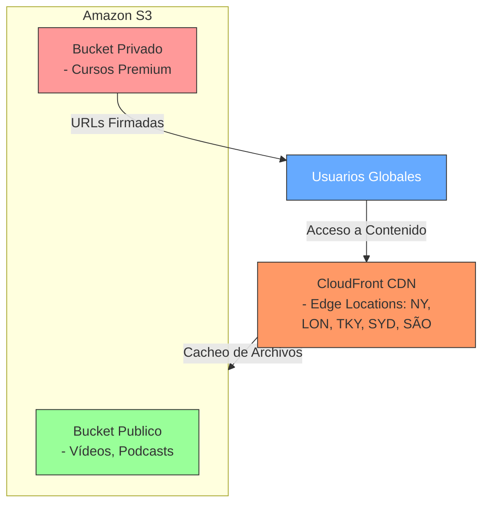

# Solución: Arquitectura de Almacenamiento de Objetos para MediaStream  

## **1. Diagnóstico Inicial**  

### **Limitaciones del almacenamiento on-premise**:  
- **Escalabilidad limitada**: No puede manejar picos de tráfico internacional.  
- **Alta latencia**: Usuarios en otras regiones experimentan carga lenta de contenido.  
- **Costos operativos**: Mantenimiento de servidores físicos y ancho de banda.  
- **Disponibilidad**: Riesgo de downtime por fallos hardware.  

### **Ventajas del almacenamiento de objetos en la nube**:  
- **Escalabilidad global**: Crecimiento automático según demanda.  
- **Baja latencia**: Integración con CDNs para distribución geográfica.  
- **Costo-eficiencia**: Pago por uso y clases de almacenamiento ajustables.  
- **Durabilidad**: Replicación automática en múltiples zonas.  

---

## **2. Diseño de Arquitectura**  

### **Proveedor seleccionado**: **AWS** (Amazon S3 + CloudFront).  
**Razón**: Mayor integración con herramientas multimedia y soporte global.  

### **Estructura de almacenamiento**:  
- **Buckets**:  
  - `mediastream-public`: Contenido accesible públicamente (ej. vídeos educativos).  
  - `mediastream-private`: Archivos sensibles (ej. cursos premium) con acceso restringido.  
- **Organización**:  
  - Carpetas por tipo de contenido: `/videos`, `/podcasts`, `/courses`.  
  - Metadatos: `content-type`, `language`, `creation-date`.  

### **Entrega vía URL**:  
- **URLs públicas**: Para contenido estático (ej. `https://mediastream-public.s3.amazonaws.com/videos/intro.mp4`).  
- **Presigned URLs**: Para contenido privado (validez de 24 horas).  
- **CDN (CloudFront)**: Acelera la entrega con edge locations.  

---

## **3. Estrategia de Respaldo y Recuperación**  

- **Respaldo automático**:  
  - **AWS Backup**: Copias diarias de buckets críticos.  
  - **Versionado**: Habilitado para recuperar archivos borrados/modificados.  
- **Capa de almacenamiento**:  
  - **S3 Standard**: Para contenido frecuentemente accedido.  
  - **S3 Glacier**: Para archivos antiguos (ej. podcasts >1 año).  

---

## **4. Control de Acceso y Seguridad**  

- **IAM**: Roles específicos para equipos (ej. `MediaStream-Devs` con permisos de escritura).  
- **Cifrado**:  
  - **En tránsito**: HTTPS/TLS.  
  - **En reposo**: SSE-S3 (cifrado automático).  
- **Monitoreo**:  
  - **AWS CloudTrail**: Auditoría de accesos.  
  - **S3 Access Logs**: Registro de solicitudes.  

**Buenas prácticas**:  
- Política de "least privilege" en permisos.  
- Rotación anual de claves de acceso.  

---

## **5. Distribución de Contenido y Escalabilidad**  

- **CDN (CloudFront)**:  
  - Origen en S3.  
  - Cacheo en edge locations (reducción de latencia).  
- **Balanceo de carga**:  
  - **AWS Global Accelerator**: Para tráfico internacional masivo.  
- **Optimización**:  
  - Compresión automática de vídeos (Lambda@Edge).  

---

## **6. Diagrama de Arquitectura**  

```plaintext
┌──────────────────────────────────────────────────────┐
|                   Usuarios Globales                  |
└───────────────┬────────────────▲─────────────────────┘
                │                │
                ▼                │
┌────────────────────────────┐  │
|       CloudFront (CDN)     |  │
|  (Edge Locations: NY, LON, |  │
|   TKY, SYD, SÃO, etc.)     |  │
└───────────────┬────────────┘  │
                │               │
                ▼               │
┌────────────────────────────┐ │
|        Amazon S3           | │
| ┌────────────┐ ┌─────────┐ | │
| │  Bucket    │ │ Bucket  │ | │
| │  Public    │ │ Private │◀┘ │
| └────────────┘ └─────────┘   │
|  (Vídeos, Podcasts)          │
└──────────────────────────────┘
```

