# Solución: Arquitectura de Almacenamiento de Objetos para MediaStream  

## **1. Diagnóstico Inicial**  

### **Limitaciones del almacenamiento on-premise**:  
- **Escalabilidad limitada**: No puede manejar picos de tráfico internacional.  
- **Alta latencia**: Usuarios en otras regiones experimentan carga lenta de contenido.  
- **Costos operativos**: Mantenimiento de servidores físicos y ancho de banda.  
- **Disponibilidad**: Riesgo de downtime por fallos hardware.  

### **Ventajas del almacenamiento de objetos en la nube**:  
- **Escalabilidad global**: Crecimiento automático según demanda.  
- **Baja latencia**: Integración con CDNs para distribución geográfica.  
- **Costo-eficiencia**: Pago por uso y clases de almacenamiento ajustables.  
- **Durabilidad**: Replicación automática en múltiples zonas.  

---

## **2. Diseño de Arquitectura**  

### **Proveedor seleccionado**: **AWS** (Amazon S3 + CloudFront).  
**Razón**: Mayor integración con herramientas multimedia y soporte global.  

### **Estructura de almacenamiento**:  
- **Buckets**:  
  - `mediastream-public`: Contenido accesible públicamente (ej. vídeos educativos).  
  - `mediastream-private`: Archivos sensibles (ej. cursos premium) con acceso restringido.  
- **Organización**:  
  - Carpetas por tipo de contenido: `/videos`, `/podcasts`, `/courses`.  
  - Metadatos: `content-type`, `language`, `creation-date`.  

### **Entrega vía URL**:  
- **URLs públicas**: Para contenido estático (ej. `https://mediastream-public.s3.amazonaws.com/videos/intro.mp4`).  
- **Presigned URLs**: Para contenido privado (validez de 24 horas).  
- **CDN (CloudFront)**: Acelera la entrega con edge locations.  

---

## **3. Estrategia de Respaldo y Recuperación**  

- **Respaldo automático**:  
  - **AWS Backup**: Copias diarias de buckets críticos.  
  - **Versionado**: Habilitado para recuperar archivos borrados/modificados.  
- **Capa de almacenamiento**:  
  - **S3 Standard**: Para contenido frecuentemente accedido.  
  - **S3 Glacier**: Para archivos antiguos (ej. podcasts >1 año).  

---

## **4. Control de Acceso y Seguridad**  

- **IAM**: Roles específicos para equipos (ej. `MediaStream-Devs` con permisos de escritura).  
- **Cifrado**:  
  - **En tránsito**: HTTPS/TLS.  
  - **En reposo**: SSE-S3 (cifrado automático).  
- **Monitoreo**:  
  - **AWS CloudTrail**: Auditoría de accesos.  
  - **S3 Access Logs**: Registro de solicitudes.  

**Buenas prácticas**:  
- Política de "least privilege" en permisos.  
- Rotación anual de claves de acceso.  

---

## **5. Distribución de Contenido y Escalabilidad**  

- **CDN (CloudFront)**:  
  - Origen en S3.  
  - Cacheo en edge locations (reducción de latencia).  
- **Balanceo de carga**:  
  - **AWS Global Accelerator**: Para tráfico internacional masivo.  
- **Optimización**:  
  - Compresión automática de vídeos (Lambda@Edge).  

---

## **6. Diagrama de Arquitectura**  

```mermaid
graph TD
    U[Usuarios Globales] -->|Acceso a Contenido| C[CloudFront CDN\n - Edge Locations: NY, LON, TKY, SYD, SÃO]
    C -->|Cacheo de Archivos| S3
    subgraph S3[Amazon S3]
        P[Bucket Publico\n - Vídeos, Podcasts]
        R[Bucket Privado\n - Cursos Premium]
    end
    R -->|URLs Firmadas| U

    style U fill:#6af,stroke:#333,color:#fff
    style C fill:#f96,stroke:#333
    style P fill:#9f9,stroke:#333
    style R fill:#f99,stroke:#333
```



### **Explicación del Diagrama Mermaid**:
1. **Nodos**:
   - `Usuarios Globales`: Punto de entrada (color azul).
   - `CloudFront CDN`: Edge locations (color naranja).
   - `Bucket Publico/Privado`: Estructura S3 (verde/rojo).

2. **Flujos**:
   - Línea sólida (`-->`): Conexiones directas.
   - Texto en pipes (`|Acceso a Contenido|`): Describe la relación.

3. **Personalización**:
   - **Colores**: Modifica los valores `fill` (ej: `#6af` = azul claro).
   - **Texto**: Añade más detalles en los labels.
   - **Formas**: Por defecto es grafo orientado (rectángulos), pero puedes usar `graph LR` para horizontal.

### **Ventajas**:
- **Dinámico**: Se actualiza automáticamente al modificar el código.
- **Portable**: Compatible con GitHub, GitLab, VS Code, etc.
- **Interactivo**: En herramientas como Mermaid Live Editor.

---

> [!WARNING]
> Por las limitaciones de AWSAlchemy Lab, se desarrollará un ejemplo con Lambda.

## 🧩 Paso a Paso

### Bucket S3 (hell-s3)

| Atributo                            | Valor                                                        | Propósito                                                                                                    |
|-----------------------------------|--------------------------------------------------------------|-------------------------------------------------------------------------------------------------------------|
| Región de AWS                     | EE.UU. Este (Norte de Virginia) us-east-1                    | Define la región donde se almacenan los datos para reducir latencia y cumplir requisitos regulatorios.      |
| Tipo de bucket                   | Uso general                                                  | Recomendado para la mayoría de casos; permite varias clases de almacenamiento con redundancia en varias zonas. |
| Tipo de bucket                   | Directorio                                                  | Para baja latencia; usa clase S3 Express One Zone, almacenando en una sola zona de disponibilidad.           |
| Nombre del bucket                 | hell-s3                                                      | Identificador único global del bucket, con reglas estrictas de formato para su creación y acceso.            |
| Copiar configuración de bucket existente | Opcional; formato: s3://bucket/prefijo                  | Permite replicar configuraciones de buckets existentes para consistencia o facilidad.                        |
| Propiedad de objetos              | ACL deshabilitadas (recomendado)                             | Garantiza que todos los objetos sean propiedad de la cuenta del bucket y el acceso se controle por políticas. |
| Propiedad de objetos              | ACL habilitadas                                              | Permite que objetos sean propiedad de otras cuentas AWS; controla acceso mediante listas de control de acceso. |
| Configuración bloqueo acceso público | Bloquear todo el acceso público                             | Previene acceso público por ACL, políticas o puntos de acceso; protege los datos de accesos no autorizados.  |
| Control de versiones             | Desactivar / Habilitar                                       | Permite mantener y restaurar múltiples versiones de objetos para recuperación ante errores o borrados.       |
| Etiquetas                        | Opcional; hasta 50 etiquetas                                 | Facilita organización y seguimiento de costos mediante etiquetas personalizadas para el bucket.              |
| Cifrado predeterminado           | SSE-S3 / SSE-KMS / DSSE-KMS                                 | Define cómo se cifran automáticamente los objetos nuevos para proteger datos en reposo.                      |
| Clave de bucket                 | Desactivar / Habilitar                                       | Reduce costos de cifrado SSE-KMS usando claves de bucket; no compatible con DSSE-KMS.                        |
| Bloqueo de objetos               | Desactivar / Habilitar                                       | Modelo WORM para impedir eliminación o sobrescritura de objetos, requiere control de versiones habilitado.   |

---


---

### Lambda (hell-lambda)

| Atributo                                         | Valor                                                                 |
|--------------------------------------------------|-----------------------------------------------------------------------|
| Habilitar URL de la función                      | Enable                                                                |
| Habilitar VPC                                    | Enable                                                                |
| VPC                                              | vpc-0c88db8efdc07ec84 (172.31.0.0/16)                                 |
| Permitir tráfico IPv6                            | Disable                                                               |
| Subredes seleccionadas                           | subnet-0004752ccbf27090b (us-east-1b)                                 |
|                                                  | subnet-08cdc83ddbbd578b9 (us-east-1f)                                 |
|                                                  | subnet-0c4637fb765a296c0 (us-east-1e)                                 |
|                                                  | subnet-03b4431ce729dec73 (us-east-1c)                                 |
|                                                  | subnet-030e652c1434c6e68 (us-east-1d)                                 |
|                                                  | subnet-0c9d1a6c81c1ebcfd (us-east-1a)                                 |
| Grupos de seguridad                              | sg-0d4eac31840b22460 (default VPC security group)                     |
| Reglas de entrada del SG                         | Protocolo: All, Puertos: All, Origen: sg-0d4eac31840b22460            |
| Reglas de salida del SG                          | -                                                                     |
| Habilitar firma de código                        | Disable                                                               |
| Cifrado con clave administrada por el cliente    | Disable                                                               |
| Habilitar etiquetas                               | Disable                                                               |

---


---

```python
import boto3
from datetime import datetime

def lambda_handler(event, context):
    # Configuración con región explícita
    s3 = boto3.client('s3', region_name='us-east-1')  # Cambia a tu región
    bucket_name = 'hell-s3'
    image_key = 'helldivers.jpg'
    
    try:
        # Verificación rápida (sin head_object para reducir tiempo)
        presigned_url = s3.generate_presigned_url(
            'get_object',
            Params={'Bucket': bucket_name, 'Key': image_key},
            ExpiresIn=3600
        )
        
        # return {
        #     'statusCode': 200,
        #     'body': presigned_url
        # }

        return {
            'statusCode': 302,
            'headers': {
                'Location': presigned_url
            }
        }
        
    except Exception as e:
        return {
            'statusCode': 500,
            'body': f"Error: {str(e)}"
        }
```

### Lambda (hell-agw)


