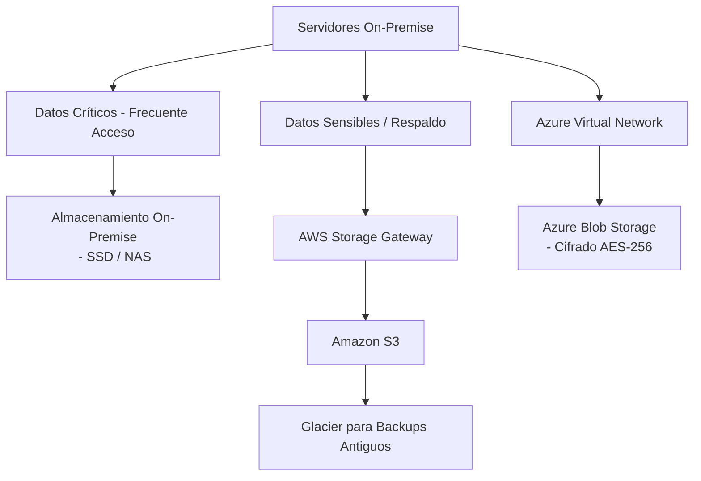

# Estrategia de Respaldo Híbrido para una Empresa de Servicios Financieros

## Descripción del Entorno Actual y Desafíos

La empresa cuenta con una infraestructura **on-premise** robusta, distribuida en varias ciudades. Los principales desafíos son:
- **Disponibilidad y continuidad operativa**: Necesidad de mejorar la resiliencia ante fallos.
- **Cumplimiento normativo**: Requisitos estrictos de seguridad y privacidad de datos financieros.
- **Costos y eficiencia**: Optimizar el almacenamiento según la criticidad de los datos.

---

## Arquitectura Propuesta

### Diagrama de Flujo (Conceptual)

### Tecnologías Clave:
1. **AWS Storage Gateway**: Conexión híbrida para integrar almacenamiento local con S3.
2. **Azure Virtual Network**: Conectividad segura entre oficinas y la nube mediante VPN/IPsec.
3. **Segmentación de Datos**:
   - **On-Premise**: Datos transaccionales frecuentes (baja latencia).
   - **Nube (S3/Azure)**: Backups, datos históricos y archivos sensibles (cifrados).

---

## Justificación Técnica

| Factor                | Solución On-Premise          | Solución en Nube               |
|-----------------------|-----------------------------|--------------------------------|
| **Sensibilidad**      | Control físico total        | Cifrado en tránsito/reposo    |
| **Costos**            | Alto CAPEX (hardware)       | OPEX escalable (pago por uso) |
| **Recuperación**      | RTO rápido (local)          | S3 Glacier (bajo costo, RTO mayor) |
| **Cumplimiento**      | Auditorías internas         | Certificaciones (ISO 27001, SOC2) |

---

## Consideraciones Clave

1. **Seguridad**:
   - Cifrado de datos en tránsito (TLS 1.2+) y en reposo (AES-256).
   - Autenticación MFA para accesos críticos.
2. **Conectividad**:
   - Uso de **VPC/Virtual Network** para aislamiento lógico.
   - Ancho de banda dedicado (MPLS) entre oficinas y cloud.
3. **Accesibilidad**:
   - Tiering automático (S3 Intelligent-Tiering para optimizar costos).

---

## Conclusión y Ventajas Esperadas

- **Resiliencia**: Redundancia geográfica en la nube.
- **Flexibilidad**: Escalabilidad bajo demanda.
- **Cumplimiento**: Adherencia a regulaciones financieras.
- **Optimización de Costos**: Balance entre almacenamiento local (performance) y cloud (backup económico).

---
