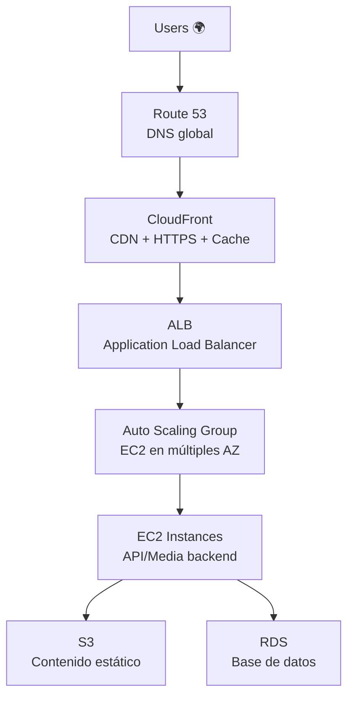

# 🧠 Caso: Disponibilidad de Contenidos de Aplicaciones en Cloud - MediaStream

## 1️⃣ Análisis del Escenario Actual

### Problemas Identificados
- ❌ Alta **latencia** en la entrega de contenido multimedia.
- ❌ **Caídas de servicio** durante picos de demanda.
- ❌ Usuarios sin acceso desde ciertas regiones.
- ❌ Infraestructura monolítica no escalable ni distribuida.

### Riesgos de No Actuar
- 📉 Pérdida de usuarios y reputación por indisponibilidad.
- 💸 Costos adicionales por interrupciones no planificadas.
- ⚠️ Problemas legales si contenidos sensibles quedan expuestos.
- 🔒 Vulnerabilidades al no tener controles de seguridad modernos.

---

## 2️⃣ Propuesta de Arquitectura Cloud

### 🌐 Arquitectura General

### 🧱 Servicios Utilizados

| Servicio         | Rol en la Arquitectura                               |
|------------------|------------------------------------------------------|
| **Route 53**     | DNS inteligente, balanceo geográfico y failover     |
| **CloudFront**   | CDN para baja latencia global y cache del contenido |
| **ALB**          | Balanceo de tráfico HTTP/HTTPS                      |
| **EC2 Auto Scaling** | Escalado horizontal automático de backend        |
| **S3**           | Almacenamiento de archivos multimedia               |
| **RDS**          | Base de datos relacional escalable                  |
| **IAM + HTTPS**  | Seguridad de acceso y cifrado de datos              |

### 🧷 Opcional: AWS Direct Connect
- Uso recomendado si MediaStream ya posee infraestructura on-premise crítica.
- Justificado para:
  - Procesamiento local de grandes volúmenes de datos.
  - Alta seguridad o baja latencia requerida hacia la nube.
  - Interoperabilidad con sistemas legacy.

---

## 3️⃣ Protección de Contenidos

### Contenidos Sensibles
- Videos exclusivos de suscripción.
- Archivos multimedia con derechos de autor.
- Datos personales de usuarios.

### Mecanismos de Protección
1. 🔐 **CloudFront Signed URLs/Cookies**: para controlar acceso a contenidos.
2. 🔒 **IAM + Bucket Policies**: solo acceso desde CloudFront y ALB.
3. 📈 **HTTPS en toda la cadena**: en CDN, balanceador, backend y S3.
4. 👤 **Cognito o JWT tokens**: autenticación y autorización de usuarios.

---

## 4️⃣ Justificación Técnica

| Servicio         | Razón de selección                                       |
|------------------|----------------------------------------------------------|
| **Route 53**     | DNS resiliente, permite routing basado en latencia      |
| **CloudFront**   | Reduce carga del backend, mejora latencia global        |
| **ALB**          | Distribuye tráfico y soporta routing avanzado            |
| **Auto Scaling** | Escala según demanda sin intervención manual            |
| **S3**           | Escalable, económico y altamente disponible             |
| **RDS**          | Administración simplificada, escalabilidad automática   |

✅ **Resultado**:
- 📈 Mejora en escalabilidad automática.
- 💡 Reducción de latencia mediante CDN.
- 💪 Alta disponibilidad con Multi-AZ.
- 🔒 Seguridad en cada capa (red, acceso, contenidos).

---

## 5️⃣ Costos y Rendimiento

### Factores a Considerar
| Aspecto               | Consideración                                           |
|------------------------|--------------------------------------------------------|
| 💰 **Costos de EC2**   | Usar `t3/t4g` burstables con escalado controlado.      |
| 💾 **S3**              | Costos por almacenamiento y requests.                 |
| 🌍 **CloudFront**      | Reduce costos en EC2 al cachear contenido.            |
| 📶 **Transferencia**   | Control de datos salientes hacia internet.            |
| 📊 **Monitoring**      | Uso de CloudWatch para ajustar métricas de escalado.  |

🔁 **Optimización posible**:
- Cache intensivo con CloudFront.
- Compresión de medios.
- Auto Scaling con políticas conservadoras.

---

## 📝 Entregables

- ✅ Análisis de los problemas y riesgos.
- ✅ Diagrama conceptual de la arquitectura.
- ✅ Explicación de componentes.
- ✅ Mecanismos de protección de contenido.
- ✅ Justificación técnica.
- ✅ Consideraciones de costo y rendimiento.

---

## 🧩 Conclusión

La arquitectura propuesta resuelve los problemas actuales de MediaStream:
- Mejora la disponibilidad global de sus servicios.
- Ofrece escalabilidad automática y balanceo ante alta demanda.
- Protege los contenidos multimedia mediante controles robustos.
- Brinda una solución segura, resiliente y alineada con buenas prácticas de AWS.
