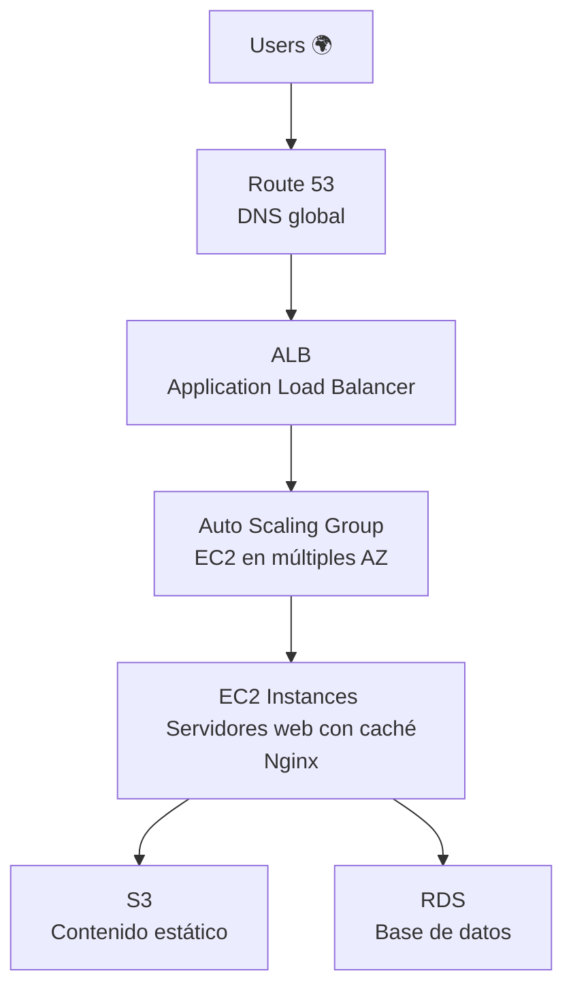
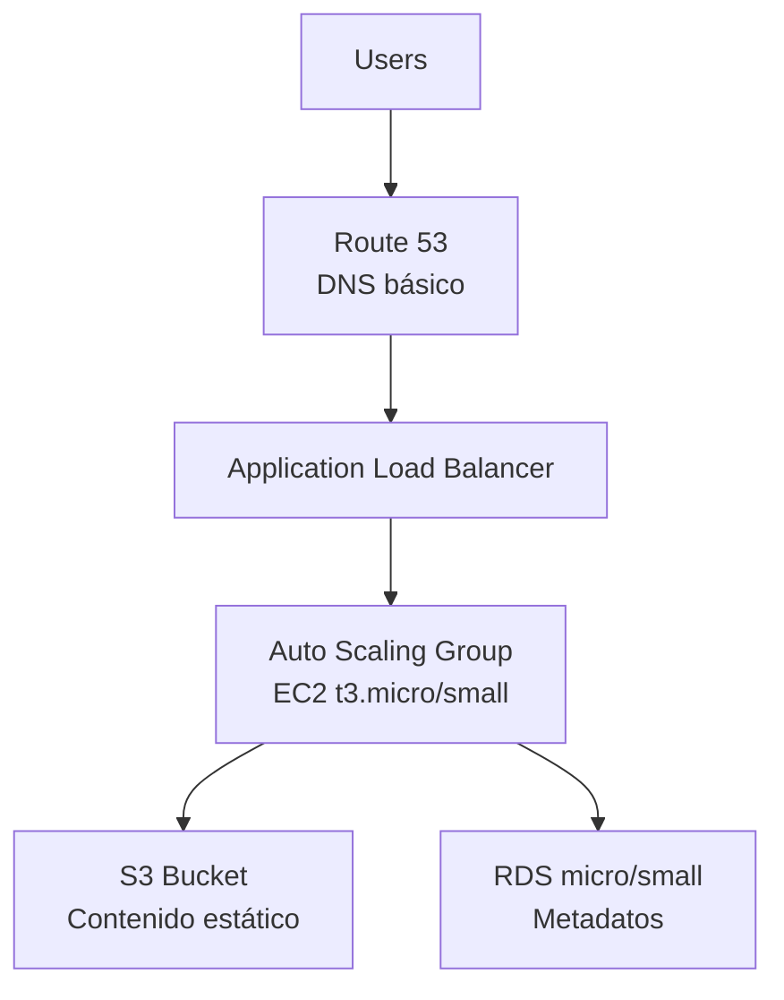
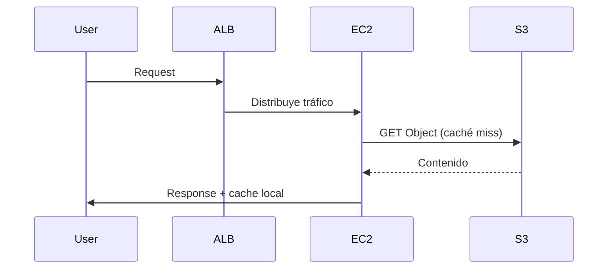

# 🧠 Caso: Disponibilidad de Contenidos de Aplicaciones en Cloud - MediaStream

## 1️⃣ Análisis del Escenario Actual

### Problemas Identificados
- ❌ Alta **latencia** en la entrega de contenido multimedia.
- ❌ **Caídas de servicio** durante picos de demanda.
- ❌ Usuarios sin acceso desde ciertas regiones.
- ❌ Infraestructura monolítica no escalable ni distribuida.

### Riesgos de No Actuar
- 📉 Pérdida de usuarios y reputación por indisponibilidad.
- 💸 Costos adicionales por interrupciones no planificadas.
- ⚠️ Problemas legales si contenidos sensibles quedan expuestos.
- 🔒 Vulnerabilidades al no tener controles de seguridad modernos.

---

## 2️⃣ Propuesta de Arquitectura Cloud

### 🌐 Arquitectura General



### 🧱 Servicios Utilizados

| Servicio         | Rol en la Arquitectura                               |
|------------------|------------------------------------------------------|
| **Route 53**     | DNS inteligente, balanceo geográfico y failover     |
| **CloudFront**   | CDN para baja latencia global y cache del contenido |
| **ALB**          | Balanceo de tráfico HTTP/HTTPS                      |
| **EC2 Auto Scaling** | Escalado horizontal automático de backend        |
| **S3**           | Almacenamiento de archivos multimedia               |
| **RDS**          | Base de datos relacional escalable                  |
| **IAM + HTTPS**  | Seguridad de acceso y cifrado de datos              |

### 🧷 Opcional: AWS Direct Connect
- Uso recomendado si MediaStream ya posee infraestructura on-premise crítica.
- Justificado para:
  - Procesamiento local de grandes volúmenes de datos.
  - Alta seguridad o baja latencia requerida hacia la nube.
  - Interoperabilidad con sistemas legacy.

---

## 3️⃣ Protección de Contenidos

### Contenidos Sensibles
- Videos exclusivos de suscripción.
- Archivos multimedia con derechos de autor.
- Datos personales de usuarios.

### Mecanismos de Protección
1. 🔐 **CloudFront Signed URLs/Cookies**: para controlar acceso a contenidos.
2. 🔒 **IAM + Bucket Policies**: solo acceso desde CloudFront y ALB.
3. 📈 **HTTPS en toda la cadena**: en CDN, balanceador, backend y S3.
4. 👤 **Cognito o JWT tokens**: autenticación y autorización de usuarios.

---

## 4️⃣ Justificación Técnica

| Servicio         | Razón de selección                                       |
|------------------|----------------------------------------------------------|
| **Route 53**     | DNS resiliente, permite routing basado en latencia      |
| **CloudFront**   | Reduce carga del backend, mejora latencia global        |
| **ALB**          | Distribuye tráfico y soporta routing avanzado            |
| **Auto Scaling** | Escala según demanda sin intervención manual            |
| **S3**           | Escalable, económico y altamente disponible             |
| **RDS**          | Administración simplificada, escalabilidad automática   |

✅ **Resultado**:
- 📈 Mejora en escalabilidad automática.
- 💡 Reducción de latencia mediante CDN.
- 💪 Alta disponibilidad con Multi-AZ.
- 🔒 Seguridad en cada capa (red, acceso, contenidos).

---

## 5️⃣ Costos y Rendimiento

### Factores a Considerar
| Aspecto               | Consideración                                           |
|------------------------|--------------------------------------------------------|
| 💰 **Costos de EC2**   | Usar `t3/t4g` burstables con escalado controlado.      |
| 💾 **S3**              | Costos por almacenamiento y requests.                 |
| 🌍 **CloudFront**      | Reduce costos en EC2 al cachear contenido.            |
| 📶 **Transferencia**   | Control de datos salientes hacia internet.            |
| 📊 **Monitoring**      | Uso de CloudWatch para ajustar métricas de escalado.  |

🔁 **Optimización posible**:
- Cache intensivo con CloudFront.
- Compresión de medios.
- Auto Scaling con políticas conservadoras.

---

# Solución Adaptada para AWS Learner Lab (Considerando Limitaciones)
Basado en las limitaciones del AWS Learner Lab (sin CloudFront, restricciones en regiones y tipos de instancia), propongo esta arquitectura alternativa viable:

## 🛠️ Arquitectura Adaptada para Learner Lab


## 🔄 Cambios Clave por Restricciones
1. Sustitución de CloudFront:
    - Implementar Nginx como caché local en instancias EC2
    - Usar S3 Transfer Acceleration (disponible en Learner Lab) para mejorar velocidad de descargas
2. Ajuste de Capacidad:
    - EC2: Máx 9 instancias (t3.micro/small)
    - RDS: Solo nano/micro/small
    - Regiones: Solo us-east-1 o us-west-2


## 📝 Propuesta Técnica Ajustada
| Servicio        | Uso Adaptado                             | Limitación Learner Lab        |
|-----------------|-------------------------------------------|-------------------------------|
| Route 53        | DNS básico (sin geolocalización)         | Funcionalidad básica          |
| ALB             | Balanceo entre AZs                       | Sin restricciones             |
| EC2 Auto Scaling| Máx 9 instancias t3.micro/small          | 32 vCPU total                 |
| S3              | Almacenamiento + Transfer Acceleration   | Sin Glacier                   |
| RDS             | Instancia micro con Multi-AZ             | Hasta 100GB gp2               |
---

## 🔐 Protección de Contenidos (Alternativas)
1. Control de Acceso:
    - Bucket Policies con restricción por VPC
    - IAM Roles (usar LabRole disponible)
2. Encriptación:
```python
s3.upload_file(..., ExtraArgs={'ServerSideEncryption': 'AES256'})
```
3. Autenticación:
    - Implementar JWT tokens en aplicación
    - Usar Secrets Manager para credenciales

## 💡 Recomendaciones para Implementación en Learner Lab
1. Patrón de Diseño:


2. Configuración Auto Scaling:
```bash
# Política básica para Learner Lab
aws autoscaling put-scaling-policy \
  --policy-name ScaleOut \
  --auto-scaling-group-name MyASG \
  --scaling-adjustment 2 \
  --adjustment-type ChangeInCapacity
```

3. Monitoreo de Costos:
    - Usar AWS Budgets con alerta al 80% del límite
    - Eliminar recursos no esenciales diariamente

## ⚖️ Balance Costo-Rendimiento
| Estrategia             | Beneficio                          | Implementación en Learner Lab               |
|------------------------|------------------------------------|---------------------------------------------|
| Instancias Spot        | Ahorro hasta 90%                   | No disponible en Learner Lab                |
| S3 Intelligent Tiering | Optimiza costos almacenamiento     | Usar solo Standard                          |
| Compresión GZIP        | Reduce transferencia               | Habilitar en Nginx                          |
| Auto Scaling agresivo  | Respuesta rápida a demanda         | Limitar a 9 instancias                      |
---

## 📌 Conclusión
Esta solución adaptada:
- ✅ Cumple con los límites del Learner Lab
- ✅ Provee alta disponibilidad dentro de lo posible
- ✅ Implementa caching alternativo sin CloudFront
- ✅ Mantiene seguridad básica con IAM Roles

**Nota clave**: Para producción real, se recomendaría la arquitectura original con CloudFront, pero esta versión es totalmente funcional para fines educativos dentro de las restricciones del lab.

---

# ✅ Implementación Paso a Paso – Arquitectura Adaptada para AWS Learner Lab
Esta sección guía la creación manual de los componentes clave usando la consola de AWS o comandos compatibles.


---

## **1. VPC: Virtual Private Cloud**
### mediastream-vpc
- **VPC settings**: VPC and more
- **Name**: mediastream
- **IPv4 CIDR block**: 10.0.0.0/16
- **IPv6 CIDR block**: No IPv6 CIDR block
- **Tenancy**: Default
- **Number of Availability Zones**: 2
- **Customize AZs**:
  - us-east-1a
  - us-east-1b
- **Number of public subnets**: 2
- **Number of private subnets**: 2
- **Customize subnets CIDR blocks**:
  - Public subnet CIDR block in us-east-1a: 10.0.0.0/20
  - Public subnet CIDR block in us-east-1b: 10.0.16.0/20
  - Private subnet CIDR block in us-east-1a: 10.0.128.0/20
  - Private subnet CIDR block in us-east-1b: 10.0.144.0/20
- **NAT gateways**: In 1 AZ
- **VPC endpoints**: None
- **Enable DNS hostnames**: Check
- **Enable DNS resolution**: Check

---

## 2. Security Groups:
### mediastream-sg-firewall
- **Name**: mediastream-sg-firewall
- **Description**: firewall
- **VPC**: mediastream-vpc
- **Inbound rules**:
  - SSH
    - Type: SSH
    - Protocol: TCP
    - Port range: 22
    - Destination type: Anywhere-IPv4
    - Destination: 0.0.0.0/0 (MyIP)
    - Description: Acceso desde SSH
  - Escritorio Remoto
    - Type: SSH
    - Protocol: RDP
    - Port range: 3389
    - Destination type: Anywhere-IPv4
    - Destination: 0.0.0.0/0 (MyIP)
    - Description: Acceso desde Escritorio Remoto
  - HTTP
    - Type: HTTP
    - Protocol: TCP
    - Port range: 80
    - Destination type: Anywhere-IPv4
    - Destination: 0.0.0.0/0
    - Description: Acceso web
  - HTTPS
    - Type: HTTPS
    - Protocol: TCP
    - Port range: 443
    - Destination type: Anywhere-IPv4
    - Destination: 0.0.0.0/0
    - Description: Acceso web
- **Outbound rules**:
  - Outbound
    - Type: All traffic
    - Protocol: all
    - Port range: all
    - Destination type: Custom
    - Destination: 0.0.0.0/0
    - Description: 

### mediastream-sg-lb
- **Name**: mediastream-sg-lb
- **Description**: load balancer
- **VPC**: mediastream-vpc
- **Inbound rules**:
  - HTTP
    - Type: HTTP
    - Protocol: TCP
    - Port range: 80
    - Destination type: Anywhere-IPv4
    - Destination: 0.0.0.0/0
    - Description: Acceso web
- **Outbound rules**:
  - Outbound
    - Type: All traffic
    - Protocol: all
    - Port range: all
    - Destination type: Custom
    - Destination: 0.0.0.0/0
    - Description: 

### artema-sg-rds
- **Name**: mediastream-sg-rds
- **Description**: postgresql
- **VPC**: mediastream-vpc
- **Inbound rules**:
  - PostgreSQL
    - Type: PostgreSQL
    - Protocol: TCP
    - Port range: 5432
    - Destination type: Custom
    - Destination: 0.0.0.0/0
    - Description: Acceso a PostgreSQL
- **Outbound rules**:
  - Outbound
    - Type: All traffic
    - Protocol: all
    - Port range: all
    - Destination type: Custom
    - Destination: 0.0.0.0/0
    - Description: 
securit
### PuTTY
- Session
    - HostName: BastionIP
- Connection
    - Seconds: 30
    - SSH
        - Auth
            - Credentials
                - Private Key: artema-key.ppk
        - Tunnels      
            - Source port: 5433
            - Destination: RDS-Endpoint + : + 5432
### Console
```bash
ec2-user
```
---

## **3. S3: Almacenamiento Estático**
### Bucket: mediastream-s3-storage
- **Region**: us-east-1
- **Name**: mediastream-s3-storage
- **Object Ownership**: ACLs desactivados
- **Block all public access**: ❌ (desactivado solo si usas políticas restrictivas)
- **Versioning**: Desactivado
- **Encryption**: SSE-S3
- **Bucket Key**: Disable
- **Create bucket**
- **Properties**:
  - **Static website hosting**: ✅ Activado
  - **Hosting type**: Host a static website
  - **Index document**: index.html
  - **Error document**: error.html
  - **Save changes**
- **Permissions**:
  - **Bucket Policy**:
```json
{
    "Version": "2012-10-17",
    "Statement": [
        {
            "Sid": "PublicReadGetObject",
            "Effect": "Allow",
            "Principal": {
                "AWS": "arn:aws:iam::992136605746:role/LabRole"
            },
            "Action": [
                "s3:GetObject",
                "s3:ListBucket"
            ],
            "Resource": [
                "arn:aws:s3:::mediastream-s3-storage",
                "arn:aws:s3:::mediastream-s3-storage/*"
            ]
        }
    ]
}
```

```
S3
└── Bucket: mediastream-s3-storage
    ├── css/
    │   └── style.css
    ├── data/
    │   └── characters.json
    ├── img/
    │   ├── biscuit.webp
    │   ├── chrollo.webp
    │   ├── gon.webp
    │   ├── hisoka.webp
    │   ├── killua.webp               
    │   ├── kurapika.webp
    │   └── leorio.webp
    ├── js/
    │   └── script.js        
    ├── error.html
    └── index.html
```

---

## **4. SNS**: Simple Notification Service 
### Topics
- **Topics**: Standard
- **Name**: mediastream-sns

### Create subscription
- **Topic ARN**: mediastream-sns
- **Protocol**: mail@mail.cl

---

## **5. EC2 Auto Scaling**
### 5.1 Launch template
- **Name**: mediastream-lt-ec2
- **Description**: Plantilla base para instancias
- **OS Images**: Amazon Linux
- **Amazon Machine Image**: Amazon Linux 2023 kernel-6.1 AMI
- **Instance type**: t3.micro
- **Key pair**: vockey (.ppk)
- **Subnet**: Don't include in launch template
- **Availability Zone**: Don't include in launch template
- **security groups**: mediastream-sg-firewall
- **Advanced network configuration**:
  - **Auto-assign public IP**: Enable
- **Resource tags**
  - **Key**: Name
  - **Value**: mediastream-ec2-web
  - **Resource types**: Instances
- **Advanced details**:
  - **IAM instance profile**: LabInstanceProfile
  - **User data**
```bash
#!/bin/bash
yum update -y
yum install nginx -y
yum install awscli -y
aws s3 sync s3://mediastream-s3-storage/ /usr/share/nginx/html/
chown -R nginx:nginx /usr/share/nginx/html/
chmod -R 755 /usr/share/nginx/html/
systemctl stop httpd
systemctl disable httpd
systemctl enable nginx
systemctl start nginx
```

### 5.2 Target Groups
- **target type**: Instances
- **Name**: mediastream-tg-ec2
- **Protocol**: HTTP
- **Port**: 80
- **VPC**: mediastream-vpc
- **Health check protocol**: HTTP 
- **Health check path**: /
- **Advanced health check settings**:
  - **Traffic port**: check
  - **Healthy threshold**: 5
  - **Unhealthy threshold**: 2
  - **Timeout**: 5
  - **Interval**: 30

### 5.3 Load Balancers
- **Load balancer types**: Application Load Balancer
- **Name**: mediastream-lb-ec2
- **Scheme**: Internal
- **Load balancer IP address type**: IPv4
- **VPC**: mediastream-vpc
- **us-east-1a (use1-az4)**: mediastream-subnet-public1-us-east-1a
- **us-east-1b (use1-az6)**: mediastream-subnet-public2-us-east-1b
- **Security groups**: mediastream-sg-lb
- **Protocol**: HTTP
- **Port**: 80
- **Default action (target group)**: mediastream-tg-ec2

### 5.4 Auto Scaling Groups
- **Name**: mediastream-asg
- **Launch template**: mediastream-lt-ec2
- **VPC**: mediastream-vpc
- **Availability Zones and subnets**:
  - mediastream-subnet-public1-us-east-1a 
  - mediastream-subnet-public2-us-east-1b
- **Availability Zone distribution**: Balanced best effort
- **Load balancing**: Attach to an existing load balancer
- **Attach to an existing load balancer**: Choose from your load balancer target groups
- **Existing load balancer target groups**: mediastream-tg-ec2 | HTTP
- **Select VPC Lattice service to attach**: 
No VPC Lattice service
- **Health check**:
  - **Turn on Elastic Load Balancing health checks**: check
- **Health check grace period**: 30
- **Desired capacity** : 1
- **Min desired capacity**: 1
- **Max desired capacit**y: 4
- **Choose whether to use a target tracking policy**: Target tracking scaling policy
- **Scaling policy name**: mediastream-policy-ec2
- **Metric type**: Average CPU utilization
- **Target value**: 80
- **Instance warmup**: 30
- **Disable scale in to create only a scale-out policy** uncheck
- **Additional settings**:
  - **Enable group metrics collection within CloudWatch**: check
- **Add notifications**: mediastream-sns

---

## **6. RDS**: Relational Database Service (servicio de base de datos)
### DRS Subnet Group
- **Name**: mediastream-rds-sng
- **Description**: Private subnet group para PostgreSQL
- **VPC**: artema-vpc
- **Availability Zones**:
    - us-east-1a
    - us-east-1b
- **Subnets**:
    - mediastream-subnet-private1-us-east-1a
    - mediastream-subnet-private2-us-east-1b

### PostgreSQL
- **Creation method**: Standard create
- **Engine type**: PostgreSQL
- **Templates**: Dev/Test
- **Availability and durability**: Multi-AZ DB instance deployment (2 instances)
- **DB instance**: mediastream-pgdb
- **Master username**: postgres
- **Credentials management**: ********
- **Instance configuration**:
    - Burstable classes (includes t classes)
    - db.t3.micro
- **Allocated storage**: 3GiB
- **Connectivity**: none
- **Compute resource**: none
- **VPC**: artema-vpc
- **DB subnet group**: artema-rds-sng
- **Public access**: No
- **Security groups**: artema-sg-rds
- **Enhanced Monitoring**: Disabled  

```sql
CREATE TABLE personajes_hxh (
    id SERIAL PRIMARY KEY,
    nombre VARCHAR(100) NOT NULL,
    tipo_nen VARCHAR(50) NOT NULL,
    edad INT NOT NULL,
    descripcion TEXT,
    img VARCHAR(100)
);
```

```sql
INSERT INTO personajes_hxh 
    (nombre, tipo_nen, edad, descripcion, img)
VALUES
    ('Gon Freecss', 'Enhancer', 12, 'Protagonista, con gran talento natural para el Nen.', 'gon.webp'),
    ('Killua Zoldyck', 'Transmuter', 12, 'Hijo de la familia asesina Zoldyck, amigo cercano de Gon.', 'killua.webp'),
    ('Kurapika', 'Conjurer', 17, 'Último sobreviviente del clan Kurta, busca venganza.', 'kurapika.webp'),
    ('Leorio Paradinight', 'Emitter', 19, 'Aspira a ser médico, es valiente y decidido.', 'leorio.webp'),
    ('Hisoka Morow', 'Transmuter', 28, 'Antagonista impredecible, disfruta de la pelea.', 'hisoka.webp'),
    ('Chrollo Lucilfer', 'Specialist', 30, 'Líder de la banda de ladrones Fantasma.', 'chrollo.webp'),
    ('Biscuit Krueger', 'Enhancer', 30, 'Maestra experimentada con apariencia joven.', 'biscuit.webp');
```

---

## **7. Route 53**: DNS
### Hosted zones
- **Domain name**: mediastreamlab.com
- **Description**: Dominio MediaStreamLab publico
- **Type**: Public hosted zone

### Create record
- **Record name**: www
- **Record type**: A – Routes traffic to an IPv4 address and some AWS resources
- **Alias**: check
- **Route traffic to**: 
  - Alias to Application and Classic Load Balancer
  - US East (N. Virginia) us-east-1
  - mediastream-lb-ec2
- **Routing policy**: Simple routing

### NS record (Copiar DNS a proveedor de dominio)
- **Value**:
  - ns-85.awsdns-10.com.
  - ns-1332.awsdns-38.org.
  - ns-1891.awsdns-44.co.uk.
  - ns-519.awsdns-00.net.

---

## **8. Certificate Manager**: SSL
### Request
- **Request a public certificate**: check
- **Fully qualified domain name**: 
  - mediastreamlab.com
  - www.mediastreamlab.com
- **DNS validation**: check
- **RSA 2048**: check

---

## **9. Billing and Cost Management**: Monitoreo y Costos
- **AWS Budgets**: Configurar alerta al 80% del presupuesto
- **CloudWatch**: Monitoreo de CPU y escalado
- **Tag Editor**: Eliminar recursos con etiquetas diarias

💡 Recomendación: evitar Glacier, no disponible. Usar solo `gp2` o `gp3` en EBS y RDS.

> [!WARNING] AWS Alchemy Lab no lo permite
---
