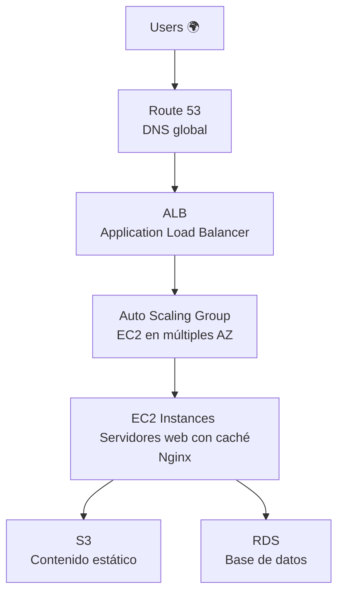
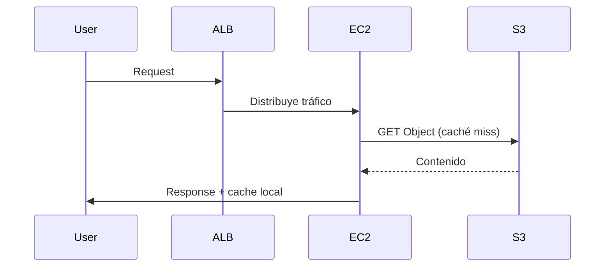

# 🧠 Caso: Disponibilidad de Contenidos de Aplicaciones en Cloud - MediaStream

## 1️⃣ Análisis del Escenario Actual

### Problemas Identificados
- ❌ Alta **latencia** en la entrega de contenido multimedia.
- ❌ **Caídas de servicio** durante picos de demanda.
- ❌ Usuarios sin acceso desde ciertas regiones.
- ❌ Infraestructura monolítica no escalable ni distribuida.

### Riesgos de No Actuar
- 📉 Pérdida de usuarios y reputación por indisponibilidad.
- 💸 Costos adicionales por interrupciones no planificadas.
- ⚠️ Problemas legales si contenidos sensibles quedan expuestos.
- 🔒 Vulnerabilidades al no tener controles de seguridad modernos.

---

## 2️⃣ Propuesta de Arquitectura Cloud

### 🌐 Arquitectura General



### 🧱 Servicios Utilizados

| Servicio         | Rol en la Arquitectura                               |
|------------------|------------------------------------------------------|
| **Route 53**     | DNS inteligente, balanceo geográfico y failover     |
| **CloudFront**   | CDN para baja latencia global y cache del contenido |
| **ALB**          | Balanceo de tráfico HTTP/HTTPS                      |
| **EC2 Auto Scaling** | Escalado horizontal automático de backend        |
| **S3**           | Almacenamiento de archivos multimedia               |
| **RDS**          | Base de datos relacional escalable                  |
| **IAM + HTTPS**  | Seguridad de acceso y cifrado de datos              |

### 🧷 Opcional: AWS Direct Connect
- Uso recomendado si MediaStream ya posee infraestructura on-premise crítica.
- Justificado para:
  - Procesamiento local de grandes volúmenes de datos.
  - Alta seguridad o baja latencia requerida hacia la nube.
  - Interoperabilidad con sistemas legacy.

---

## 3️⃣ Protección de Contenidos

### Contenidos Sensibles
- Videos exclusivos de suscripción.
- Archivos multimedia con derechos de autor.
- Datos personales de usuarios.

### Mecanismos de Protección
1. 🔐 **CloudFront Signed URLs/Cookies**: para controlar acceso a contenidos.
2. 🔒 **IAM + Bucket Policies**: solo acceso desde CloudFront y ALB.
3. 📈 **HTTPS en toda la cadena**: en CDN, balanceador, backend y S3.
4. 👤 **Cognito o JWT tokens**: autenticación y autorización de usuarios.

---

## 4️⃣ Justificación Técnica

| Servicio         | Razón de selección                                       |
|------------------|----------------------------------------------------------|
| **Route 53**     | DNS resiliente, permite routing basado en latencia      |
| **CloudFront**   | Reduce carga del backend, mejora latencia global        |
| **ALB**          | Distribuye tráfico y soporta routing avanzado            |
| **Auto Scaling** | Escala según demanda sin intervención manual            |
| **S3**           | Escalable, económico y altamente disponible             |
| **RDS**          | Administración simplificada, escalabilidad automática   |

✅ **Resultado**:
- 📈 Mejora en escalabilidad automática.
- 💡 Reducción de latencia mediante CDN.
- 💪 Alta disponibilidad con Multi-AZ.
- 🔒 Seguridad en cada capa (red, acceso, contenidos).

---

## 5️⃣ Costos y Rendimiento

### Factores a Considerar
| Aspecto               | Consideración                                           |
|------------------------|--------------------------------------------------------|
| 💰 **Costos de EC2**   | Usar `t3/t4g` burstables con escalado controlado.      |
| 💾 **S3**              | Costos por almacenamiento y requests.                 |
| 🌍 **CloudFront**      | Reduce costos en EC2 al cachear contenido.            |
| 📶 **Transferencia**   | Control de datos salientes hacia internet.            |
| 📊 **Monitoring**      | Uso de CloudWatch para ajustar métricas de escalado.  |

🔁 **Optimización posible**:
- Cache intensivo con CloudFront.
- Compresión de medios.
- Auto Scaling con políticas conservadoras.

---

# Solución Adaptada para AWS Learner Lab (Considerando Limitaciones)
Basado en las limitaciones del AWS Learner Lab (sin CloudFront, restricciones en regiones y tipos de instancia), propongo esta arquitectura alternativa viable:

## 🛠️ Arquitectura Adaptada para Learner Lab
```mermaid
flowchart TD
    A[Users] --> B[Route 53<br/>(DNS básico)]
    B --> C[Application Load Balancer]
    C --> D[Auto Scaling Group<br/>(EC2 t3.micro/small)]
    D --> E[S3 Bucket<br/>(Contenido estático)]
    D --> F[RDS micro/small<br/>(Metadatos)]
```

## 🔄 Cambios Clave por Restricciones
1. Sustitución de CloudFront:
    - Implementar Nginx como caché local en instancias EC2
    - Usar S3 Transfer Acceleration (disponible en Learner Lab) para mejorar velocidad de descargas
2. Ajuste de Capacidad:
    - EC2: Máx 9 instancias (t3.micro/small)
    - RDS: Solo nano/micro/small
    - Regiones: Solo us-east-1 o us-west-2


## 📝 Propuesta Técnica Ajustada
| Servicio        | Uso Adaptado                             | Limitación Learner Lab        |
|-----------------|-------------------------------------------|-------------------------------|
| Route 53        | DNS básico (sin geolocalización)         | Funcionalidad básica          |
| ALB             | Balanceo entre AZs                       | Sin restricciones             |
| EC2 Auto Scaling| Máx 9 instancias t3.micro/small          | 32 vCPU total                 |
| S3              | Almacenamiento + Transfer Acceleration   | Sin Glacier                   |
| RDS             | Instancia micro con Multi-AZ             | Hasta 100GB gp2               |
---

## 🔐 Protección de Contenidos (Alternativas)
1. Control de Acceso:
    - Bucket Policies con restricción por VPC
    - IAM Roles (usar LabRole disponible)
2. Encriptación:
```python
s3.upload_file(..., ExtraArgs={'ServerSideEncryption': 'AES256'})
```
3. Autenticación:
    - Implementar JWT tokens en aplicación
    - Usar Secrets Manager para credenciales

## 💡 Recomendaciones para Implementación en Learner Lab
1. Patrón de Diseño:


2. Configuración Auto Scaling:
```bash
# Política básica para Learner Lab
aws autoscaling put-scaling-policy \
  --policy-name ScaleOut \
  --auto-scaling-group-name MyASG \
  --scaling-adjustment 2 \
  --adjustment-type ChangeInCapacity
```

3. Monitoreo de Costos:
    - Usar AWS Budgets con alerta al 80% del límite
    - Eliminar recursos no esenciales diariamente

## ⚖️ Balance Costo-Rendimiento
| Estrategia             | Beneficio                          | Implementación en Learner Lab               |
|------------------------|------------------------------------|---------------------------------------------|
| Instancias Spot        | Ahorro hasta 90%                   | No disponible en Learner Lab                |
| S3 Intelligent Tiering | Optimiza costos almacenamiento     | Usar solo Standard                          |
| Compresión GZIP        | Reduce transferencia               | Habilitar en Nginx                          |
| Auto Scaling agresivo  | Respuesta rápida a demanda         | Limitar a 9 instancias                      |
---

## 📌 Conclusión
Esta solución adaptada:
- ✅ Cumple con los límites del Learner Lab
- ✅ Provee alta disponibilidad dentro de lo posible
- ✅ Implementa caching alternativo sin CloudFront
- ✅ Mantiene seguridad básica con IAM Roles

**Nota clave**: Para producción real, se recomendaría la arquitectura original con CloudFront, pero esta versión es totalmente funcional para fines educativos dentro de las restricciones del lab.

---

# ✅ Implementación Paso a Paso – Arquitectura Adaptada para AWS Learner Lab
Esta sección guía la creación manual de los componentes clave usando la consola de AWS o comandos compatibles.

## 1. VPC: Virtual Private Cloud
### mediastream-vpc
- **VPC settings**: VPC and more
- **Name**: mediastream
- **IPv4 CIDR block**: 10.0.0.0/16
- **IPv6 CIDR block**: No IPv6 CIDR block
- **Tenancy**: Default
- **Number of Availability Zones**: 2
- **Customize AZs**:
  - us-east-1a
  - us-east-1b
- **Number of public subnets**: 2
- **Number of private subnets**: 2
- **Customize subnets CIDR blocks**:
  - Public subnet CIDR block in us-east-1a: 10.0.0.0/20
  - Public subnet CIDR block in us-east-1b: 10.0.16.0/20
  - Private subnet CIDR block in us-east-1a: 10.0.128.0/20
  - Private subnet CIDR block in us-east-1b: 10.0.144.0/20
- **NAT gateways**: 1 per AZ
- **VPC endpoints**: None
- **Enable DNS hostnames**: Check
- **Enable DNS resolution**: Check

## 2. S3: Almacenamiento Estático
### Bucket: mediastream-s3-storage
- **Region**: us-east-1
- **Name**: mediastream-s3-storage
- **Object Ownership**: ACLs desactivados
- **Block all public access**: ❌ (desactivado solo si usas políticas restrictivas)
- **Versioning**: Desactivado
- **Encryption**: SSE-S3
- **Static website hosting**: ✅ Activado
  - **Index document**: index.html
  - **Error document**: error.html
- **Bucket Policy**:
```json
{
  "Version": "2012-10-17",
  "Statement": [
    {
      "Sid": "PublicReadGetObject",
      "Effect": "Allow",
      "Principal": "*",
      "Action": "s3:GetObject",
      "Resource": "arn:aws:s3:::mediastream-s3-storage/*"
    }
  ]
}
```

---

## **3. EC2 Auto Scaling Group**
### Plantilla de Lanzamiento
- AMI: Amazon Linux 2 o equivalente con Nginx
- Tipo de instancia: t3.micro
- Par de llaves: vockey (en us-east-1)
- IAM Role: LabRole
- User Data:
```bash
#!/bin/bash
yum update -y
amazon-linux-extras install nginx1 -y
systemctl enable nginx
systemctl start nginx
```

### Auto Scaling Group
- Min instances: 2
- Max instances: 6 (límite de vCPU)
- Health check: EC2 + ALB
- Escalado:
  - Política de incremento: +2 instancias al 70% CPU
  - Política de decremento: -1 instancia al 30% CPU

---

## **4. Application Load Balancer (ALB)**
- Tipo: Internet-facing
- Listeners: HTTP (puerto 80), HTTPS (443 si tienes certificado)
- Target Group: EC2 Auto Scaling Group
- Health checks: HTTP / (raíz)
- Subnets: públicas de las AZs
- Security Group: permitir tráfico HTTP/HTTPS desde 0.0.0.0/0

---

## 5. RDS: Base de Datos
### PostgreSQL / MySQL
- Tipo de instancia: db.t3.micro
- Multi-AZ: ✅ Activado
- Storage: gp2, 20–50 GB
- Backup: 7 días
- VPC: mediastream-vpc
- Subnets: privadas
- Acceso: solo desde las instancias EC2 (por SG)

💡 **Nota**: Crear un Security Group que permita acceso en el puerto 3306 (MySQL) o 5432 (PostgreSQL) solo desde las EC2.

---

## 6. Route 53: DNS
- Crear zona hospedada pública: ej. `mediastreamlab.com`
- Crear registros A:
  - `www` → ALB DNS Name
- Opción: crear un registro con redirección HTTP a HTTPS si se habilita SSL

⚠️ Solo funciones básicas disponibles en Learner Lab (sin routing geográfico).

---

## 7. Seguridad: IAM y Contenidos
## **Seguridad de Contenidos**
1. **IAM Role**: usar `LabRole` preconfigurado
2. **Encriptación S3**:
```python
s3.upload_file(..., ExtraArgs={'ServerSideEncryption': 'AES256'})
```
3. **Autenticación**:
    - Implementar JWT en backend
    - Guardar secretos (DB, tokens) en AWS Secrets Manager
4. **Restricciones en S3**:
    - Aplicar políticas de bucket para acceso solo desde VPC o IP de EC2 si es necesario

---

### **8. Monitoreo y Costos**
- **AWS Budgets**: Configurar alerta al 80% del presupuesto
- **CloudWatch**: Monitoreo de CPU y escalado
- **Tag Editor**: Eliminar recursos con etiquetas diarias

💡 Recomendación: evitar Glacier, no disponible. Usar solo `gp2` o `gp3` en EBS y RDS.

---
