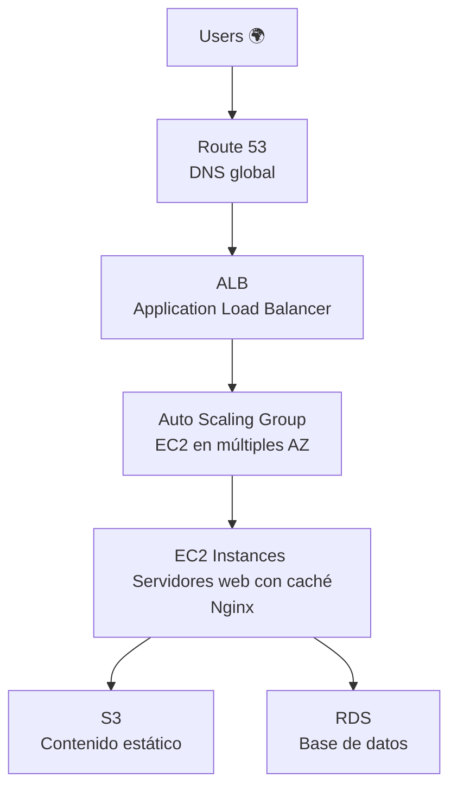

# 🧠 Caso: Disponibilidad de Contenidos de Aplicaciones en Cloud - MediaStream

## 1️⃣ Análisis del Escenario Actual

### Problemas Identificados
- ❌ Alta **latencia** en la entrega de contenido multimedia.
- ❌ **Caídas de servicio** durante picos de demanda.
- ❌ Usuarios sin acceso desde ciertas regiones.
- ❌ Infraestructura monolítica no escalable ni distribuida.

### Riesgos de No Actuar
- 📉 Pérdida de usuarios y reputación por indisponibilidad.
- 💸 Costos adicionales por interrupciones no planificadas.
- ⚠️ Problemas legales si contenidos sensibles quedan expuestos.
- 🔒 Vulnerabilidades al no tener controles de seguridad modernos.

---

## 2️⃣ Propuesta de Arquitectura Cloud

### 🌐 Arquitectura General


```mermaid
flowchart TD
    A[Users 🌍] --> B[Route 53 <br/> DNS global]
    B --> C[ALB <br/> Application Load Balancer]
    C --> D[Auto Scaling Group <br/> EC2 en múltiples AZ]
    D --> E[EC2 Instances <br/> Servidores web con caché Nginx]
    E --> F[S3 <br/> Contenido estático]
    E --> G[RDS <br/> Base de datos]
```

### 🧱 Servicios Utilizados

| Servicio         | Rol en la Arquitectura                               |
|------------------|------------------------------------------------------|
| **Route 53**     | DNS inteligente, balanceo geográfico y failover     |
| **CloudFront**   | CDN para baja latencia global y cache del contenido |
| **ALB**          | Balanceo de tráfico HTTP/HTTPS                      |
| **EC2 Auto Scaling** | Escalado horizontal automático de backend        |
| **S3**           | Almacenamiento de archivos multimedia               |
| **RDS**          | Base de datos relacional escalable                  |
| **IAM + HTTPS**  | Seguridad de acceso y cifrado de datos              |

### 🧷 Opcional: AWS Direct Connect
- Uso recomendado si MediaStream ya posee infraestructura on-premise crítica.
- Justificado para:
  - Procesamiento local de grandes volúmenes de datos.
  - Alta seguridad o baja latencia requerida hacia la nube.
  - Interoperabilidad con sistemas legacy.

---

## 3️⃣ Protección de Contenidos

### Contenidos Sensibles
- Videos exclusivos de suscripción.
- Archivos multimedia con derechos de autor.
- Datos personales de usuarios.

### Mecanismos de Protección
1. 🔐 **CloudFront Signed URLs/Cookies**: para controlar acceso a contenidos.
2. 🔒 **IAM + Bucket Policies**: solo acceso desde CloudFront y ALB.
3. 📈 **HTTPS en toda la cadena**: en CDN, balanceador, backend y S3.
4. 👤 **Cognito o JWT tokens**: autenticación y autorización de usuarios.

---

## 4️⃣ Justificación Técnica

| Servicio         | Razón de selección                                       |
|------------------|----------------------------------------------------------|
| **Route 53**     | DNS resiliente, permite routing basado en latencia      |
| **CloudFront**   | Reduce carga del backend, mejora latencia global        |
| **ALB**          | Distribuye tráfico y soporta routing avanzado            |
| **Auto Scaling** | Escala según demanda sin intervención manual            |
| **S3**           | Escalable, económico y altamente disponible             |
| **RDS**          | Administración simplificada, escalabilidad automática   |

✅ **Resultado**:
- 📈 Mejora en escalabilidad automática.
- 💡 Reducción de latencia mediante CDN.
- 💪 Alta disponibilidad con Multi-AZ.
- 🔒 Seguridad en cada capa (red, acceso, contenidos).

---

## 5️⃣ Costos y Rendimiento

### Factores a Considerar
| Aspecto               | Consideración                                           |
|------------------------|--------------------------------------------------------|
| 💰 **Costos de EC2**   | Usar `t3/t4g` burstables con escalado controlado.      |
| 💾 **S3**              | Costos por almacenamiento y requests.                 |
| 🌍 **CloudFront**      | Reduce costos en EC2 al cachear contenido.            |
| 📶 **Transferencia**   | Control de datos salientes hacia internet.            |
| 📊 **Monitoring**      | Uso de CloudWatch para ajustar métricas de escalado.  |

🔁 **Optimización posible**:
- Cache intensivo con CloudFront.
- Compresión de medios.
- Auto Scaling con políticas conservadoras.

---

## 📝 Entregables

- ✅ Análisis de los problemas y riesgos.
- ✅ Diagrama conceptual de la arquitectura.
- ✅ Explicación de componentes.
- ✅ Mecanismos de protección de contenido.
- ✅ Justificación técnica.
- ✅ Consideraciones de costo y rendimiento.

---

## 🧩 Conclusión

La arquitectura propuesta resuelve los problemas actuales de MediaStream:
- Mejora la disponibilidad global de sus servicios.
- Ofrece escalabilidad automática y balanceo ante alta demanda.
- Protege los contenidos multimedia mediante controles robustos.
- Brinda una solución segura, resiliente y alineada con buenas prácticas de AWS.

---

##  Desarrollo

## **VPC**: Virtual Private Cloud
### mediastream-vpc
- **VPC settings**: VPC and more
- **Name**: mediastream
- **IPv4 CIDR block**: 10.0.0.0/16
- **IPv6 CIDR block**: No IPv6 CIDR block
- **Tenancy**: Default
- **Number of Availability Zones**: 2
- **Customize AZs**:
  - us-east-1a
  - us-east-1b
- **Number of public subnets**: 2
- **Number of private subnets**: 2
- **Customize subnets CIDR blocks**:
  - Public subnet CIDR block in us-east-1a: 10.0.0.0/20
  - Public subnet CIDR block in us-east-1b: 10.0.16.0/20
  - Private subnet CIDR block in us-east-1a: 10.0.128.0/20
  - Private subnet CIDR block in us-east-1b: 10.0.144.0/20
- **NAT gateways**: 1 per AZ
- **VPC endpoints**: None
- **Enable DNS hostnames**: Check
- **Enable DNS resolution**: Check

---

## **S3**: Storage
### backet mediastream-s3-storage
- **AWS Region**: us-east-1
- **Name**: mediastream-s3-storage
- **Object Ownership**: ACLs disabled
- **Block all public access**: uncheck
- **Bucket Versioning**: Disable
- **Encryption type**: SSE-S3
- **Bucket Key**: Disable
- **Properties**:
  - **Static website hosting**: Enable
  - **Host a static website**: Check
  - **Index document**: index.html
  - **Error document**: error.html
- **Permissions**:
  - **Bucket policy**
```json
{
  "Version": "2012-10-17",
  "Statement": [
    {
      "Sid": "PublicReadGetObject",
      "Effect": "Allow",
      "Principal": "*",
      "Action": "s3:GetObject",
      "Resource": "arn:aws:s3:::mediastream-s3-storage/*"
    }
  ]
}
```

---

## CloudFront (Sin Permisos)
### mediastream-cf-web
- **Name**: mediastream-cf-web
- **Description**: mediastream web
- **Distribution type**: Single website or app
- **Origin type**: Amazon S3
- **S3 origin**: mediastream-s3-storage.s3-website-us-east-1.amazonaws.com
- **Origin path**: 
- **Allow private S3 bucket access to CloudFront**: check
- **Origin settings**: Use recommended origin settings
- **Web Application Firewall**: Do not enable security protections

--- 

