# 💼 Implementación de una Arquitectura Monolítica

## 1. Desafío 🎯

### 📌 Sistemas de Mensajería en la Nube

Los **sistemas de mensajería en la nube** son servicios que permiten la
**comunicación asíncrona entre componentes de una aplicación**,
desacoplando procesos y mejorando la escalabilidad.\
Su importancia radica en que permiten manejar **grandes volúmenes de
datos**, garantizar la **entrega confiable de mensajes** y facilitar la
**integración de microservicios o aplicaciones monolíticas escalables**.

------------------------------------------------------------------------

### 📌 Amazon Simple Queue Service (SQS)

-   **Definición**: Servicio de colas gestionado por AWS para enviar,
    almacenar y recibir mensajes entre sistemas distribuidos.\
-   **Configuración básica**:
    1.  Crear una **cola SQS** desde la consola de AWS.\
    2.  Enviar mensajes a la cola utilizando la **SDK de AWS o la
        consola**.\
    3.  Recibir mensajes con consumidores que procesan y eliminan
        mensajes de la cola.\
    4.  Gestionar la cola configurando **políticas de acceso**,
        reintentos automáticos y **Dead Letter Queues (DLQ)** para
        mensajes fallidos.

------------------------------------------------------------------------

### 📌 Amazon Simple Notification Service (SNS)

-   **Definición**: Servicio de notificaciones que permite la
    **publicación y suscripción a mensajes** en tiempo real.\
-   **Configuración básica**:
    1.  Crear un **tema SNS** en la consola de AWS.\
    2.  Publicar mensajes en el tema mediante la consola o SDK.\
    3.  Suscribir **endpoints** (correo electrónico, SMS, colas SQS,
        funciones Lambda, etc.).\
    4.  Gestionar permisos de acceso mediante **políticas de control
        (IAM Policies)**.

------------------------------------------------------------------------

## 2. ¿Dónde se lleva a cabo? 👩‍💻

Este ejercicio se implementa en la plataforma **AWS Academy**, que
proporciona un entorno seguro para aprender y practicar con los
servicios de AWS.

---

## 3. Recursos 🛠

-   Manual: *Implementación de Servicios de Mensajería Cloud*\
-   Documentación oficial de AWS:
    -   [Amazon
        SQS](https://docs.aws.amazon.com/AWSSimpleQueueService/latest/SQSDeveloperGuide/welcome.html)\
    -   [Amazon
        SNS](https://docs.aws.amazon.com/sns/latest/dg/welcome.html)

---

## 4. Diagrama de Integración SQS + SNS

``` mermaid
flowchart TD
    A[Aplicación Monolítica] -->|Publica mensaje| B[SNS - Tema]
    B -->|Notificación| C[SQS - Cola 1]
    B -->|Notificación| D[SQS - Cola 2]
    C -->|Consumidor procesa mensajes| E[Servicio Interno 1]
    D -->|Consumidor procesa mensajes| F[Servicio Interno 2]
```



---

# 5. 🚀 Proyecto Práctico: Mensajería con SQS y SNS en AWS

### 🎯 Objetivo
- Desplegar una aplicación Node.js 22 en Elastic Beanstalk.
- Integrar SNS para enviar notificaciones.
- Integrar SQS para procesar mensajes en segundo plano.

---

## **Seciruty Group**
- **Name**: monolitica-sg
- **Description**: Acceso SSH y HTTP
- **VPC**: default
- **Inbound rules**:
  - SSH
    - Type: SSH
    - Protocol: TCP
    - Port range: 22
    - Destination type: Anywhere-IPv4
    - Destination: 0.0.0.0/0
    - Description: Acceso SSH
  - HTTP
    - Type: HTTP
    - Protocol: TCP
    - Port range: 80
    - Destination type: Anywhere-IPv4
    - Destination: 0.0.0.0/0
    - Description: Acceso web
- **Outbound rules**:
  - Outbound
    - Type: All traffic
    - Protocol: all
    - Port range: all
    - Destination type: Custom
    - Destination: 0.0.0.0/0
    - Description:

---

## **SQS**: Simple Queue Service:
### Create queue
- **Type**: Standard
- **Name**: monolitica-sqs
- **Visibility timeout**: 30 Seconds
- **Message retention period**: 4 Days
- **Delivery delay**: 0
- **Receive message wait time**: 0
- **Maximum message size**: 1024 KiB

> Obtener URL para la variable de entorno

---

## **SNS**: Simple Notification Service 
### Topics
- **Topics**: Standard
- **Name**: monolitica-sns

### Create subscription
- **Topic ARN**: monolitica-sns
- **Protocol**: Amazon SQS
- **Endpoint**: monolitica-sqs

> Obtener ARN para la variable de entorno

---

## **EB**: Elastic Beanstalk
- **Environment tier**: Web server environment
- **Application name**: monolitica-eb
- **Platform**: Node.js
- **Platform branch**: Node.js 22 running on 64bit Amazon Linux 2023
- **Platform version**: 6.6.3
- **Upload your code**: check
- **Version labe**: 1
- **Local file**: server.zip
- **Single instance**: check
- **Service role**: LabRole
- **EC2 instance profile**: LabInstanceProfile
- **EC2 key pair**: vockey
- **VPC**: default
- **Public IP address**: Enable
- **Instance subnets**:
  - us-east-1a
  - us-east-1b
- **EC2 security groups**: monolitica-sg
- **Health reporting**: Basic
- **Managed updates**: uncheck
- **Environment properties**:
  - Region
    - **Name**: AWS_REGION
    - **Value**: us-east-1
  - SQS
    - **Name**: SNS_TOPIC_ARN
    - **Value**: arn:aws:sns:us-east-1:123:monolitica-sns
  - SNS
    - **Name**: SQS_QUEUE_URL
    - **Value**: https://sqs.us-east-1.amazonaws.com/123/monolitica-sqs
  - Port
    - **Name**: PORT
    - **Value**: 80

---

## App Monolítica
- Diagrama

```mermaid
graph TD
    %% Aplicación y usuario
    A[👤 Usuario] -->|Acción| B[🖥️ App Monolítica Node.js]
    
    %% Publicación en SNS
    B -->|1️⃣ Publica MENSAJE| C[📢 SNS Topic<br/>artema-topic-monolitica]
    
    %% Fan-out: SNS distribuye a múltiples colas
    C -->|2️⃣ Distribuye automáticamente| D[📬 SQS Cola Email<br/>artema-queue-email]
    C -->|2️⃣ Distribuye automáticamente| E[📬 SQS Cola SMS<br/>artema-queue-sms]
    C -->|2️⃣ Distribuye automáticamente| F[📬 SQS Cola Stats<br/>artema-queue-stats]
    
    %% Procesamiento independiente
    D -->|3️⃣ Procesa mensajes| G[📧 Servicio Email<br/>Envío de correos]
    E -->|3️⃣ Procesa mensajes| H[📱 Servicio SMS<br/>Envío de mensajes]
    F -->|3️⃣ Procesa mensajes| I[📊 Servicio Stats<br/>Actualiza métricas]
    
    %% Estilo visual
    classDef userApp fill:#e1f5fe,stroke:#0277bd,stroke-width:2px
    classDef sns fill:#fff3e0,stroke:#f57c00,stroke-width:2px
    classDef sqs fill:#f3e5f5,stroke:#7b1fa2,stroke-width:2px
    classDef service fill:#e8f5e8,stroke:#388e3c,stroke-width:2px
    
    class A,B userApp
    class C sns
    class D,E,F sqs
    class G,H,I service
```


- Estructura
```
app-monolitica/
├── .env
├── package.json
├── package-lock.json
└── server.js
```
- Variables de entorno
```env
AWS_REGION=us-east-1
SNS_TOPIC_ARN=arn:aws:sns:us-east-1:123456789:tu-topic
SQS_QUEUE_URL=https://sqs.us-east-1.amazonaws.com/123456789/tu-cola
PORT=3000
```
- Inicializar package.json
```sh
npm init -y
```
- Dependencias
```sh
npm install express aws-sdk dotenv express-openapi-validator swagger-ui-express yamljs
```
- Correr Servidor
```sh
npm start
```

- server.js
```javascript
const express = require('express');
const AWS = require('aws-sdk');
const YAML = require('yamljs');
const swaggerUi = require('swagger-ui-express');
require('dotenv').config();

const app = express();
const port = process.env.PORT || 3000;

// Middleware básico
app.use(express.json());

// Configurar Swagger
try {
  const swaggerDocument = YAML.load('./swagger.yaml');
  app.use('/api-docs', swaggerUi.serve, swaggerUi.setup(swaggerDocument));
  console.log('📚 Swagger configurado en /api-docs');
} catch (error) {
  console.log('⚠️  Swagger no disponible - archivo swagger.yaml no encontrado');
}

// Configurar AWS
AWS.config.update({
  region: process.env.AWS_REGION || 'us-east-1'
});

const sns = new AWS.SNS();
const sqs = new AWS.SQS();

// Variables
const SNS_TOPIC_ARN = process.env.SNS_TOPIC_ARN;
const SQS_QUEUE_URL = process.env.SQS_QUEUE_URL;

// Ruta básica
app.get('/', (req, res) => {
  res.json({ 
    message: 'API de Mensajería - SQS & SNS',
    endpoints: [
      'GET /health',
      'POST /sns/publish', 
      'POST /sqs/send',
      'GET /sqs/receive'
    ]
  });
});

// Health check
app.get('/health', (req, res) => {
  res.json({ status: 'OK', timestamp: new Date().toISOString() });
});

// Publicar en SNS
app.post('/sns/publish', async (req, res) => {
  try {
    const { message, subject } = req.body;
    
    if (!message) {
      return res.status(400).json({ error: 'Mensaje requerido' });
    }

    const result = await sns.publish({
      TopicArn: SNS_TOPIC_ARN,
      Message: message,
      Subject: subject || 'Notificación'
    }).promise();

    res.json({ success: true, messageId: result.MessageId });
  } catch (error) {
    console.error('Error SNS:', error);
    res.status(500).json({ error: error.message });
  }
});

// Enviar a SQS
app.post('/sqs/send', async (req, res) => {
  try {
    const { message } = req.body;
    
    if (!message) {
      return res.status(400).json({ error: 'Mensaje requerido' });
    }

    const result = await sqs.sendMessage({
      QueueUrl: SQS_QUEUE_URL,
      MessageBody: message
    }).promise();

    res.json({ success: true, messageId: result.MessageId });
  } catch (error) {
    console.error('Error SQS Send:', error);
    res.status(500).json({ error: error.message });
  }
});

// Recibir de SQS
app.get('/sqs/receive', async (req, res) => {
  try {
    const result = await sqs.receiveMessage({
      QueueUrl: SQS_QUEUE_URL,
      MaxNumberOfMessages: 10
    }).promise();

    const messages = result.Messages || [];

    // Eliminar mensajes después de recibirlos
    for (const msg of messages) {
      await sqs.deleteMessage({
        QueueUrl: SQS_QUEUE_URL,
        ReceiptHandle: msg.ReceiptHandle
      }).promise();
    }

    res.json({ 
      success: true, 
      messages: messages.map(m => ({ id: m.MessageId, body: m.Body })),
      count: messages.length 
    });
  } catch (error) {
    console.error('Error SQS Receive:', error);
    res.status(500).json({ error: error.message });
  }
});

app.listen(port, () => {
  console.log(`🚀 API corriendo en puerto ${port}`);
  console.log(`📍 Prueba: http://localhost:${port}`);
  console.log(`📍 Swagger: http://localhost:${port}/api-docs`);
});
```

```
http://PUBLIC_IP
http://PUBLIC_IP/api-docs
```

---
