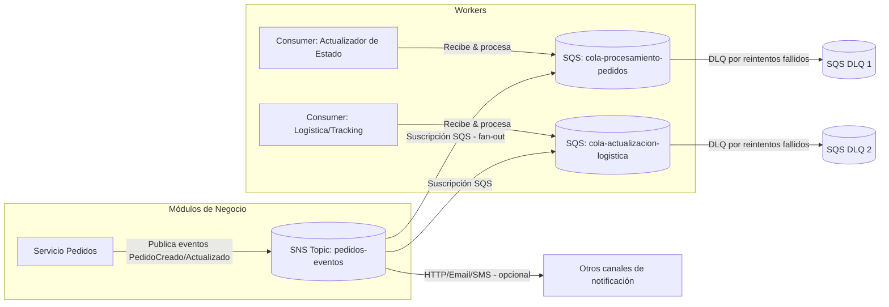

# Implementación de Servicios de Mensajería Cloud (E‑ComExpress)

> **Caso:** Desacoplar los módulos de procesamiento de pedidos y notificación de envíos mediante Amazon SQS y Amazon SNS para mejorar escalabilidad, resiliencia y tiempos de respuesta.

## Resumen ejecutivo
E‑ComExpress sufre cuellos de botella y errores de transmisión en un sistema monolítico. Se propone una arquitectura basada en **Amazon SQS** (procesamiento asíncrono y desacoplamiento entre productores/consumidores) y **Amazon SNS** (difusión tipo *fan-out* de notificaciones de eventos a múltiples suscriptores). La solución mejora **escalabilidad**, **tolerancia a fallos**, **integración de datos** y **experiencia de cliente** al reducir latencia percibida y fallos de comunicación.

---

## 1) Análisis de la situación
**Problemas actuales**
- Acoplamiento fuerte entre módulos (procesamiento de pedidos ↔ notificaciones), con dependencias temporales y de estado.
- Bloqueos al incrementar el volumen de pedidos: el productor queda esperando al consumidor.
- Retrasos en actualización de estado y notificaciones inconsistentes hacia logística y clientes.
- Recuperación ante fallos deficiente: si un servicio cae, se pierden eventos.

**Impacto en operación y clientes**
- Pedidos “atascados” sin confirmación o notificación de envío.
- SLA incumplidos y aumento de reintentos manuales/soporte.
- Caída de la satisfacción y percepción de servicio poco confiable.

**Por qué mensajería en la nube**
- **Desacoplar** temporalmente: productor publica y sigue; consumidor procesa cuando tenga capacidad.
- **Elasticidad**: las colas suavizan picos; consumidores escalan horizontalmente.
- **Resiliencia**: reintentos, *dead-letter queues* (DLQ) y *visibility timeout* reducen pérdidas y duplicidades.
- **Observabilidad**: métricas nativas (edad de mensajes, mensajes en vuelo, tasas de error) y alarmas.

---

## 2) Diseño de la solución

### 2.1 Diagrama (Mermaid)


### 2.2 Flujo de mensajes
1. **Servicio de Pedidos** publica un evento de dominio (p. ej., `PedidoCreado`) en **SNS** (`pedidos-eventos`).
2. **SNS** distribuye (*fan-out*) a múltiples **suscriptores**: colas SQS (procesamiento interno), HTTP(S) webhooks (servicios externos), email/SMS (alertas, opcional).
3. **Consumidores** leen de SQS con *long polling*; procesan idempotentemente y confirman borrando el mensaje.
4. En caso de error/transitorio, el mensaje se hace visible de nuevo tras el **visibility timeout**; tras *N* intentos máximos, se envía a la **DLQ** para análisis.

---

## 3) Propuesta de implementación

### 3.1 Creación de recursos (AWS CLI)
> Ajusta `--region` y nombres según tu cuenta/entorno.

**SQS (Standard o FIFO) + DLQ**
```bash
# DLQ (Standard o FIFO según la cola principal)
aws sqs create-queue --queue-name cola-procesamiento-pedidos-dlq

# Cola principal (ejemplo Standard)
aws sqs create-queue --queue-name cola-procesamiento-pedidos \
  --attributes VisibilityTimeout=30,MessageRetentionPeriod=345600,ReceiveMessageWaitTimeSeconds=20,RedrivePolicy='{"deadLetterTargetArn":"ARN_DLQ","maxReceiveCount":"5"}'
```

**SNS Topic y suscripciones**
```bash
# Crear topic
aws sns create-topic --name pedidos-eventos

# Suscribir la cola a SNS
# 1) Obtener ARN del topic y URL/ARN de la cola
aws sns subscribe --topic-arn ARN_TOPIC --protocol sqs --notification-endpoint ARN_COLA

# 2) Agregar política a la cola para permitir a SNS enviar mensajes
# (ver ejemplo de política más abajo)
```

### 3.2 Política de acceso (SQS permite publicar a SNS)
```json
{
  "Version": "2012-10-17",
  "Statement": [
    {
      "Sid": "Allow-SNS-SendMessage",
      "Effect": "Allow",
      "Principal": { "Service": "sns.amazonaws.com" },
      "Action": "sqs:SendMessage",
      "Resource": "arn:aws:sqs:REGION:ACCOUNT_ID:cola-procesamiento-pedidos",
      "Condition": {
        "ArnEquals": { "aws:SourceArn": "arn:aws:sns:REGION:ACCOUNT_ID:pedidos-eventos" }
      }
    }
  ]
}
```

### 3.3 Parámetros clave y buenas prácticas
- **Tipo de cola**:  
  - *Standard* (mayor throughput, *at-least-once*, orden eventual).  
  - *FIFO* (orden estricto + deduplicación con `MessageGroupId` y `MessageDeduplicationId`). Úsala si el negocio exige orden.
- **Visibility timeout**: ~ tiempo máximo de procesamiento del consumidor × 1.5. Ej.: si el *handler* tarda 20 s, empieza con 30 s.
- **Long polling** (`ReceiveMessageWaitTimeSeconds=20`) para reducir *empty receives* y costos.
- **Redrive policy / DLQ**: `maxReceiveCount` según criticidad (5–10) y alarmas sobre la DLQ.
- **Retención**: `MessageRetentionPeriod` según RTO/RPO (de 60 s hasta 14 días).
- **Idempotencia** en consumidores (protege contra redelivery). Guarda *dedup keys* (p. ej., `pedidoId#eventoVersion`).
- **Observabilidad**: CloudWatch métricas (ApproximateNumberOfMessagesVisible/InFlight, AgeOfOldestMessage) + alarmas y tableros.
- **Seguridad**: Principio de mínimo privilegio (IAM por rol/servicio). Cifrado en reposo (SSE-SQS/KMS) y en tránsito (HTTPS).

### 3.4 Beneficios esperados
- **Tolerancia a fallos**: reintentos automáticos, DLQs y desacoplamiento minimizan impacto de caídas parciales.
- **Integración de datos**: difusión consistente de eventos a múltiples consumidores (internos/externos).
- **Optimización de tiempos**: productor no bloquea; usuarios reciben confirmación rápida mientras el backend procesa asíncronamente.

---

## 4) Retroalimentación y evaluación

**Posibles desafíos/limitaciones**
- Duplicados y *out-of-order* en Standard SQS; exige idempotencia y manejo de versiones.
- *Backlogs* prolongados si los consumidores no escalan; aumenta latencia (ver *AgeOfOldestMessage*).
- Esquemas de eventos cambiantes (*schema evolution*) rompen consumidores acoplados a payloads antiguos.
- Entregas a endpoints HTTP pueden fallar por *timeouts* o *throttling*.

**Medidas de mitigación**
- Consumidores **idempotentes** + control de versiones de eventos (ej. `type`, `version`, `occurredAt`).  
- **Auto Scaling**/KEDA sobre métricas de cola; *batch size* óptimo y *prefetch* en SDK.  
- **Contracts** de eventos (JSON Schema/Avro) + *compatibilidad hacia atrás*.  
- **Retries** y **DLQs** para HTTP/Webhooks (o proxy vía SQS).  
- **Chaos testing** y pruebas de *load & soak* con traza distribuida (X-Ray u OpenTelemetry).

---

## 5) Anexos

### 5.1 Ejemplo .NET (C#) — Publicar evento a SNS
```csharp
using Amazon;
using Amazon.SimpleNotificationService;
using Amazon.SimpleNotificationService.Model;
using System.Text.Json;

// POCO de evento
public record PedidoCreado(string PedidoId, DateTimeOffset OccurredAt, string ClienteId, decimal Total);

public class Publisher {
    private readonly IAmazonSimpleNotificationService _sns;
    private readonly string _topicArn;

    public Publisher(string topicArn, RegionEndpoint region) {
        _sns = new AmazonSimpleNotificationServiceClient(region);
        _topicArn = topicArn;
    }

    public async Task PublicarPedido(PedidoCreado evt) {
        var message = JsonSerializer.Serialize(evt);
        var req = new PublishRequest {
            TopicArn = _topicArn,
            Message = message,
            MessageAttributes = {
                { "eventType", new MessageAttributeValue { DataType = "String", StringValue = "PedidoCreado" } },
                { "eventVersion", new MessageAttributeValue { DataType = "String", StringValue = "1" } }
            }
        };
        await _sns.PublishAsync(req);
    }
}
```

### 5.2 Ejemplo .NET (C#) — Consumidor SQS idempotente
```csharp
using Amazon;
using Amazon.SQS;
using Amazon.SQS.Model;
using System.Text.Json;

public class SqsConsumer {
    private readonly IAmazonSQS _sqs;
    private readonly string _queueUrl;

    public SqsConsumer(string queueUrl, RegionEndpoint region) {
        _sqs = new AmazonSQSClient(region);
        _queueUrl = queueUrl;
    }

    public async Task RunAsync(CancellationToken ct) {
        while (!ct.IsCancellationRequested) {
            var resp = await _sqs.ReceiveMessageAsync(new ReceiveMessageRequest {
                QueueUrl = _queueUrl,
                MaxNumberOfMessages = 10,
                WaitTimeSeconds = 20,
                VisibilityTimeout = 30
            }, ct);

            foreach (var msg in resp.Messages) {
                // Idempotencia por PedidoId+Version en el cuerpo
                try {
                    var evt = JsonSerializer.Deserialize<PedidoCreado>(msg.Body);
                    if (await YaProcesado(evt.PedidoId, "1")) {
                        await _sqs.DeleteMessageAsync(_queueUrl, msg.ReceiptHandle, ct);
                        continue;
                    }

                    await Procesar(evt);
                    await MarcarProcesado(evt.PedidoId, "1");
                    await _sqs.DeleteMessageAsync(_queueUrl, msg.ReceiptHandle, ct);
                }
                catch (Exception) {
                    # noqa: E722
                    // no borrar: se reintentará hasta DLQ
                }
            }
        }
    }

    private Task<bool> YaProcesado(string pedidoId, string version) => Task.FromResult(false);
    private Task MarcarProcesado(string pedidoId, string version) => Task.CompletedTask;
    private Task Procesar(PedidoCreado evt) => Task.CompletedTask;
}

public record PedidoCreado(string PedidoId, DateTimeOffset OccurredAt, string ClienteId, decimal Total);
```

### 5.3 Terraform (opcional) — SQS + SNS + suscripción
```hcl
resource "aws_sqs_queue" "dlq" {
  name = "cola-procesamiento-pedidos-dlq"
}

resource "aws_sqs_queue" "main" {
  name                      = "cola-procesamiento-pedidos"
  receive_wait_time_seconds = 20
  visibility_timeout_seconds = 30
  message_retention_seconds = 345600
  redrive_policy = jsonencode({
    deadLetterTargetArn = aws_sqs_queue.dlq.arn
    maxReceiveCount     = 5
  })
}

resource "aws_sns_topic" "topic" {
  name = "pedidos-eventos"
}

resource "aws_sns_topic_subscription" "sub_sqs" {
  topic_arn = aws_sns_topic.topic.arn
  protocol  = "sqs"
  endpoint  = aws_sqs_queue.main.arn
}

resource "aws_sqs_queue_policy" "allow_sns" {
  queue_url = aws_sqs_queue.main.id
  policy = jsonencode({
    Version = "2012-10-17",
    Statement = [
      {
        Sid = "Allow-SNS-SendMessage",
        Effect = "Allow",
        Principal = { Service = "sns.amazonaws.com" },
        Action = "sqs:SendMessage",
        Resource = aws_sqs_queue.main.arn,
        Condition = {
          ArnEquals = { "aws:SourceArn" = aws_sns_topic.topic.arn }
        }
      }
    ]
  })
}
```

### 5.4 Plan de pruebas resumido
- **Carga**: simular picos con *batch* 10–100; validar *AgeOfOldestMessage* < umbral.
- **Resiliencia**: detener consumidores; confirmar que no hay pérdida y que el *backlog* se vacía al reanudar.
- **DLQ**: forzar errores para verificar enrutamiento a DLQ y alarmas.
- **Orden e idempotencia**: pruebas con duplicados/reentregas.
- **Contrato de eventos**: validación de esquemas y compatibilidad hacia atrás.

---

## Entregables incluidos
- Reporte con análisis, diseño (diagrama Mermaid), pasos de implementación, políticas de acceso, ventajas, riesgos y mitigaciones.
- Ejemplos de configuración (CLI/Terraform) y snippets en .NET para publicación y consumo.
