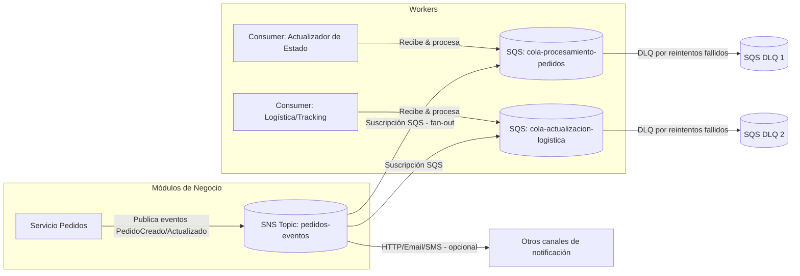

# Implementación de Servicios de Mensajería Cloud (E‑ComExpress)

> **Caso:** Desacoplar los módulos de procesamiento de pedidos y notificación de envíos mediante Amazon SQS y Amazon SNS para mejorar escalabilidad, resiliencia y tiempos de respuesta.

## Resumen ejecutivo
E‑ComExpress sufre cuellos de botella y errores de transmisión en un sistema monolítico. Se propone una arquitectura basada en **Amazon SQS** (procesamiento asíncrono y desacoplamiento entre productores/consumidores) y **Amazon SNS** (difusión tipo *fan-out* de notificaciones de eventos a múltiples suscriptores). La solución mejora **escalabilidad**, **tolerancia a fallos**, **integración de datos** y **experiencia de cliente** al reducir latencia percibida y fallos de comunicación.

---

## 1) Análisis de la situación
**Problemas actuales**
- Acoplamiento fuerte entre módulos (procesamiento de pedidos ↔ notificaciones), con dependencias temporales y de estado.
- Bloqueos al incrementar el volumen de pedidos: el productor queda esperando al consumidor.
- Retrasos en actualización de estado y notificaciones inconsistentes hacia logística y clientes.
- Recuperación ante fallos deficiente: si un servicio cae, se pierden eventos.

**Impacto en operación y clientes**
- Pedidos “atascados” sin confirmación o notificación de envío.
- SLA incumplidos y aumento de reintentos manuales/soporte.
- Caída de la satisfacción y percepción de servicio poco confiable.

**Por qué mensajería en la nube**
- **Desacoplar** temporalmente: productor publica y sigue; consumidor procesa cuando tenga capacidad.
- **Elasticidad**: las colas suavizan picos; consumidores escalan horizontalmente.
- **Resiliencia**: reintentos, *dead-letter queues* (DLQ) y *visibility timeout* reducen pérdidas y duplicidades.
- **Observabilidad**: métricas nativas (edad de mensajes, mensajes en vuelo, tasas de error) y alarmas.

---

## 2) Diseño de la solución

### 2.1 Diagrama (Mermaid)


### 2.2 Flujo de mensajes
1. **Servicio de Pedidos** publica un evento de dominio (p. ej., `PedidoCreado`) en **SNS** (`pedidos-eventos`).
2. **SNS** distribuye (*fan-out*) a múltiples **suscriptores**: colas SQS (procesamiento interno), HTTP(S) webhooks (servicios externos), email/SMS (alertas, opcional).
3. **Consumidores** leen de SQS con *long polling*; procesan idempotentemente y confirman borrando el mensaje.
4. En caso de error/transitorio, el mensaje se hace visible de nuevo tras el **visibility timeout**; tras *N* intentos máximos, se envía a la **DLQ** para análisis.

---

## 3) Propuesta de implementación

### 3.1 Creación de recursos (AWS CLI)
> Ajusta `--region` y nombres según tu cuenta/entorno.

**SQS (Standard o FIFO) + DLQ**
```bash
# DLQ (Standard o FIFO según la cola principal)
aws sqs create-queue --queue-name cola-procesamiento-pedidos-dlq

# Cola principal (ejemplo Standard)
aws sqs create-queue --queue-name cola-procesamiento-pedidos \
  --attributes VisibilityTimeout=30,MessageRetentionPeriod=345600,ReceiveMessageWaitTimeSeconds=20,RedrivePolicy='{"deadLetterTargetArn":"ARN_DLQ","maxReceiveCount":"5"}'
```

**SNS Topic y suscripciones**
```bash
# Crear topic
aws sns create-topic --name pedidos-eventos

# Suscribir la cola a SNS
# 1) Obtener ARN del topic y URL/ARN de la cola
aws sns subscribe --topic-arn ARN_TOPIC --protocol sqs --notification-endpoint ARN_COLA

# 2) Agregar política a la cola para permitir a SNS enviar mensajes
# (ver ejemplo de política más abajo)
```

### 3.2 Política de acceso (SQS permite publicar a SNS)
```json
{
  "Version": "2012-10-17",
  "Statement": [
    {
      "Sid": "Allow-SNS-SendMessage",
      "Effect": "Allow",
      "Principal": { "Service": "sns.amazonaws.com" },
      "Action": "sqs:SendMessage",
      "Resource": "arn:aws:sqs:REGION:ACCOUNT_ID:cola-procesamiento-pedidos",
      "Condition": {
        "ArnEquals": { "aws:SourceArn": "arn:aws:sns:REGION:ACCOUNT_ID:pedidos-eventos" }
      }
    }
  ]
}
```

### 3.3 Parámetros clave y buenas prácticas
- **Tipo de cola**:  
  - *Standard* (mayor throughput, *at-least-once*, orden eventual).  
  - *FIFO* (orden estricto + deduplicación con `MessageGroupId` y `MessageDeduplicationId`). Úsala si el negocio exige orden.
- **Visibility timeout**: ~ tiempo máximo de procesamiento del consumidor × 1.5. Ej.: si el *handler* tarda 20 s, empieza con 30 s.
- **Long polling** (`ReceiveMessageWaitTimeSeconds=20`) para reducir *empty receives* y costos.
- **Redrive policy / DLQ**: `maxReceiveCount` según criticidad (5–10) y alarmas sobre la DLQ.
- **Retención**: `MessageRetentionPeriod` según RTO/RPO (de 60 s hasta 14 días).
- **Idempotencia** en consumidores (protege contra redelivery). Guarda *dedup keys* (p. ej., `pedidoId#eventoVersion`).
- **Observabilidad**: CloudWatch métricas (ApproximateNumberOfMessagesVisible/InFlight, AgeOfOldestMessage) + alarmas y tableros.
- **Seguridad**: Principio de mínimo privilegio (IAM por rol/servicio). Cifrado en reposo (SSE-SQS/KMS) y en tránsito (HTTPS).

### 3.4 Beneficios esperados
- **Tolerancia a fallos**: reintentos automáticos, DLQs y desacoplamiento minimizan impacto de caídas parciales.
- **Integración de datos**: difusión consistente de eventos a múltiples consumidores (internos/externos).
- **Optimización de tiempos**: productor no bloquea; usuarios reciben confirmación rápida mientras el backend procesa asíncronamente.

---

## 4) Retroalimentación y evaluación

**Posibles desafíos/limitaciones**
- Duplicados y *out-of-order* en Standard SQS; exige idempotencia y manejo de versiones.
- *Backlogs* prolongados si los consumidores no escalan; aumenta latencia (ver *AgeOfOldestMessage*).
- Esquemas de eventos cambiantes (*schema evolution*) rompen consumidores acoplados a payloads antiguos.
- Entregas a endpoints HTTP pueden fallar por *timeouts* o *throttling*.

**Medidas de mitigación**
- Consumidores **idempotentes** + control de versiones de eventos (ej. `type`, `version`, `occurredAt`).  
- **Auto Scaling**/KEDA sobre métricas de cola; *batch size* óptimo y *prefetch* en SDK.  
- **Contracts** de eventos (JSON Schema/Avro) + *compatibilidad hacia atrás*.  
- **Retries** y **DLQs** para HTTP/Webhooks (o proxy vía SQS).  
- **Chaos testing** y pruebas de *load & soak* con traza distribuida (X-Ray u OpenTelemetry).

---

## 5) Anexos

### 5.1 Ejemplo .NET (C#) — Publicar evento a SNS
- Configuracion variable de entorno
```csharp
var region = Environment.GetEnvironmentVariable("AWS_REGION") ?? "us-east-1";
var topicArn = Environment.GetEnvironmentVariable("SNS_TOPIC_ARN");

if (string.IsNullOrEmpty(region) || string.IsNullOrEmpty(topicArn))
{
  throw new InvalidOperationException("Faltan las variables de entorno AWS_REGION o SNS_TOPIC_ARN.");
}
```
- Registrar cliente SNS 
```csharp
builder.Services.AddSingleton<IAmazonSimpleNotificationService>(sp =>
  new AmazonSimpleNotificationServiceClient(RegionEndpoint.GetBySystemName(region)));
```
- Punto de acceso para crear pedido
```csharp
app.MapPost("/api/pedidos", async (PedidoCreado pedido, IAmazonSimpleNotificationService sns) =>
{
  try
  {
    var json = System.Text.Json.JsonSerializer.Serialize(pedido);

    await sns.PublishAsync(new PublishRequest
    {
      TopicArn = topicArn,
      Message = json,
      Subject = "Nuevo Pedido"
    });

    return Results.Ok(new { status = "Publicado en SNS", pedido.PedidoId });
  } catch (Exception ex)
  {
    return Results.Problem(
      detail: ex.Message,
      statusCode: 500,
      title: "Error interno en la API"
    );
  }
});
```
- Registro para crear pedido
```csharp
public record PedidoCreado(Guid PedidoId, Guid ClienteId, DateTimeOffset Fecha, decimal Total);
```

### 5.2 Ejemplo .NET (C#) — Consumidor SQS idempotente
- Configuracion variable de entorno
```csharp
var region = Environment.GetEnvironmentVariable("AWS_REGION") ?? "us-east-1";
var queueUrl = Environment.GetEnvironmentVariable("SQS_QUEUE_URL");

if (string.IsNullOrEmpty(region) || string.IsNullOrEmpty(queueUrl))
{
    throw new InvalidOperationException("Faltan las variables de entorno AWS_REGION o SQS_QUEUE_URL.");
}
```
- Crear cliente SQS
```csharp
var sqs = new AmazonSQSClient(RegionEndpoint.GetBySystemName(region));
```
- Iniciar loop de mensajes
```csharp
while (true)
{
  var resp = await sqs.ReceiveMessageAsync(new ReceiveMessageRequest
  {
    QueueUrl = queueUrl,
    MaxNumberOfMessages = 5,
    WaitTimeSeconds = 20,   // long polling
    VisibilityTimeout = 30
  });

  foreach (var msg in resp.Messages)
  {
    try
    {
      // 1️⃣ Deserializar el sobre SNS
      var envelope = JsonSerializer.Deserialize<SnsEnvelope>(msg.Body);

      if (envelope?.Message == null)
      {
        Console.WriteLine("⚠️ Mensaje inválido o vacío en SNS.");
        continue;
      }

      // 2️⃣ Deserializar el JSON real dentro de "Message"
      var pedido = JsonSerializer.Deserialize<PedidoCreado>(envelope.Message);

      Console.WriteLine($"✅ Procesando pedido {pedido.PedidoId} de cliente {pedido.ClienteId}, total: {pedido.Total}");

      // 3️⃣ Procesar (guardar en DB, llamar servicio, etc.)

      // 4️⃣ Borrar el mensaje
      await sqs.DeleteMessageAsync(queueUrl, msg.ReceiptHandle);
    }
    catch (Exception ex)
    {
      Console.WriteLine($"❌ Error procesando: {ex.Message}");
      // No borrar → SQS reintentará o DLQ
    }
  }
}
```

### 5.3 Terraform (opcional) — SQS + SNS + suscripción
```hcl
resource "aws_sqs_queue" "dlq" {
  name = "cola-procesamiento-pedidos-dlq"
}

resource "aws_sqs_queue" "main" {
  name                      = "cola-procesamiento-pedidos"
  receive_wait_time_seconds = 20
  visibility_timeout_seconds = 30
  message_retention_seconds = 345600
  redrive_policy = jsonencode({
    deadLetterTargetArn = aws_sqs_queue.dlq.arn
    maxReceiveCount     = 5
  })
}

resource "aws_sns_topic" "topic" {
  name = "pedidos-eventos"
}

resource "aws_sns_topic_subscription" "sub_sqs" {
  topic_arn = aws_sns_topic.topic.arn
  protocol  = "sqs"
  endpoint  = aws_sqs_queue.main.arn
}

resource "aws_sqs_queue_policy" "allow_sns" {
  queue_url = aws_sqs_queue.main.id
  policy = jsonencode({
    Version = "2012-10-17",
    Statement = [
      {
        Sid = "Allow-SNS-SendMessage",
        Effect = "Allow",
        Principal = { Service = "sns.amazonaws.com" },
        Action = "sqs:SendMessage",
        Resource = aws_sqs_queue.main.arn,
        Condition = {
          ArnEquals = { "aws:SourceArn" = aws_sns_topic.topic.arn }
        }
      }
    ]
  })
}
```

### 5.4 Plan de pruebas resumido
- **Carga**: simular picos con *batch* 10–100; validar *AgeOfOldestMessage* < umbral.
- **Resiliencia**: detener consumidores; confirmar que no hay pérdida y que el *backlog* se vacía al reanudar.
- **DLQ**: forzar errores para verificar enrutamiento a DLQ y alarmas.
- **Orden e idempotencia**: pruebas con duplicados/reentregas.
- **Contrato de eventos**: validación de esquemas y compatibilidad hacia atrás.

---

# Desarrollo Práctico

## **Seciruty Group**:
### ecomexpress-sns-api-sg
- **Name**: ecomexpress-sg-sns-api
- **Description**: Acceso SNS and API
- **VPC**: default
- **Inbound rules**:
  - SSH
    - Type: SSH
    - Protocol: TCP
    - Port range: 22
    - Destination type: Anywhere-IPv4
    - Destination: 0.0.0.0/0
    - Description: Acceso SSH
  - HTTP
    - Type: HTTP
    - Protocol: TCP
    - Port range: 80
    - Destination type: Anywhere-IPv4
    - Destination: 0.0.0.0/0
    - Description: Acceso web
  - HTTPS
    - Type: HTTPS
    - Protocol: TCP
    - Port range: 443
    - Destination type: Anywhere-IPv4
    - Destination: 0.0.0.0/0
    - Description: Acceso web
- **Outbound rules**:
  - Outbound
    - Type: All traffic
    - Protocol: all
    - Port range: all
    - Destination type: Custom
    - Destination: 0.0.0.0/0
    - Description:

### ecomexpress-sg-sqs-worker
- **Name**: ecomexpress-sg-sqs-worker
- **Description**: Acceso SQS Worker
- **VPC**: default
- **Inbound rules**:
  - SSH
    - Type: SSH
    - Protocol: TCP
    - Port range: 22
    - Destination type: Anywhere-IPv4
    - Destination: 0.0.0.0/0
    - Description: Acceso SSH
  - HTTP
    - Type: HTTP
    - Protocol: TCP
    - Port range: 80
    - Destination type: Anywhere-IPv4
    - Destination: 0.0.0.0/0
    - Description: Acceso web    
- **Outbound rules**:
  - Outbound
    - Type: All traffic
    - Protocol: all
    - Port range: all
    - Destination type: Custom
    - Destination: 0.0.0.0/0
    - Description:

## **SQS**: Simple Queue Service:
### Queue Procesamiento de Pedidos
- **Type**: Standard
- **Name**: ecomexpress-sqs-orders-process
- **Visibility timeout**: 30 Seconds
- **Message retention period**: 4 Days
- **Delivery delay**: 0
- **Receive message wait time**: 0
- **Maximum message size**: 1024 KiB

### Queue Logística/Tracking
- **Type**: Standard
- **Name**: ecomexpress-sqs-logistics
- **Visibility timeout**: 30 Seconds
- **Message retention period**: 4 Days
- **Delivery delay**: 0
- **Receive message wait time**: 0
- **Maximum message size**: 1024 KiB

---

## **SNS**: Simple Notification Service 
### Topics
- **Topics**: Standard
- **Name**: ecomexpress-sns-orders-events

### Create subscription
- **Topic ARN**: ecomexpress-sns
- **Protocol**: Amazon SQS
- **Endpoint**: ecomexpress-sqs-orders-process

### Create subscription
- **Topic ARN**: ecomexpress-sns
- **Protocol**: Amazon SQS
- **Endpoint**: ecomexpress-sqs-logistics

### Create subscription
- **Topic ARN**: ecomexpress-sns
- **Protocol**: mail@mail.cl

---

## **EB**: Elastic Beanstalk
### SNS Web Api
- **Environment tier**: Web server environment
- **Application name**: ecomexpress-eb-sns-api
- **Platform**: .NET Core on Linux
- **Platform branch**: .NET 8 running on 64bit Amazon Linux 2023
- **Platform version**: 3.5.3
- **Upload your code**: check
- **Version labe**: 1
- **Local file**: AWS_SNS_MinimalApi.zip
- **Single instance**: check
- **Service role**: LabRole
- **EC2 instance profile**: LabInstanceProfile
- **EC2 key pair**: vockey
- **VPC**: default
- **Public IP address**: Enable
- **Instance subnets**:
  - us-east-1a
  - us-east-1b
- **EC2 security groups**: ecomexpress-sg-sns-api
- **Health reporting**: Basic
- **Managed updates**: uncheck
- **Environment properties**:
  - Region
    - **Name**: AWS_REGION
    - **Value**: us-east-1
  - SNS
    - **Name**: SNS_TOPIC_ARN
    - **Value**: arn:aws:sns:us-east-1:123:ecomexpress-sns-orders-events

### SQS Worker App (Queue Procesamiento de Pedidos)
- **Environment tier**: Web server environment
- **Application name**: ecomexpress-eb-sqs-worker-process
- **Platform**: .NET Core on Linux
- **Platform branch**: .NET 8 running on 64bit Amazon Linux 2023
- **Platform version**: 3.5.3
- **Upload your code**: check
- **Version labe**: 1
- **Local file**: AWS_SQS_Worker.zip
- **Single instance**: check
- **Service role**: LabRole
- **EC2 instance profile**: LabInstanceProfile
- **EC2 key pair**: vockey
- **VPC**: default
- **Public IP address**: Enable
- **Instance subnets**:
  - us-east-1a
  - us-east-1b
- **EC2 security groups**: ecomexpress-sg-sqs-worker
- **Health reporting**: Basic
- **Managed updates**: uncheck
- **Environment properties**:
  - Region
    - **Name**: AWS_REGION
    - **Value**: us-east-1
  - SNS
    - **Name**: SQS_QUEUE_URL
    - **Value**: https://sqs.us-east-1.amazonaws.com/123/ecomexpress-sqs-orders-process

### SQS Worker App (Queue Logística/Tracking)
- **Environment tier**: Web server environment
- **Application name**: ecomexpress-eb-sqs-worker-logistics
- **Platform**: .NET Core on Linux
- **Platform branch**: .NET 8 running on 64bit Amazon Linux 2023
- **Platform version**: 3.5.3
- **Upload your code**: check
- **Version labe**: 1
- **Local file**: AWS_SQS_Worker.zip
- **Single instance**: check
- **Service role**: LabRole
- **EC2 instance profile**: LabInstanceProfile
- **EC2 key pair**: vockey
- **VPC**: default
- **Public IP address**: Enable
- **Instance subnets**:
  - us-east-1a
  - us-east-1b
- **EC2 security groups**: ecomexpress-sg-sqs-worker
- **Health reporting**: Basic
- **Managed updates**: uncheck
- **Environment properties**:
  - Region
    - **Name**: AWS_REGION
    - **Value**: us-east-1
  - SNS
    - **Name**: SQS_QUEUE_URL
    - **Value**: https://sqs.us-east-1.amazonaws.com/123/ecomexpress-sqs-logistics

---

---
---
---
---

## **ECR**: Elastic Container Registry
### Repositorio - SNS Api
- **Repository name**: ecomexpress-sns-api-repo
- **Image tag mutability**: Mutable
- **Mutable tag exclusions**:
- **Encryption configuration**: AES-256
- **View push commands**

### Push Commands
```sh
aws ecr get-login-password --region us-east-1 | docker login --username AWS --password-stdin 123.dkr.ecr.us-east-1.amazonaws.com
```
```sh
docker build -t ecomexpress-sns-api-repo .
```
```sh
docker tag ecomexpress-sns-api-repo:latest 123.dkr.ecr.us-east-1.amazonaws.com/ecomexpress-sns-api-repo:latest
```
```sh
docker push 123.dkr.ecr.us-east-1.amazonaws.com/ecomexpress-sns-api-repo:latest
```

## **ECR**: Elastic Container Registry
### Repositorio - SQS Worker
- **Repository name**: ecomexpress-sqs-worker-repo
- **Image tag mutability**: Mutable
- **Mutable tag exclusions**:
- **Encryption configuration**: AES-256
- **View push commands**

### Push Commands
```sh
aws ecr get-login-password --region us-east-1 | docker login --username AWS --password-stdin 123.dkr.ecr.us-east-1.amazonaws.com
```
```sh
docker build -t ecomexpress-sqs-worker-repo .
```
```sh
docker tag ecomexpress-sqs-worker-repo:latest 123.dkr.ecr.us-east-1.amazonaws.com/ecomexpress-sqs-worker-repo:latest
```
```sh
docker push 123.dkr.ecr.us-east-1.amazonaws.com/ecomexpress-sqs-worker-repo:latest
```

---

## **CloudShell**:
### Consola CloudShell
```sh
ls
df -h
```
```sh
git clone https://github.com/TheNefelin/AWS_ApiSNS_WorkerSQS_.NET8.git
```
```sh
cd AWS_ApiSNS_WorkerSQS_.NET8
```
```sh
aws ecr get-login-password --region us-east-1 | docker login --username AWS --password-stdin 123.dkr.ecr.us-east-1.amazonaws.com
```
- Crear imagen docker `ecomexpress-sns-api-repo`
```sh
docker build -f AWS_SNS_MinimalApi/Dockerfile -t ecomexpress-sns-api-repo .
```
```sh
docker tag ecomexpress-sns-api-repo:latest 123.dkr.ecr.us-east-1.amazonaws.com/ecomexpress-sns-api-repo:latest
```
```sh
docker push 123.dkr.ecr.us-east-1.amazonaws.com/ecomexpress-sns-api-repo:latest
```
- Crear imagen docker `ecomexpress-sqs-worker-repo`
```sh
docker build -f AWS_SQS_Worker/Dockerfile -t ecomexpress-sqs-worker-repo .
```
```sh
docker tag ecomexpress-sqs-worker-repo:latest 123.dkr.ecr.us-east-1.amazonaws.com/ecomexpress-sqs-worker-repo:latest
```
```sh
docker push 123.dkr.ecr.us-east-1.amazonaws.com/ecomexpress-sqs-worker-repo:latest
```
- Limpieza completa de Docker 
```sh
docker system prune -af
docker volume prune -f
```
```sh
rm -rf AWS_ApiSNS_WorkerSQS_.NET8/
```
```sh
ls
docker images
df -h
```

## **ECS**: Elastic Container Service
### ECS - Clusters
- **Cluster name**: ecomexpress-sns-api-cluster
- **AWS Fargate (serverless)**: check
- **Amazon EC2 instances**: uncheck

### ECS - Task definitions
- **Task definition family**: ecomexpress-sns-api-task
- **AWS Fargate**: check
- **Amazon EC2 instances**: unchek
- **Operating system**: Linux/X86_64
- **CPU**: 1vCPU
- **Memory**: 2 GB
- **Task role**: LabRole
- **Task execution role**: LabRole
- **Name**: sns-app
- **Image URI**: ECR_IMAGE_URI
- **Essential container**: yes
- **Container port**: 3000
- **Protocol**: TCP
- **App protocol**: HTTP
- **Environment variables**:
  - PostgreSQL host
    - **Key**: AWS_REGION
    - **Value type**: Value
    - **Value**: us-east-1
  - PostgreSQL port
    - **Key**: TOPIC_ARN
    - **Value type**: Value
    - **Value**: "arn:aws:sns:us-east-1:123:ecomexpress-sns"

### ECS - Run Task
- Run new task:
  - **Task definition family**: ecomexpress-sns-api-task
  - **Task definition revision**: last
  - **Desired tasks**: 1
  - **Existing cluster**: ecomexpress-sns-api-cluster
  - **Capacity provider**: FARGATE
  - **Platform version**: LATEST
  - **VPC**: default
  - **Subnets**:
    - us-east-1a
    - us-east-1b
    - us-east-1c
  - **Use an existing security group**: ecomexpress-sns-api-sg
  - **Public IP** check

---