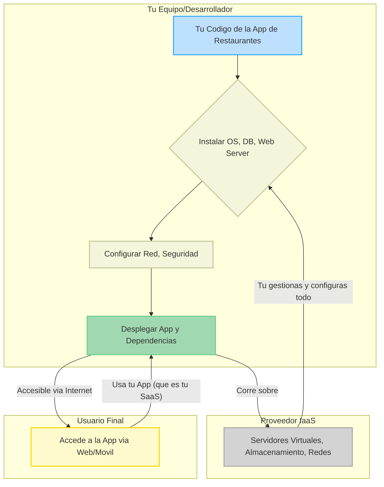
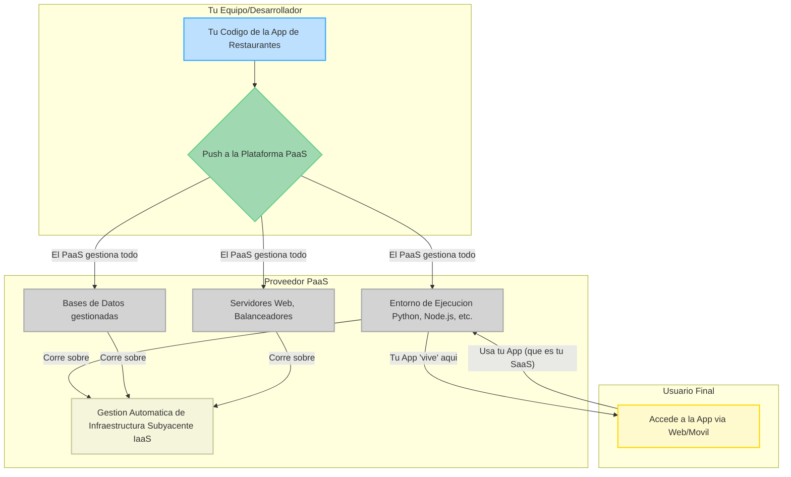

# Diagrama de Flujo: Tu Aplicación de Restaurantes en la Nube

Aquí te presento el flujo de tu aplicación de restaurantes, mostrando lo que sucede en cada modelo (IaaS, PaaS, SaaS, y FaaS para una tarea específica).

---

## 1. Modelo IaaS (Infraestructura como Servicio)



### Explicación IaaS:

- Tú (o tu equipo) tiene máximo control.
- Compras/alquilas los componentes básicos (servidores virtuales, discos, red).
- Tú instalas y configuras el sistema operativo, la base de datos, el servidor web y despliegas tu aplicación.
- Tu aplicación "vive" aquí y los restaurantes la usan.

## 2. Modelo PaaS (Plataforma como Servicio)



### Explicación PaaS:

- Tú (o tu equipo) se enfoca solo en tu código.
- Haces un "push" de tu código a la plataforma PaaS.
- El PaaS se encarga de todo lo demás: compilar, configurar el entorno, gestionar servidores, bases de datos, etc.
- Tu aplicación "vive" aquí y los restaurantes la usan.

## 3. Modelo SaaS (Software como Servicio)

```mermaid
graph TD
    subgraph Proveedor de tu App (Tu)
        A[Gestiona y Mantiene la App] --> B[Actualiza la App];
    end

    subgraph Tu App (el SaaS)
        C[App de Restaurantes Funcionando]
    end

    subgraph Usuario Final
        D[Accede a la App via Web/Movil]
    end

    A -- "Ofrece y Mantiene" --> C
    B -- "Actualiza y Mejora" --> C
    D -- "Usa las Funcionalidades de la App" --> C

style A fill:#F5F5DC,stroke:#C6C69C,stroke-width:2px
style B fill:#F5F5DC,stroke:#C6C69C,stroke-width:2px
style C fill:#A0D9B1,stroke:#6CCF8D,stroke-width:2px
style D fill:#FFFACD,stroke:#FFD700,stroke-width:2px
```

## Explicación SaaS:

- Tú eres el proveedor de la aplicación de restaurantes.
- El restaurante (usuario final) simplemente la usa. No sabe ni le importa dónde está alojada.
- Tú te encargas de todo: desarrollo (a menudo con PaaS o IaaS), despliegue, mantenimiento, actualizaciones.

## 4. Modelo FaaS (Función como Servicio)

```mermaid
graph TD
    subgraph Tu Equipo/Desarrollador
        A[Tu Codigo de una Funcion (ej. Enviar SMS de Pedido)]
    end

    subgraph Proveedor FaaS
        B[Evento (ej. Nuevo Pedido Recibido)] --> C{Ejecuta la Funcion};
        C -- "Se apaga al terminar" --> D[No hay servidores que gestionar permanentemente]
    end

    subgraph Usuario Final (Restaurante / Cliente de App)
        E[Confirma Pedido / Recibe Notificacion]
    end

    A -- "Desplegas solo la Funcion" --> C
    C -- "Resultado de la Funcion" --> E
    B -- "Dispara la Ejecucion" --> C

style A fill:#BDE0FE,stroke:#36A9FF,stroke-width:2px
style B fill:#D3D3D3,stroke:#A9A9A9,stroke-width:2px
style C fill:#A0D9B1,stroke:#6CCF8D,stroke-width:2px
style D fill:#F5F5DC,stroke:#C6C69C,stroke-width:2px
style E fill:#FFFACD,stroke:#FFD700,stroke-width:2px
```

## Explicación FaaS:

- Tú escribes solo una pequeña función de código para una tarea específica (ej. enviar un SMS al cocinero cuando llega un nuevo pedido).
- Esta función se "dispara" solo cuando ocurre un evento.
- El proveedor FaaS la ejecuta instantáneamente y luego la apaga.
- Solo pagas por el tiempo de ejecución real. No hay servidores que mantener continuamente.