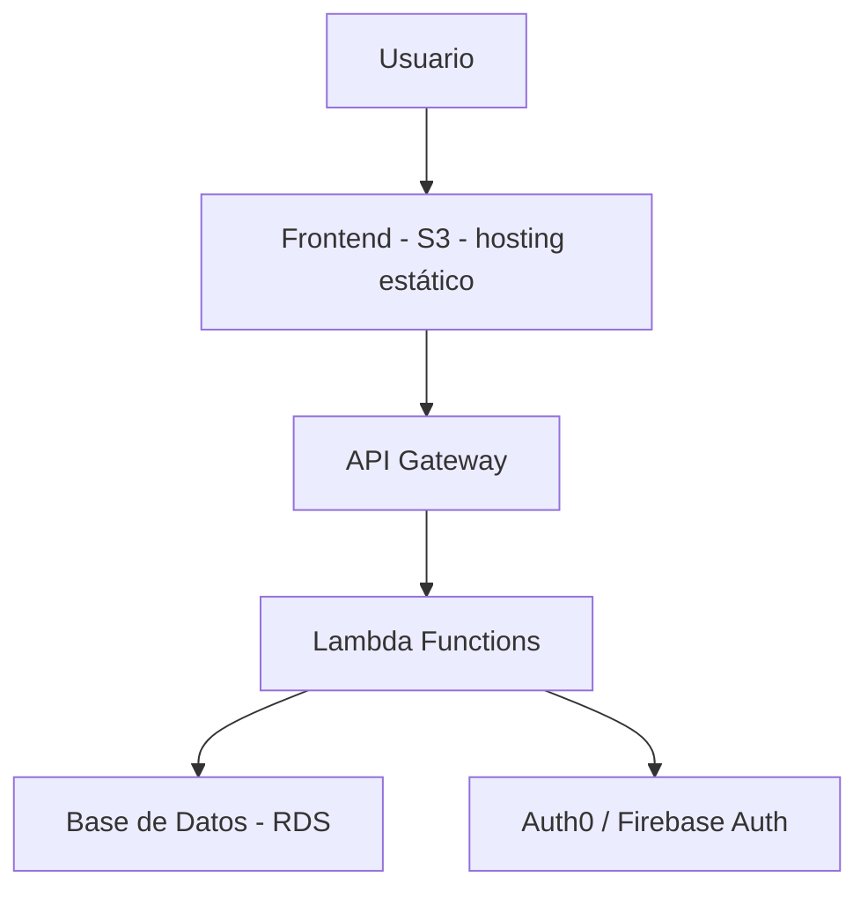

# ☁️ Proyecto Nube Sólida

---

## 📘 1. Introducción general (Resumen del proyecto)

### 🏢 Unidad solicitante:
Área de Infraestructura y Seguridad de una empresa tecnológica.

### 🧩 Situación:
La empresa se encuentra en proceso de migración hacia la nube para mejorar sus servicios. Las soluciones actuales presentan:
- Problemas de escalabilidad
- Costos elevados
- Baja resiliencia

### 🎯 Objetivo del proyecto:
Diseñar una arquitectura conceptual en la nube que:
- Aplique fundamentos cloud
- Use el modelo cliente-servidor
- Incorpore escalabilidad, resiliencia y seguridad

---

## 📋 2. Requerimientos del proyecto

### Requerimientos generales:
- Aplicación de fundamentos de cloud computing
- Principios de diseño arquitectónico (modularidad, resiliencia, etc.)
- Integración del modelo cliente-servidor
- Justificación de decisiones técnicas

### Requerimientos técnicos:
- Asignación adecuada de modelos de servicio (IaaS, PaaS, SaaS, FaaS)
- Elección de modelo de implementación (pública, privada o híbrida)
- Esquema conceptual de arquitectura
- Documentación con diagramas y atributos de calidad

---

## 👣 3. Desarrollo por etapas

## 🧾 Lección 1: Introducción a la Computación en la Nube

### 🎯 Objetivo
Comprender los conceptos fundamentales de la computación en la nube y sus beneficios.

### 📄 Fundamentos resumidos

| Concepto                  | Descripción breve |
|---------------------------|-------------------|
| Cloud Computing           | Modelo para acceder a recursos TI por internet |
| Autoservicio              | Los usuarios consumen recursos sin intervención humana |
| Elasticidad               | Escala automática según la demanda |
| Multitenencia             | Recursos compartidos entre múltiples usuarios |
| Medición del servicio     | Paga solo por lo que usas |

### 🚀 Beneficios
- _Disponibilidad 24/7_
- _Costos optimizados_
- _Escalabilidad automática_
- _Despliegue rápido_

### 🌐 Modelos de Despliegue

| Modelo        | Descripción                            | Ventajas                              | Desventajas                  |
|---------------|----------------------------------------|----------------------------------------|------------------------------|
| Nube Pública  | Infraestructura compartida             | Bajo costo, escalable                  | Menor control de seguridad   |
| Nube Privada  | Infraestructura dedicada               | Control total                          | Costosa                      |
| Nube Híbrida  | Combina pública y privada              | Equilibrio entre control y flexibilidad | Complejidad técnica          |

---

## 🧩 Lección 2: Modelos de Servicio en la Nube

### 🎯 Objetivo
Asignar y justificar modelos de servicio para cada componente.

### 🧠 Explicación general

| Modelo   | Descripción                                        |
|----------|----------------------------------------------------|
| IaaS     | Infraestructura como servicio (máquinas virtuales) |
| PaaS     | Plataforma como servicio (entorno gestionado)      |
| SaaS     | Software como servicio (aplicaciones completas)    |
| FaaS     | Función como servicio (ejecución por evento)       |

### 🧱 Asignación de servicios

| Componente             | Modelo de Servicio | Justificación                                    |
|------------------------|--------------------|--------------------------------------------------|
| Frontend (Web/App)     | SaaS               | Hosting como servicio (ej: Netlify, Firebase)    |
| Backend / API          | FaaS               | Escalabilidad automática                         |
| Base de Datos          | PaaS               | Gestión simplificada, backups incluidos          |
| Autenticación          | SaaS               | Uso de servicios externos seguros                |
| Infraestructura de Red | IaaS               | Control sobre la configuración de redes          |

### 🧱 Asignación de modelos de servicio con justificación

| Componente             | Modelo de Servicio | Justificación                                                                 |
|------------------------|--------------------|------------------------------------------------------------------------------|
| Frontend (Web/App)     | SaaS               | Permite alojar fácilmente la interfaz en servicios gestionados como Firebase o Netlify, sin preocuparse por infraestructura. Ideal para despliegue rápido y alta disponibilidad. |
| Backend / API          | FaaS               | AWS Lambda o Google Cloud Functions permiten ejecutar funciones bajo demanda, con escalabilidad automática y sin necesidad de administrar servidores. |
| Base de Datos          | PaaS               | Usar RDS o Cloud SQL simplifica la administración, ya que incluye backups automáticos, escalabilidad y alta disponibilidad sin gestión manual. |
| Autenticación          | SaaS               | Servicios como Auth0 o Firebase Authentication proveen seguridad robusta, fácil integración y cumplen estándares como OAuth2. Reduce errores y tiempo de desarrollo. |
| Red / Infraestructura  | IaaS               | Se requiere control total sobre la configuración de red, subredes, reglas de firewall y acceso. IaaS como Amazon VPC ofrece flexibilidad completa. |

---

## ☁️ Lección 3: Modelos de Implementación

### 🎯 Objetivo
Elegir el modelo de implementación (público, privado, híbrido).

### 🧪 Comparativa

### ☁️ Comparativa de Modelos de Implementación

| Modelo         | Ventajas                                                             | Desventajas                                                   |
|----------------|----------------------------------------------------------------------|----------------------------------------------------------------|
| Nube Pública   | Bajo costo, rápida implementación, escalabilidad automática.         | Menor control sobre seguridad y ubicación de los datos.        |
| Nube Privada   | Mayor control, cumplimiento normativo, personalización total.        | Costos más altos, requiere administración y mantenimiento.     |
| Nube Híbrida   | Combina control y flexibilidad, permite integración progresiva.      | Mayor complejidad técnica e integración entre entornos.        |

### ✅ Modelo seleccionado: Nube Híbrida

**Justificación:**

Se optó por una **nube híbrida** debido a que combina lo mejor de los dos mundos: la **escalabilidad y eficiencia** de la nube pública con el **control y seguridad** de una nube privada para los componentes más sensibles.

Este modelo permite, por ejemplo:
- Desplegar el backend y el frontend en la nube pública (para aprovechar la elasticidad y menor costo).
- Mantener la base de datos y los servicios de autenticación en una nube privada o entorno controlado (para cumplir requisitos de seguridad o normativas de datos).

Además, la arquitectura híbrida facilita una **migración progresiva** desde sistemas tradicionales hacia la nube, lo que se alinea con el contexto actual del negocio que está en proceso de modernización, sin comprometer la continuidad operativa ni la seguridad.

---

## 🏗️ Lección 4: Principios de Diseño Arquitectónico

### 🎯 Objetivo
Aplicar principios fundamentales de diseño para construir una arquitectura modular, resiliente y segura, basada en el modelo cliente-servidor.

---

### 🔧 Principios aplicados en la arquitectura

| Principio        | Aplicación práctica en el diseño                                     |
|------------------|----------------------------------------------------------------------|
| **Modularidad**  | Separación clara entre frontend, backend, autenticación y base de datos. |
| **Desacoplamiento** | Uso de funciones FaaS (Lambda) que interactúan por eventos/API Gateway. |
| **Elasticidad**  | Uso de servicios autoescalables como Lambda y S3.                    |
| **Resiliencia**  | Replicación en múltiples zonas, balanceo de carga, retry y fallback. |
| **Seguridad**    | IAM, roles mínimos necesarios, encriptación en tránsito y reposo.    |

---

### 🗺️ Esquema conceptual de arquitectura (cliente-servidor)

> Puedes agregar aquí un diagrama visual o usar herramientas como draw.io o mermaid.

---

## 🔐 Lección 5: Atributos de Calidad en la Arquitectura en la Nube

### 🎯 Objetivo
Incorporar los atributos clave de calidad en el diseño arquitectónico: **resiliencia**, **seguridad** y **escalabilidad**, garantizando una solución robusta, segura y adaptable a la demanda.

---

### ⚙️ Atributos de calidad aplicados

| Atributo       | Estrategia aplicada                                                                 |
|----------------|--------------------------------------------------------------------------------------|
| **Resiliencia**| - Uso de múltiples zonas de disponibilidad (AZ) en RDS y Lambda.                    |
|                | - Mecanismos de retry automático en funciones Lambda.                                |
|                | - API Gateway para distribuir el tráfico y manejar picos de carga.     |
|                | - Monitorización con CloudWatch para detección temprana de fallos.                  |
| **Seguridad**  | - Control de acceso mediante IAM con principio de menor privilegio.                 |
|                | - Encriptación de datos en tránsito (TLS) y en reposo (AES-256 en RDS/S3).           |
|                | - Autenticación externa segura (Auth0 / Firebase Authentication).                   |
|                | - Configuración de reglas de seguridad (Security Groups, políticas VPC).            |
| **Escalabilidad** | - Uso de AWS Lambda y S3 (escalan automáticamente según demanda).                 |
|                | - Diseño sin servidor que permite escalar horizontalmente sin afectar la UX.        |
|                | - Posibilidad de agregar nuevas funciones o microservicios sin alterar el sistema.  |

---

### 🧩 Integración de los atributos en la arquitectura

- Los componentes están distribuidos en servicios escalables y desacoplados, asegurando que un fallo en uno no afecte a los demás.
- La combinación de servicios gestionados y sin servidor minimiza los puntos de falla y facilita la recuperación.
- El diseño contempla escenarios de carga variable, con una arquitectura que crece o se contrae automáticamente.
- La seguridad está integrada desde la base con autenticación robusta, cifrado y control de acceso granular.

---

### 🧪 Ejemplo práctico

> Si la aplicación web recibe una cantidad inesperada de usuarios, el CDN (CloudFront) y el bucket de S3 escalan automáticamente, mientras que Lambda crea instancias bajo demanda para manejar las peticiones sin afectar el rendimiento ni los costos.

---

## 🛠️ Desarrollo en AWS Alchemy Lab

A continuación, se describen los pasos para implementar la arquitectura conceptual en el entorno AWS Alchemy Lab, considerando las restricciones típicas de la plataforma.

### 1. Acceso a AWS Alchemy Lab
- Inicia sesión en AWS Educate o Alchemy Lab con tus credenciales.
- Abre la consola de AWS.

### 2. Configuración de la red (VPC)
- Crea una VPC con al menos una subred pública para hospedar los recursos.
- Configura un Internet Gateway y asocia la tabla de rutas para acceso a Internet.

### 3. Despliegue del Frontend
- Usa un bucket de S3 para alojar el contenido estático del frontend (HTML, CSS, JS).
- Habilita el hosting estático en el bucket.

### 4. Backend sin servidor (Lambda)
- Crea funciones Lambda para la lógica del backend.
- Configura API Gateway para exponer las funciones como endpoints REST.

### 5. Base de datos (RDS)
- Despliega una instancia de RDS (MySQL o PostgreSQL) en la VPC.
- Configura los grupos de seguridad para permitir acceso desde Lambda.

### 6. Seguridad
- Define roles y políticas IAM mínimos para que Lambda acceda a RDS y S3.
- Aplica reglas de firewall (Security Groups) para restringir acceso solo a los recursos necesarios.

### 7. Pruebas
- Realiza pruebas de conexión entre Lambda y la base de datos.
- Prueba la carga del frontend desde S3.
- Verifica los endpoints REST vía API Gateway.

---

> Esta configuración evita el uso de servicios avanzados como CloudFront o CloudFlare, debido a las restricciones de AWS Alchemy Lab, enfocándose en servicios básicos para garantizar la compatibilidad con la plataforma

--- 

## ⚙️ VPC
- 