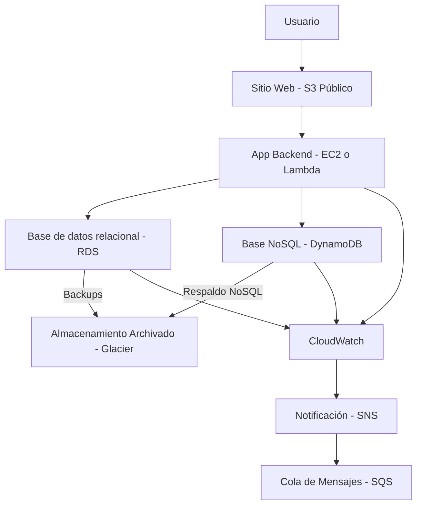

# Infraestructura Viva - Proyecto AWS Academy

---

## Índice

1. Introducción  
2. Objetivo  
3. Requerimientos  
4. Arquitectura propuesta  
5. Paso a paso de implementación  
   - Creación de VPC y subredes  
   - Configuración de bases de datos (RDS y DynamoDB)  
   - Configuración de almacenamiento (S3 y Glacier)  
   - Servicios de cómputo (EC2, Lambda, ECS)  
   - Configuración de red y seguridad (grupos de seguridad, NACL, VPN)  
   - Monitoreo y notificaciones (CloudWatch, SNS, SQS)  
6. Plan de monitoreo y alertas  
7. Buenas prácticas  
8. Conclusiones y aprendizajes  
9. Referencias  

---

## 1. Introducción

Este proyecto, denominado **Infraestructura Viva**, tiene como objetivo la migración de un entorno on-premise a la nube utilizando recursos gratuitos de AWS Academy. La solución contempla la integración y configuración de servicios de cómputo, bases de datos, almacenamiento, red, monitoreo y mensajería, buscando una infraestructura escalable, segura y eficiente.

---

## 2. Objetivo

Desarrollar una propuesta que contemple la migración y modernización de un entorno on-premise a AWS, aprovechando el Free Tier y los recursos de AWS Academy, cumpliendo con los requerimientos de cómputo, bases de datos, almacenamiento, red, monitoreo y notificaciones.

---

## 3. Requerimientos

- Desplegar aplicaciones mediante máquinas virtuales, contenedores o funciones serverless.  
- Utilizar una base de datos relacional gestionada (RDS).  
- Incorporar una solución NoSQL (DynamoDB) para datos semiestructurados.  
- Implementar almacenamiento de objetos con S3 y políticas de archivado con Glacier.  
- Configurar una red VPC segmentada con subredes públicas y privadas, reglas de seguridad y balanceo de carga.  
- Establecer un sistema de monitoreo y notificaciones con CloudWatch, SNS y SQS.  

---

## 4. Arquitectura propuesta

> (Aquí se insertará el diagrama arquitectónico)

---

## 5. Paso a paso de implementación

### 5.1 Creación de VPC y Subredes

Para comenzar con la infraestructura, crearemos la VPC y las subredes correspondientes.

---

### 5.1.1 Crear la VPC

- Nombre: `acme-vpc`  
- CIDR: `10.0.0.0/16`  

#### Comando AWS CLI

```bash
aws ec2 create-vpc --cidr-block 10.0.0.0/16 --tag-specifications 'ResourceType=vpc,Tags=[{Key=Name,Value=acme-vpc}]'
```

### 5.1.2 Crear Subredes Públicas
- Subred pública 1:
  - Nombre: acme-vpc-subnet-public1-us-east-1a
  - CIDR: 10.0.1.0/24
  - Zona de disponibilidad: us-east-1a
- Subred pública 2:
  - Nombre: acme-vpc-subnet-public2-us-east-1b
  - CIDR: 10.0.2.0/24
  - Zona de disponibilidad: us-east-1b

Comando AWS CLI (ejemplo para la primera subred)

```bash
aws ec2 create-subnet --vpc-id <VPC_ID> --cidr-block 10.0.1.0/24 --availability-zone us-east-1a --tag-specifications 'ResourceType=subnet,Tags=[{Key=Name,Value=acme-vpc-subnet-public1-us-east-1a}]'
```

### 5.1.3 Crear Subredes Privadas
- Subred privada 1:
  - Nombre: acme-vpc-subnet-private1-us-east-1a
  - CIDR: 10.0.3.0/24
  - Zona de disponibilidad: us-east-1a
- Subred privada 2:
  - Nombre: acme-vpc-subnet-private2-us-east-1b
  - CIDR: 10.0.4.0/24
  - Zona de disponibilidad: us-east-1b

Comando AWS CLI (ejemplo para la primera subred privada)

```bash
aws ec2 create-subnet --vpc-id <VPC_ID> --cidr-block 10.0.3.0/24 --availability-zone us-east-1a --tag-specifications 'ResourceType=subnet,Tags=[{Key=Name,Value=acme-vpc-subnet-private1-us-east-1a}]'
```

### 5.1.4 Crear Internet Gateway y Asociarlo a la VPC

```bash
aws ec2 create-internet-gateway --tag-specifications 'ResourceType=internet-gateway,Tags=[{Key=Name,Value=acme-vpc-igw}]'
```

- Anotar el InternetGatewayId generado y asociarlo a la VPC:
```bash
aws ec2 attach-internet-gateway --internet-gateway-id <IGW_ID> --vpc-id <VPC_ID>
```

### 5.1.5 Configurar Tabla de Enrutamiento Pública

- Crear una tabla de enrutamiento:
```bash
aws ec2 create-route-table --vpc-id <VPC_ID> --tag-specifications 'ResourceType=route-table,Tags=[{Key=Name,Value=acme-vpc-rtb-public}]'
```

- Añadir ruta hacia Internet Gateway:
```bash
aws ec2 create-route --route-table-id <RTB_ID> --destination-cidr-block 0.0.0.0/0 --gateway-id <IGW_ID>
```

- Asociar la tabla con las subredes públicas:
```bash
aws ec2 associate-route-table --subnet-id <SUBNET_PUBLIC_ID> --route-table-id <RTB_ID>
```

### 5.1.6 Configurar NAT Gateway y Tabla de Enrutamiento Privada

- Crear Elastic IP para NAT Gateway:
```bash
aws ec2 allocate-address --domain vpc
```

- Crear NAT Gateway en una subred pública:
```bash
aws ec2 create-nat-gateway --subnet-id <SUBNET_PUBLIC_ID> --allocation-id <ALLOCATION_ID> --tag-specifications 'ResourceType=natgateway,Tags=[{Key=Name,Value=acme-vpc-natgw}]'
```

- Crear tabla de enrutamiento para subredes privadas y asociar:
```bash
aws ec2 create-route-table --vpc-id <VPC_ID> --tag-specifications 'ResourceType=route-table,Tags=[{Key=Name,Value=acme-vpc-rtb-private}]'
```

- Añadir ruta hacia NAT Gateway:
```bash
aws ec2 create-route --route-table-id <PRIVATE_RTB_ID> --destination-cidr-block 0.0.0.0/0 --nat-gateway-id <NAT_GW_ID>
```

- Asociar tabla de enrutamiento privada a subredes privadas:
```bash
aws ec2 associate-route-table --subnet-id <SUBNET_PRIVATE_ID> --route-table-id <PRIVATE_RTB_ID>
```

---
---
---
---
---
---

# 🌐 Proyecto: Infraestructura Viva - Portafolio Cloud

## 🏢 Situación Inicial

**Unidad solicitante:** Equipo de Innovación Tecnológica de la empresa _“Soluciones Digitales ACME”_

El área de Innovación Tecnológica ha identificado la necesidad de modernizar la infraestructura para responder a crecientes requerimientos de procesamiento, almacenamiento y disponibilidad de datos.

Actualmente, los departamentos de **ventas**, **soporte** y **finanzas** utilizan un entorno **on-premise**, que genera altos costos de mantenimiento y limita la rápida implementación de nuevas funcionalidades.

### 🔍 Problemáticas a resolver

1. Disponer de un entorno de **cómputo escalable y seguro** para desplegar aplicaciones.
2. Integrar de forma unificada **bases de datos relacionales y NoSQL** sin depender de hardware físico.
3. Implementar un **sistema de almacenamiento confiable**, diferenciando datos de uso frecuente y de archivado.
4. Configurar una **red virtual** que permita aislar servicios internos y exponer aplicaciones públicas de forma segura.
5. Establecer un **plan de monitoreo y notificaciones** que detecte y corrija incidentes de forma proactiva.
6. Diseñar una **solución que pueda implementarse** utilizando los contenidos y conceptos vistos en los manuales del curso.

---

## 📘 Presentación del Caso

Este proyecto tiene como objetivo migrar una infraestructura on-premise hacia la nube, implementando una solución denominada **“Infraestructura Viva”**, utilizando recursos gratuitos de AWS (AWS Free Tier y AWS Academy).

Se busca poner en práctica los conceptos del módulo 4: _Fundamentos de Tecnología Cloud_, mediante el uso de servicios gestionados de cómputo, bases de datos, almacenamiento, redes, monitoreo y notificaciones, con énfasis en el diseño escalable, seguro y viable dentro de un entorno educativo.

---

## ⚙️ Alcance y Restricciones Técnicas

Dado que el entorno de laboratorio en AWS Academy (Alchemy Lab) **no permite el acceso completo a todos los servicios**, se tomaron decisiones técnicas basadas en disponibilidad real. Las siguientes limitaciones fueron detectadas:

| Servicio | Restricción en Alchemy | Solución Alternativa |
|----------|------------------------|------------------------|
| CloudFront | No disponible | Se omite CDN; se trabaja solo con S3 público |
| Lightsail | No disponible | Se utiliza EC2 t2.micro desde Free Tier |
| ACM / dominios personalizados | No disponible | Uso de dominios internos o IP públicas |
| CLI o SDK limitado | No disponible | Se utiliza únicamente la consola web (GUI) de AWS Academy |

Estas decisiones permiten mantener la **viabilidad técnica del proyecto**, ajustándose al entorno educativo, sin perder los objetivos de aprendizaje.

---

## 🧱 Componentes de la Arquitectura



---

## 🔍 Descripción Técnica de Componentes

| Componente         | Función                                               | Justificación técnica                                                   |
| ------------------ | ----------------------------------------------------- | ----------------------------------------------------------------------- |
| **S3**             | Almacena sitio web estático y archivos multimedia     | Sencillo, seguro y gratuito (Free Tier)                                 |
| **EC2 / Lambda**   | Ejecuta backend de aplicación                         | EC2 se usa por simplicidad en Alchemy; Lambda si se prefiere serverless |
| **RDS**            | Gestiona datos estructurados (ventas, usuarios, etc.) | Alta disponibilidad, backup automático, escalabilidad                   |
| **DynamoDB**       | Guarda datos semiestructurados (logs, tickets)        | No requiere mantenimiento ni escalado manual                            |
| **Glacier**        | Almacenamiento a largo plazo y respaldo               | Coste mínimo para datos poco accedidos                                  |
| **VPC + Subredes** | Aislar servicios internos y públicos                  | Mejora la seguridad y control de red                                    |
| **CloudWatch**     | Recoge métricas y genera alarmas                      | Permite acciones proactivas ante fallas                                 |
| **SNS + SQS**      | Canal de alertas y comunicación entre servicios       | Alta disponibilidad y comunicación desacoplada                          |

--- 

# 🧩 Desarrollo
### Recursos y nombres utilizados

| Recurso            | Nombre sugerido                                 | Comentario                            |
| ------------------ | ----------------------------------------------- | ------------------------------------- |
| VPC                | `acme-vpc`                                      | VPC general para todo el proyecto     |
| Subred pública     | `acme-subnet-public`                            | Para EC2, Lambda o API Gateway        |
| Subred privada     | `acme-subnet-private`                           | Para RDS o servicios internos         |
| IGW                | `acme-igw`                                      | Internet Gateway                      |
| Tabla de rutas     | `acme-route-table`                              | Para asociar a subredes               |
| Grupo de seguridad | `acme-sg-web` (pública), `acme-sg-db` (privada) | Buen nombre para distinguir roles     |
| EC2 (si usas)      | `acme-ec2-api`                                  | Solo si decides usar EC2              |
| Lambda             | `acme-lambda-api`                               | Para tu función que consulta DynamoDB |
| API Gateway        | `acme-api`                                      | Nombre para endpoint REST             |
| RDS                | `acme-db`                                       | Instancia MySQL/PostgreSQL            |
| DynamoDB           | `acme-products`                                 | Tabla de productos ACME               |
| S3                 | `acme-store` o `acme-web`                       | Bucket con el sitio web               |
| CloudWatch alarmas | `acme-alarm-lambda` etc.                        | Si configuras monitoreo               |
| SNS/SQS            | `acme-sns-alertas`, `acme-sqs-eventos`          | Si haces notificaciones               |

--- 

## VPC


## DynamoDB


## S3


```json
{
    "Version": "2012-10-17",
    "Statement": [
        {
            "Sid": "PublicReadGetObject",
            "Effect": "Allow",
            "Principal": "*",
            "Action": "s3:GetObject",
            "Resource": "arn:aws:s3:::acme-s3-assets/*"
        }
    ]
}
```


## Security Group Lambda - VPC - Public Network

| # | Tipo      | Protocolo | Puerto | Destino   | Comentario                                      |
| - | --------- | --------- | ------ | --------- | ----------------------------------------------- |
| 1 | HTTPS     | TCP       | 443    | 0.0.0.0/0 | ✅ Permite acceso a DynamoDB, S3, SNS, SQS, etc. |
| 2 | DNS (UDP) | UDP       | 53     | 0.0.0.0/0 | ✅ Para resolución de nombres (básico)           |
| 3 | DNS (TCP) | TCP       | 53     | 0.0.0.0/0 | ✅ Para resolución DNS avanzada (fallback TCP)   |


## Lambda


```python
import json
import boto3

dynamodb = boto3.client('dynamodb')

def lambda_handler(event, context):
    response = dynamodb.scan(TableName='products')

    items = []
    for item in response['Items']:
        items.append({
            'id': item['id']['S'],
            'nombre': item['nombre']['S'],
            'descripcion': item['descripcion']['S'],
            'img': item['img']['S']
        })

    return {
        'statusCode': 200,
        'headers': { 'Content-Type': 'application/json' },
        'body': json.dumps(items)
    }
```
