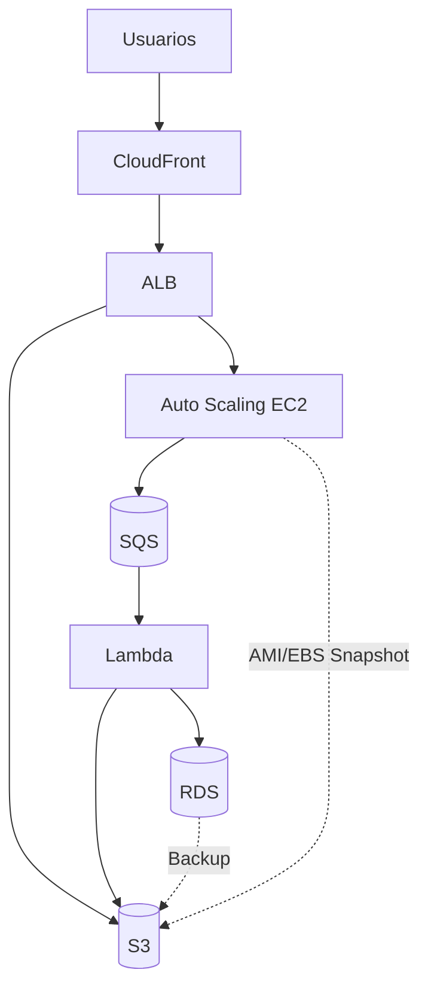
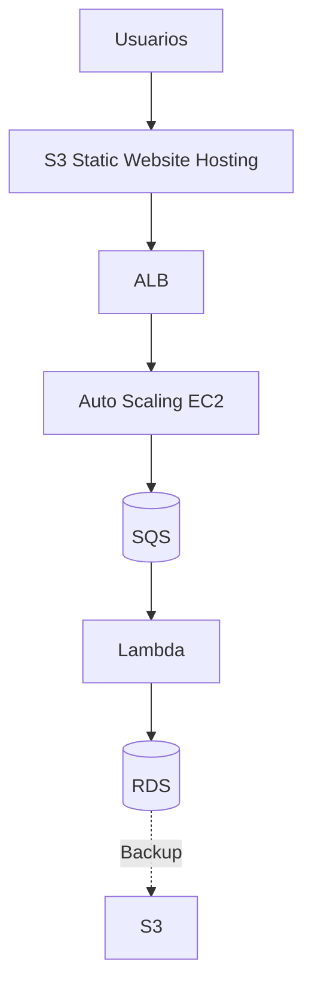

# 📄 Proyecto: Arquitecturas Cloud Básicas – Caso Resuelto (Versión Dual)

## 🏢 Situación Inicial
La empresa tecnológica moderniza su infraestructura y migra servicios a la nube. El objetivo es diseñar una arquitectura cloud escalable, disponible y eficiente en costos, siguiendo buenas prácticas —y también adaptándola a las limitaciones de AWS Academy Learner Lab.

---

## 📋 Requerimientos y Solución

### 1. Almacenamiento de Objetos
- **Ideal:** Amazon S3 (acceso completo), sin Glacier Vault, usado para archivos estáticos y respaldos.
- **Academy:** Igual, ya que S3 está disponible en AWS Academy Learner Lab.

### 2. Respaldo y Recuperación
- **Ideal:** RDS snapshots → S3; EC2 AMI/EBS snapshots → S3 (≤ 100 GB por volumen).
- **Academy:** Igual, cuidando de no exceder almacenamiento y presupuesto.

### 3. Modelo de Nube
- **Ideal:** Nube Pública AWS en `us-east-1` / `us-west-2`.
- **Academy:** Igual, el entorno ofrece estas regiones.

### 4. Escalabilidad y Balanceo
- **Ideal:** Auto Scaling Group (t2.micro/t3.micro) + ALB; máx. 9 instancias/región y 32 vCPU totales.
- **Academy:** Coincide con los límites reales del lab.

### 5. Alta Disponibilidad
- **Ideal:** 2 Zonas de Disponibilidad con ALB distribuyendo tráfico.
- **Academy:** Igual, manteniendo bajo el número de instancias.

### 6. Disponibilidad de Contenidos (CDN)
- **Ideal:** CloudFront como CDN para distribución global.
- **Academy:** Si CloudFront no está disponible, usar:
  - S3 Static Website Hosting + HTTP cache control.
  - Route 53 con TTL bajos para simular distribución.

### 7. Mensajería Asíncrona y Lambda
- **Ideal:** Amazon SQS → Lambda → Backend (desacoplamiento).
- **Límite real AWS:** LambdaConcurrency = 1,000 ejecuciones concurrentes por región.
- **Academy:** Igual, respetando el límite.

### 8. Administración de Costos
- AWS Cost Explorer, Trusted Advisor, tagging, instancias pequeñas, detener recursos inactivos, evitar NAT Gateway.

---

## 🗺️ Arquitectura Ideal (Mermaid)

---

## 🗺️ Arquitectura Adaptada (AWS Academy Learner Lab)

- Reemplazo de CloudFront por S3 Static Website Hosting (o Route 53) para cumplir con disponibilidad.
- Se mantienen ASG, ALB, SQS, Lambda, RDS y respaldos.

---

## 📊 Límites Reales en AWS Academy Lab
- **EC2:** Máx. 9 instancias por región y 32 vCPU totales.
- **Lambda:** Concurrency por defecto de 1,000 invocaciones concurrentes por región.
- **S3, SQS, RDS, snapshots, ALB:** Disponibles sin restricciones mayores.

---

## 💰 Estimación de Costos (On-Demand – Región us-east-1)
| Componente            | Cantidad | Tipo           | Precio Unitario (USD/h) | Total (USD/mes) |
|----------------------|----------|----------------|-------------------------|-----------------|
| EC2 t3.micro         | 4        | On-Demand      | 0.0104                  | ~30.00          |
| RDS t3.micro         | 1        | On-Demand      | 0.018                    | ~13.00          |
| S3 Standard          | 50 GB    | Almacenamiento | 0.023/GB-mes            | ~1.15           |
| CloudFront (Ideal)   | 50 GB    | Data Out       | 0.085/GB                | ~4.25           |
| SQS Standard         | 1 cola   | 1M req incl.   | 0.40/M extra            | 0               |
| Lambda               | 1M invoc.| Incl. 400k seg | Gratis/uso menor        | 0               |

> *Valores aproximados de AWS On-Demand para referencia; en AWS Academy Learner Lab el costo no se cobra pero el presupuesto es limitado.*

---

## ✅ Beneficios Clave
- Escalabilidad automática sin superar límites del lab.
- Alta disponibilidad multi-AZ.
- Mensajería asíncrona para resiliencia.
- Distribución de contenido optimizada (ideal con CDN).
- Costos reducidos y controlados en entorno real o de laboratorio.
