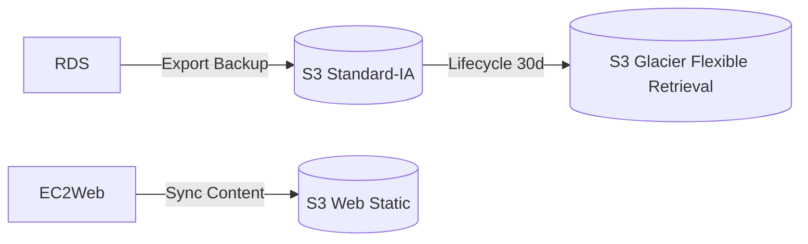
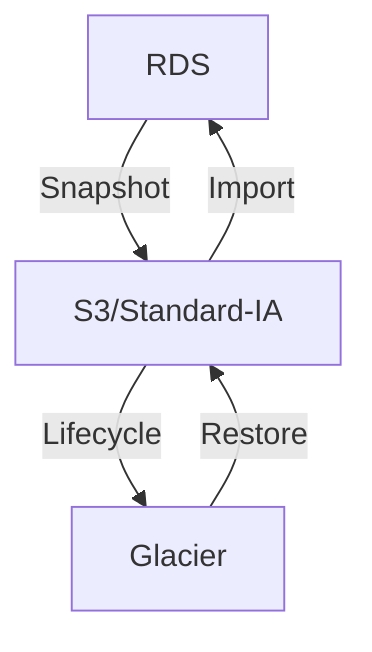
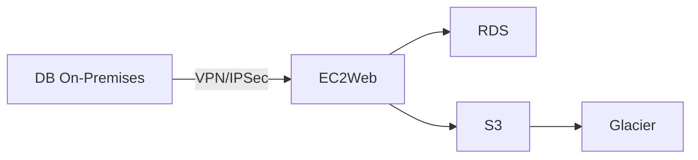
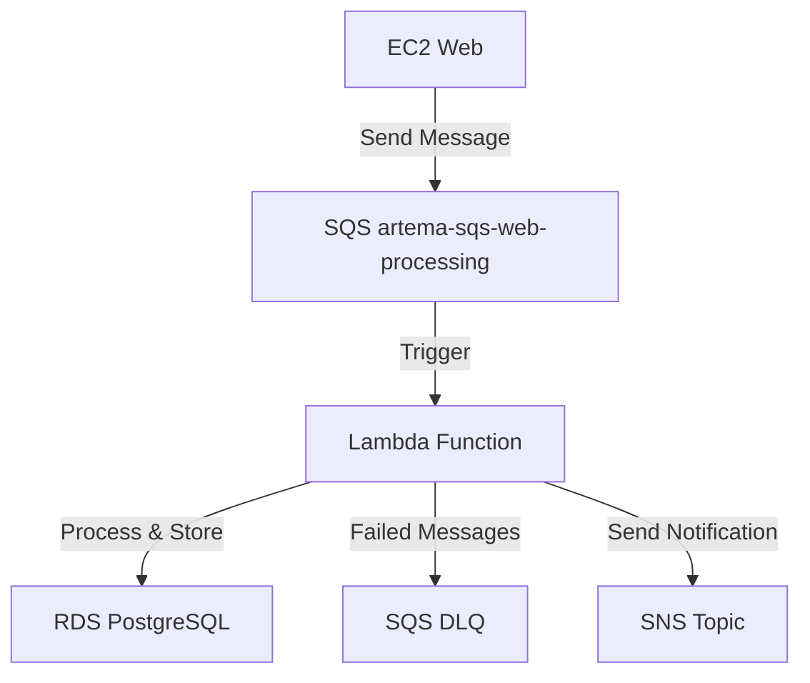
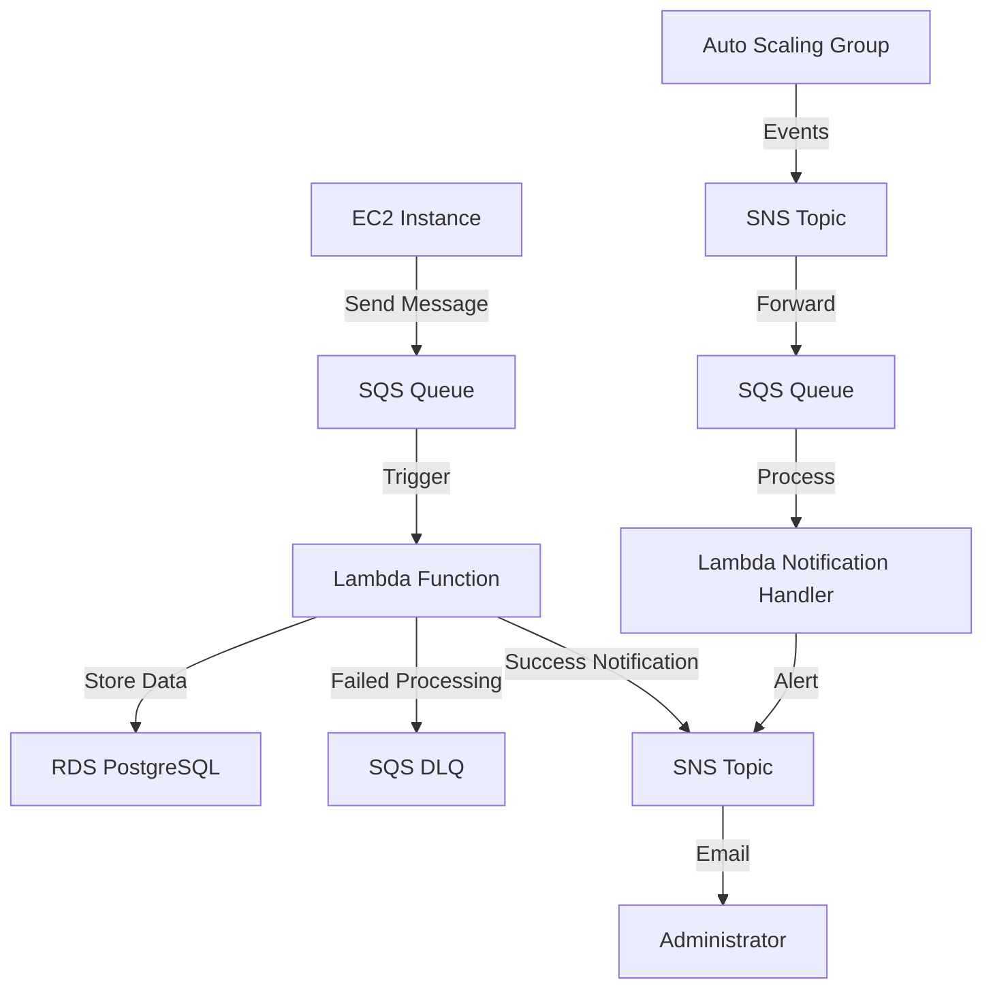
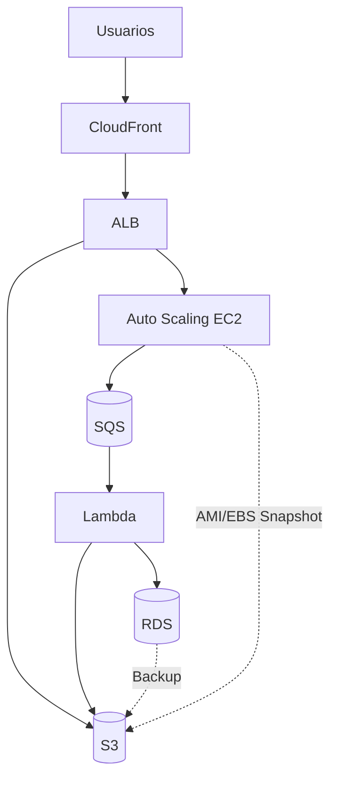
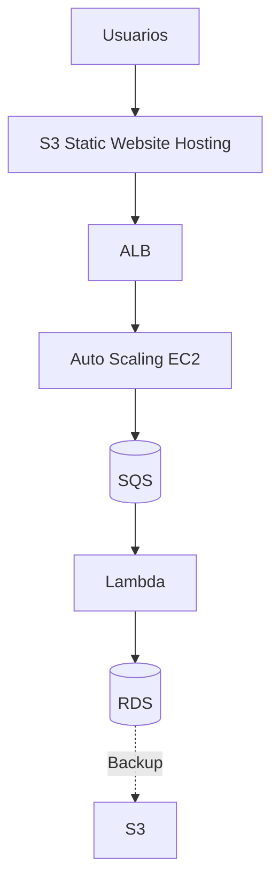

# 📄 Proyecto: Arquitecturas Cloud Básicas

### 🏢 Situación Inicial
La empresa está modernizando su infraestructura y migrando servicios a la nube. Requiere diseños de arquitecturas cloud que garanticen escalabilidad, disponibilidad y eficiencia en costos, combinando modelos públicos, privados e híbridos, con balanceo de carga, escalabilidad automática y mensajería asíncrona.

---

## Objetivo
Diseñar arquitecturas cloud básicas aplicando buenas prácticas para garantizar:
- Escalabilidad  
- Disponibilidad  
- Eficiencia en costos  

Incluyendo componentes como almacenamiento, cómputo, red, mensajería y gestión de costos.

---

## Requerimientos
### Generales
- Aplicar buenas prácticas en diseño cloud.  
- Justificar elección de componentes.  
- Considerar costos, seguridad y disponibilidad.  

### Técnicos
1. **Almacenamiento**: Servicio de objetos (ej. AWS S3, Azure Blob Storage).  
2. **Respaldo**: Mecanismo de backup y recuperación (ej. Snapshots, AWS Backup).  
3. **Modelo de nube**: Elegir entre pública, privada o híbrida.  
4. **Escalabilidad**: Auto Scaling y balanceo de carga (ej. AWS ELB, Kubernetes).  
5. **Mensajería**: Servicio asíncrono (ej. AWS SQS, Azure Service Bus).  
6. **Costos**: Estimación detallada (ej. AWS Pricing Calculator).  

---

# 📋 Paso a Paso (8 Lecciones)

## Leccion 1. Almacenamiento de Objetos
### Decisión técnica:
- Se eligió Amazon S3 como servicio de almacenamiento de objetos debido a su alta disponibilidad (99.999999999%), durabilidad, integración con otros servicios de AWS y escalabilidad sin intervención manual.

### Clases de almacenamiento elegidas:
- S3 Standard-IA para backups recientes de base de datos (acceso poco frecuente, recuperación rápida).
- S3 Glacier Flexible Retrieval para almacenamiento a largo plazo con costo reducido y recuperación en minutos-horas.

### Integración en la arquitectura:
- RDS genera respaldos → S3 (Standard-IA) → Regla de ciclo de vida → Glacier Flexible Retrieval a los 30 días.
- EC2 Web descarga archivos estáticos desde s3://artema-s3-storage/web/.

### Diagrama:
- S3 Standard-IA
- Glacier Flexible Retrieval


### Costos estimados (mensual):
| Recurso                       | Uso estimado | Precio unitario | Costo   |
| ----------------------------- | ------------ | --------------- | ------- |
| S3 Standard-IA                | 10 GB        | \$0.0125/GB     | \$0.125 |
| S3 Glacier Flexible Retrieval | 50 GB        | \$0.0036/GB     | \$0.18  |
| Requests GET/PUT              | 100k ops     | \$0.0004/1000   | \$0.04  |

---

## Leccion 2. Respaldo y Recuperación
### Mecanismo de respaldo*:
- Snapshots automáticos de RDS en Multi-AZ.
- Exportación manual de backups a S3 → Glacier (ciclo de vida).

### Proceso de recuperación:
1. Restaurar snapshot más reciente desde RDS.
2. Si es necesario, recuperar archivo desde S3 Glacier (espera de minutos-horas).
3. Importar datos a instancia RDS.

### Diagrama:


### Costos estimados:
| Componente               | Uso estimado | Precio     | Costo  |
| ------------------------ | ------------ | ---------- | ------ |
| Snapshot RDS             | 20 GB        | \$0.095/GB | \$1.90 |
| Transferencia S3-Glacier | 50 GB        | \$0.03/GB  | \$1.50 |

---

## Leccion 3. Modelo de Nube
### Modelo elegido: Nube Híbrida.
- Parte pública: AWS (S3, EC2, RDS, SQS, ALB).
- Parte privada (simulada): almacenamiento local para datos sensibles (ej. DB con información crítica).

### Justificación:
- Cumplimiento normativo y control de datos sensibles.
- Aprovechar elasticidad y pago por uso de la nube pública.
- Resiliencia y redundancia con servicios gestionados.

### Diagrama:


---

## Leccion 4. Escalabilidad y Balanceo
### Implementación:
- Launch Template con Amazon Linux + Nginx que sincroniza contenido desde S3.
- Auto Scaling Group con mínimo 1, máximo 3 instancias t2.micro.
- Escalado basado en CPU ≥ 80%.

### Ventajas:
- Escalado automático sin intervención humana.
- Integración con ALB para balanceo de tráfico.

---

## Leccion 5. Alta Disponibilidad
### Implementación:
- Application Load Balancer en 2 zonas de disponibilidad (us-east-1a y us-east-1b).
- Health checks HTTP cada 10s con 5 intentos para considerar una instancia saludable.

### Continuidad de servicio:
- Si una AZ falla, el ALB redirige tráfico automáticamente a la otra.

---

## Leccion 6. Disponibilidad de Contenidos (CDN)
### Implementación:
- Ideal: CloudFront.
- Restricción AWS Academy: uso de S3 Static Website Hosting + Route 53 con TTL bajos para simular distribución.

### Políticas de protección:
- Bloqueo de acceso público a buckets (solo mediante IAM Role).
- Uso de HTTPS en ALB para contenido dinámico.

---

## Leccion 7. Mensajería Asíncrona y Lambda
### Implementación:
- Amazon SQS como cola de mensajes para desacoplar procesos (ej. subida de archivo → notificación vía SNS → procesamiento por Lambda).
- SNS para envío de notificaciones por email en eventos de Auto Scaling (lanzamiento/terminación de instancias).

### Beneficios:
- Evita bloqueos entre servicios.
- Escalable y tolerante a fallos.


---

## Leccion 8. Administración de Costos
### Estimación mensual aproximada:
| Servicio                   | Costo estimado |
| -------------------------- | -------------- |
| EC2 (t2.micro x 2)         | \$8.50         |
| ALB                        | \$16.00        |
| S3                         | \$0.35         |
| Glacier                    | \$0.18         |
| RDS (db.t3.micro Multi-AZ) | \$23.00        |
| SQS/SNS                    | \$0.20         |
| **Total estimado**         | **\$48.23**    |



---

## 🗺️ Arquitectura Ideal (Mermaid)


---

## 🗺️ Arquitectura Adaptada (AWS Academy Learner Lab)


- Reemplazo de CloudFront por S3 Static Website Hosting (o Route 53) para cumplir con disponibilidad.
- Se mantienen ASG, ALB, SQS, Lambda, RDS y respaldos.

---

# 📋 Paso a Paso (Construcción de la Infraestructura)


## 1. **VPC**: Virtual Private Cloud
### Configuracion
- **VPC settings**: VPC and more
- **Name**: artema
- **IPv4 CIDR block**: 10.0.0.0/16
- **IPv6 CIDR block**: No IPv6 CIDR block
- **Number of Availability Zones**: 2
- **Customize AZs**:
  - us-east-1a
  - us-east-1b
- **Number of public subnets**: 2
- **Number of private subnets**: 2
- **Customize subnets CIDR blocks**:
  - **Public subnet CIDR block in us-east-1a**: 10.0.0.0/20
  - **Public subnet CIDR block in us-east-1b**: 10.0.16.0/20
  - **Private subnet CIDR block in us-east-1a**: 10.0.128.0/20
  - **Private subnet CIDR block in us-east-1b**: 10.0.144.0/20
- **NAT gateways**: In 1 AZ
- **VPC endpoints**: S3 Gateway
- **Enable DNS hostnames**: check
- **Enable DNS resolution**: check

### Enrutar subredes privadas por un solo camino
```bash
Private Route tables
└── artema-rtb-private1-us-east-1a rename to ==> artema-rtb-private
    └── Subnet associations
        └── Edit subnet associations
            ├── Selected subnets
            │   ├── artema-subnet-private1-us-east-1a     
            │   └── artema-subnet-private2-us-east-1b
            └── Save associations
```

```bash
Public Router Table
    ├── artema-rtb-public
    │   ├── Routes
    │   │   ├── igw 0.0.0.0/0
    │   │   └── local 10.0.0.0/16
    │   └── Subnet associations
    │       ├── artema-subnet-public1-us-east-1a 10.0.0.0/20
    │       └── artema-subnet-public2-us-east-1b 10.0.16.0/20
    └── artema-rtb-private
        ├── Routes
        │   ├── nat 0.0.0.0/0
        │   └── local 10.0.0.0/16
        └── Subnet associations
            ├── artema-subnet-private1-us-east-1a 10.0.128.0/20
            └── artema-subnet-private2-us-east-1b 10.0.144.0/20    
```

---

## 2.**Seciruty Group**:

### artema-sg-bastion
- **Name**: artema-sg-bastion
- **Description**: Acceso Bastion
- **VPC**: artema-vpc
- **Inbound rules**:
  - SSH
    - Type: SSH
    - Protocol: TCP
    - Port range: 22
    - Destination type: Anywhere-IPv4
    - Destination: 0.0.0.0/0
    - Description: Acceso SSH 
  - HTTP
    - Type: HTTP
    - Protocol: TCP
    - Port range: 80
    - Destination type: Anywhere-IPv4
    - Destination: 0.0.0.0/0
    - Description: Acceso web    
  - PostgreSQL
    - Type: PostgreSQL
    - Protocol: TCP
    - Port range: 5432
    - Destination type: Custom
    - Destination: artema-sg-rds
    - Description: Acceso PostgreSQL 
- **Outbound rules**:
  - Outbound
    - Type: All traffic
    - Protocol: all
    - Port range: all
    - Destination type: Custom
    - Destination: 0.0.0.0/0
    - Description:

### artema-sg-web
- **Name**: artema-sg-web
- **Description**: Acceso Web
- **VPC**: artema-vpc
- **Inbound rules**:
  - SSH
    - Type: SSH
    - Protocol: TCP
    - Port range: 22
    - Destination type: Anywhere-IPv4
    - Destination: 0.0.0.0/0
    - Description: Acceso SSH   
  - HTTP
    - Type: HTTP
    - Protocol: TCP
    - Port range: 80
    - Destination type: Anywhere-IPv4
    - Destination: 0.0.0.0/0
    - Description: Acceso web    
  - HTTPS
    - Type: HTTPS
    - Protocol: TCP
    - Port range: 443
    - Destination type: Anywhere-IPv4
    - Destination: 0.0.0.0/0
    - Description: Acceso web
- **Outbound rules**:
  - Outbound
    - Type: All traffic
    - Protocol: all
    - Port range: all
    - Destination type: Custom
    - Destination: 0.0.0.0/0
    - Description: Acceso PostgreSQL

### artema-sg-rds
- **Name**: artema-sg-rds
- **Description**: Acceso para RDS
- **VPC**: artema-vpc
- **Inbound rules**:
  - PostgreSQL
    - Type: PostgreSQL
    - Protocol: TCP
    - Port range: 5432
    - Destination type: Custom
    - Destination: artema-sg-bastion
    - Description: Acceso PostgreSQL
- **Outbound rules**:
  - Outbound
    - Type: PostgreSQL
    - Protocol: TCP
    - Port range: 5432
    - Destination type: Custom
    - Destination: 0.0.0.0/0
    - Description: Acceso PostgreSQL

### artema-sg-lambda
- **Name**: artema-sg-lambda
- **Description**: Permite trafico de salida desde Lambda
- **VPC**: artema-vpc
- **Outbound rules**:
  - Outbound
    - Type: All traffic
    - Protocol: all
    - Port range: all
    - Destination type: Custom
    - Destination: 0.0.0.0/0
    - Description:

---

## 3. **S3 Bucket**: Almacenamiento Estático
### Estructura Optimizada del Bucket S3
```bash
artema-s3-storage/
├── web/                  # ✅ Contenido estático,se montará via IAM Role sin acceso público
│   ├── css/
│   ├── data/
│   ├── img/
│   ├── js/
│   ├── error.html
│   └── index.html
├── docs/                 # ✅ Documentos privados (Standard-IA)
└── db_backups/           # ✅ Backups → Glacier (Lifecycle Rule)
```

### Bucket
- **Region**: us-east-1
- **Name**: artema-s3-storage
- **Object Ownership**: ACLs desactivados
- **Block all public access**: check
- **Versioning**: Disable
- **Encryption**: SSE-S3
- **Bucket Key**: Disable

### Management - Create lifecycle rule (Opcional mover a Glacier)
- **Name**: artema-s3-pgdb-to-glacier
- **Choose a rule scope**: Limit the scope of this rule using one or more filters
- **Prefix**: db_backups/
- **Lifecycle rule actions**: Transition current versions of objects between storage classes
- **Choose storage class transitions**: Glacier Flexible Retrieval
- **Days after object creation**: 30

### Permissions - Bucket Policy
```json
{
    "Version": "2012-10-17",
    "Statement": [
        {
            "Sid": "EC2AccessViaIAMRole",
            "Effect": "Allow",
            "Principal": {
                "AWS": "arn:aws:iam::992136605746:role/LabRole"
            },
            "Action": [
                "s3:GetObject",
                "s3:ListBucket",
                "s3:PutObject"  // Necesario si EC2 sube archivos
            ],
            "Resource": [
                "arn:aws:s3:::artema-s3-storage",
                "arn:aws:s3:::artema-s3-storage/*"
            ]
        },
        {
            "Sid": "GlacierBackups",
            "Effect": "Allow",
            "Principal": {
                "AWS": "arn:aws:iam::992136605746:role/LabRole"
            },
            "Action": [
                "s3:PutObject",
                "s3:RestoreObject"  // Para recuperar de Glacier
            ],
            "Resource": "arn:aws:s3:::artema-s3-storage/db_backups/*"
        },
        {
            "Sid": "AllowRDSExportToS3",
            "Effect": "Allow",
            "Principal": {
                "Service": "export.rds.amazonaws.com"
            },
            "Action": [
                "s3:PutObject*",
                "s3:ListBucket",
                "s3:GetBucketLocation" // Para ecportar desde RDS
            ],
            "Resource": [
                "arn:aws:s3:::artema-s3-storage",
                "arn:aws:s3:::artema-s3-storage/db_backups/*"
            ]
        }        
    ]
}
```

---

## 4. **RDS**: Relational Database Service
### DRS Subnet Group
- **Name**: artema-rds-sng
- **Description**: Private subnet group para PostgreSQL
- **VPC**: artema-vpc
- **Availability Zones**:
    - us-east-1a
    - us-east-1b
- **Subnets**:
    - artema-subnet-private1-us-east-1a
    - artema-subnet-private2-us-east-1b

### PostgreSQL
- **Creation method**: Standard create
- **Engine type**: PostgreSQL
- **Templates**: Dev/Test
- **Availability and durability**: Multi-AZ DB instance deployment (2 instances)
- **DB instance**: artema-pgdb
- **Master username**: postgres
- **Credentials management**: ********
- **Instance configuration**:
    - Burstable classes (includes t classes)
    - db.t3.micro
- **Allocated storage**: 20 GiB
- **Enable storage autoscaling**: check
- **Connectivity**: none
- **Compute resource**: none
- **VPC**: artema-vpc
- **DB subnet group**: artema-rds-sng
- **Public access**: No
- **Security groups**: artema-sg-rds
- **Enhanced Monitoring**: Disabled  

### Snapshots respado manual en S3 (Opcional)
> [!CAUTION] NO SE PUEDE POR LIMITACIONES DE AWS ACADEMY

```sql
CREATE TABLE personajes_hxh (
    id SERIAL PRIMARY KEY,
    nombre VARCHAR(100) NOT NULL,
    tipo_nen VARCHAR(50) NOT NULL,
    edad INT NOT NULL,
    descripcion TEXT,
    img VARCHAR(100)
);
```

```sql
INSERT INTO personajes_hxh 
    (nombre, tipo_nen, edad, descripcion, img)
VALUES
    ('Gon Freecss', 'Enhancer', 12, 'Protagonista, con gran talento natural para el Nen.', 'gon.webp'),
    ('Killua Zoldyck', 'Transmuter', 12, 'Hijo de la familia asesina Zoldyck, amigo cercano de Gon.', 'killua.webp'),
    ('Kurapika', 'Conjurer', 17, 'Último sobreviviente del clan Kurta, busca venganza.', 'kurapika.webp'),
    ('Leorio Paradinight', 'Emitter', 19, 'Aspira a ser médico, es valiente y decidido.', 'leorio.webp'),
    ('Hisoka Morow', 'Transmuter', 28, 'Antagonista impredecible, disfruta de la pelea.', 'hisoka.webp'),
    ('Chrollo Lucilfer', 'Specialist', 30, 'Líder de la banda de ladrones Fantasma.', 'chrollo.webp'),
    ('Biscuit Krueger', 'Enhancer', 30, 'Maestra experimentada con apariencia joven.', 'biscuit.webp');
```

---

# **5. SNS**: Simple Notification Service 
### Topics
- **Topics**: Standard
- **Name**: artema-sns

### Create subscription
- **Topic ARN**: artema-sns
- **Protocol**: mail@mail.cl

---

## **6. EC2**: Elastic Compute Cloud
###  Bastion
- **Name**: artema-ec2-bastion
- **OS Images**: Amazon Linux
- **Amazon Machine Image**: Amazon Linux 2023 kernel-6.1 AMI
- **Instance type**: t2.micro
- **Key pair**: artema-key (RSA) (.ppk)
- **VPC**: artema-vpc
- **Subnet**: artema-subnet-public1-us-east-1a
- **Auto-assign public IP**: Enable
- **security groups**: artema-sg-bastion
- **Advanced details**:
  - **IAM instance profile**: LabInstanceProfile
  - **User data**
```bash
#!/bin/bash
yum update && yum upgrade -y
yum install -y httpd
systemctl enable httpd
systemctl start httpd
echo '<html><h1>EC2 Bastion Corriendo!!!</h1></html>' > /var/www/html/index.html
```
### PuTTY
- Session
    - HostName: BastionIP
- Connection
    - Seconds: 30
    - SSH
        - Auth
            - Credentials
                - Private Key: artema-key.ppk
        - Tunnels      
            - Source port: 5433
            - Destination: RDS-Endpoint + : + 5432
### Console
```bash
ec2-user
```

---

## **7. EC2**: Launch Templates
### Launch template web
- **Name**: artema-lt-web
- **Description**: Plantilla base para Web
- **OS Images**: Amazon Linux
- **Amazon Machine Image**: Amazon Linux 2023 kernel-6.1 AMI
- **Instance type**: t2.micro
- **Key pair**: artema-key.ppk (RSA) (.ppk)
- **Subnet**: Don't include in launch template
- **Availability Zone**: Don't include in launch template
- **security groups**: artema-sg-web
- **Advanced network configuration**:
  - **Auto-assign public IP**: Enable
- **Resource tags**
  - **Key**: Name
  - **Value**: artema-ec2-web
  - **Resource types**: Instances
- **Advanced details**:
  - **IAM instance profile**: LabInstanceProfile
  - **User data**
```bash
#!/bin/bash
yum update && yum upgrade -y
yum install -y nginx awscli
aws s3 sync s3://artema-s3-storage/web/ /usr/share/nginx/html/
chown -R nginx:nginx /usr/share/nginx/html/
chmod -R 755 /usr/share/nginx/html/
systemctl enable nginx
systemctl start nginx
```

- Validar funcionamiento
```bash
# Comprobar estado de Nginx
systemctl status nginx
# Probar acceso local a la web
curl -I http://localhost
# Verificar contenido descargado de S3
ls -la /usr/share/nginx/html/
# Validar AWS CLI
aws s3 ls s3://artema-s3-storage/web/ --human-readable
# Verificar puertos abiertos
sudo netstat -tulnp | grep nginx
```

---

## **8. Auto Scaling**:
### Target groups
- **target type**: Instances
- **Name**: artema-tg-web
- **Protocol**: HTTP
- **Port**: 80
- **VPC**: artema-vpc
- **Health check protocol**: HTTP 
- **Health check path**: /
- **Traffic port**: check
- **Healthy threshold**: 5
- **Unhealthy threshold**: 2
- **Timeout**: 5
- **Interval**: 10

### Load balancers
- **Load balancer types**: Application Load Balancer
- **Name**: artema-lb-web
- **Scheme**: Internal
- **Load balancer IP address type**: IPv4
- **VPC**: artema-vpc
- **us-east-1a (use1-az4)**: artema-subnet-public1-us-east-1a
- **us-east-1b (use1-az6)**: artema-subnet-public2-us-east-1b
- **Security groups**: artema-sg-web
- **Protocol**: HTTP
- **Port**: 80
- **Default action (target group)**: artema-tg-web

### Auto Scaling
- **Name**: artema-asg
- **Launch template**: artema-lt-web
- **VPC**: artema-vpc
- **Availability Zones and subnets**:
  - artema-subnet-public1-us-east-1a 
  - artema-subnet-public2-us-east-1b
- **Availability Zone distribution**: Balanced best effort
- **Load balancing**: Attach to an existing load balancer
- **Attach to an existing load balancer**: Choose from your load balancer target groups
- **Existing load balancer target groups**: artema-tg-web | HTTP
- **Select VPC Lattice service to attach**: 
No VPC Lattice service
- **Health check**:
  - **Turn on Elastic Load Balancing health checks**: check
  - **Turn on Amazon EBS health checks**: check
- **Health check grace period**: 90
- **Desired capacity** : 1
- **Min desired capacity**: 1
- **Max desired capacit**y: 3
- **Choose whether to use a target tracking policy**: Target tracking scaling policy
- **Scaling policy name**: artema-policy-web
- **Metric type**: Average CPU utilization
- **Target value**: 80
- **Instance warmup**: 90
- **SNS Topic**: SNS Topic
- **Event types**:
  - **Launch**: check
  - **Terminate**: check
  - **Fail to launch**: check
  - **Fail to terminate**: check      

---

## **9. SQS: Simple Queue Service**:
### artema-sqs-web-processing
- **Type**: Standard
- **Name**: artema-sqs-web-processing
- **Visibility timeout**: 30 Seconds
- **Message retention period**: 4 Days
- **Delivery delay**: 0
- **Receive message wait time**: 0
- **Maximum message size**: 1024 KiB

---

## **10. Lambda Functions**:
### Lambda SQS Processor
- **Name**: artema-lambda-sqs-processor
- **Runtime**: Python 3.13
- **Architecture**: x86_64
- **Use an existing role**: LabRole
- **VPC**: artema-vpc
- **Subnets**
    - artema-subnet-private1-us-east-1a
    - artema-subnet-private2-us-east-1b
- **Security groups**: artema-sg-lambda

###  Configuration - Environment variable
- **RDS_ENDPOINT**: artema-pgdb.code.us-east-1.rds.amazonaws.com
- **DB_NAME**: postgres
- **SNS_TOPIC_ARN**: arn:aws:sns:us-east-1:account:artema-sns

```python
import json
import boto3
import psycopg2
import os
from datetime import datetime

def lambda_handler(event, context):
  # Clientes AWS
  sns = boto3.client('sns')
  
  # Procesar mensajes de SQS
  for record in event['Records']:
    try:
      # Parsear mensaje
      message = json.loads(record['body'])
      
      # Conectar a RDS
      conn = psycopg2.connect(
        host=os.environ['RDS_ENDPOINT'],
        database=os.environ['DB_NAME'],
        user='postgres',
        password='tu_password_aqui'  # Mejor usar AWS Secrets Manager
      )
      
      # Insertar log de procesamiento
      cur = conn.cursor()
      cur.execute("""
        INSERT INTO processing_logs (message_id, content, processed_at) 
        VALUES (%s, %s, %s)
      """, (record['messageId'], str(message), datetime.now()))
      
      conn.commit()
      cur.close()
      conn.close()
      
      # Enviar notificación
      sns.publish(
        TopicArn=os.environ['SNS_TOPIC_ARN'],
        Subject='Mensaje Procesado',
        Message=f'Mensaje {record["messageId"]} procesado exitosamente'
      )
        
    except Exception as e:
      print(f"Error procesando mensaje: {str(e)}")
      # El mensaje volverá a SQS para reintento
      raise e
  
  return {
    'statusCode': 200,
    'body': json.dumps('Mensajes procesados exitosamente')
  }
```

---

### Lambda Auto Scaling Notification Handler
- **Name**: artema-lambda-asg-notifications
- **Runtime**: Python 3.13
- **Architecture**: x86_64
- **Use an existing role**: LabRole
- **VPC**: artema-vpc
- **Subnets**
    - artema-subnet-private1-us-east-1a
    - artema-subnet-private2-us-east-1b
- **Security groups**: artema-sg-lambda

### Configuration - Triggers
- **Trigger configuration**: 
- **SQS queue**: 
- **Batch size**: 1
- **Batch window**: 0

```python
import json
import boto3
from datetime import datetime

def lambda_handler(event, context):
  sns = boto3.client('sns')
  
  for record in event['Records']:
    # Parsear notificación de Auto Scaling
    message = json.loads(record['body'])
    
    # Extraer información relevante
    if 'AutoScalingGroupName' in str(message):
      notification_type = message.get('Event', 'Unknown')
      instance_id = message.get('EC2InstanceId', 'Unknown')
      
      # Enviar notificación personalizada
      sns.publish(
        TopicArn='arn:aws:sns:us-east-1:account:artema-sns',
        Subject=f'Auto Scaling Event: {notification_type}',
        Message=f"""
        Evento de Auto Scaling detectado:
        - Tipo: {notification_type}
        - Instancia: {instance_id}
        - Hora: {datetime.now()}
        - Grupo: artema-asg
        """
      )
  
  return {'statusCode': 200}
```

### IAM Permissions (Anexar a LabRole o crear role específico)
```json
{
  "Version": "2012-10-17",
  "Statement": [
    {
      "Effect": "Allow",
      "Action": [
        "sqs:ReceiveMessage",
        "sqs:DeleteMessage",
        "sqs:GetQueueAttributes"
      ],
      "Resource": "arn:aws:sqs:us-east-1:account:artema-sqs-*"
    },
    {
      "Effect": "Allow",
      "Action": [
        "sns:Publish"
      ],
      "Resource": "arn:aws:sns:us-east-1:account:artema-sns"
    },
    {
      "Effect": "Allow",
      "Action": [
        "rds:DescribeDBInstances"
      ],
      "Resource": "*"
    }
  ]
}
```

---

## **11. CloudWatch**:
### CloudWatch - Dashboards
- **Dashboard name**: artema-architecture-monitoring
- **Metrics**: Line
- **EC2 Metrics**:
  - CPUUtilization (Average, per instance)
  - NetworkIn/NetworkOut
  - StatusCheckFailed  
- **RDS Metrics**:
  - DatabaseConnections
  - CPUUtilization
  - FreeStorageSpace
- **ALB Metrics**:
  - RequestCount
  - TargetResponseTime
  - HealthyHostCount
- **Lambda Metrics**:
  - Invocations
  - Errors
  - Duration
- **SQS Metrics**:
  - NumberOfMessagesReceived
  - NumberOfMessagesDeleted
  - ApproximateNumberOfVisibleMessages

### CloudWatch - Alarms
- **High CPU EC2**
  - **Name**: artema-alarm-ec2-high-cpu
  - **Metric**: EC2 CPUUtilization
  - **Threshold**: > 80% for 2 consecutive periods
  - **Action**: Send notification to SNS + Trigger Auto Scaling
- **RDS Connection Count**
  - **Name**: artema-alarm-rds-connections
  - **Metric**: RDS DatabaseConnections
  - **Threshold**: > 15 connections
  - **Action**: Send notification to SNS
- **SQS Message Backlog**
  - **Name**: artema-alarm-sqs-backlog
  - **Metric**: SQS ApproximateNumberOfVisibleMessages
  - **Threshold**: > 10 messages for 5 minutes
  - **Action**: Send notification to SNS
- **Lambda Errors**
  - **Name**: artema-alarm-lambda-errors
  - **Metric**: Lambda Errors
  - **Threshold**: > 3 errors in 5 minutes
  - **Action**: Send notification to SNS

### CloudWatch - Billing
- **Static**: check
- **Greater**: check
- **than…**: 23 USD
- **Alarm state trigger**: In alarm
- **Select an existing SNS topic**: check
- **Send a notification to…**: artema-sns
- **Name**: artema-alarm-monthly-cost

---