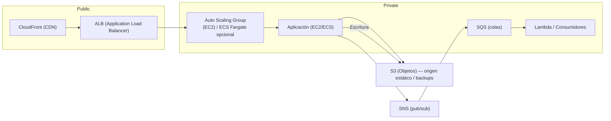

# M5 — Evaluación: Arquitecturas Cloud Básicas — Propuesta de solución

> **Autor:** (Tu nombre) **Fecha:** (Completar)

---

## Resumen ejecutivo

Se propone una arquitectura **cloud pública (AWS)**, modular y escalable que cubre los requisitos del enunciado: almacenamiento de objetos, respaldo y recuperación, escalabilidad automática, alta disponibilidad, CDN para contenido y mensajería asíncrona. La propuesta prioriza buenas prácticas de seguridad (IAM, cifrado), costes controlados (uso de lifecycle, CloudFront para reducir egress) y facilidad de operación (CloudWatch, AWS Backup).

---

## Arquitectura propuesta (visión general)

> Nota: el diagrama es de alto nivel. Para producción recomendamos multi-AZ, subredes públicas/privadas y separación de responsabilidades entre cuentas (por ejemplo: cuentas de prod/stage/infra).

---

## Lección 1 — Arquitecturas de almacenamiento de objetos

**Decisión**: Amazon S3 como almacenamiento de objetos principal para contenidos estáticos, artefactos y dumps. Justificación breve:

- Durabilidad y disponibilidad diseñadas para datos estáticos; integración nativa con CloudFront.
- Versionado y políticas de ciclo de vida para gestionar costes y retención.
- Soporta cifrado en reposo (SSE-KMS) y acceso con políticas finas (IAM + bucket policies).

**Componentes**: S3 (bucket principal), S3 Lifecycle (move to IA/Glacier), S3 Versioning, SSE-KMS.

**Resultado esperado**: almacenamiento seguro, con políticas de retención y coste optimizado.

---

## Lección 2 — Estrategias de almacenamiento y respaldo en la nube

**Estrategia de backup**:

1. **Datos en S3:** activar versioning + lifecycle (archivar a Glacier/Deep Archive según RPO/RTO).
2. **EBS (volúmenes de EC2):** snapshots programados (AWS Backup o snapshot Lambda) y retención cruzada por región si se requiere DR.
3. **Bases de datos (si aplica):** RDS con snapshots automáticos y multi-AZ; exportes regulares a S3.

**Recuperación ante fallos**: pruebas regulares de restauración desde snapshots/Glacier; playbooks de recuperación documentados.

---

## Lección 3 — Arquitecturas públicas/privadas/híbridas

**Propuesta**: **Nube pública (AWS)** con opción híbrida para sistemas legacy sensibles mediante VPN/Direct Connect. Justificación:

- Rapidez de despliegue, coste y servicios gestionados (S3, SNS, CloudFront, ALB).
- Híbrido cuando hay requisitos regulatorios o latencia a sistemas on‑prem.

**Integración**: VPN site-to-site o AWS Transit Gateway / Direct Connect según SLA y volumen de tráfico.

---

## Lección 4 — Escalabilidad de servicios de cómputo

**Mecanismo**:

- **Auto Scaling Group (EC2)** con ALB para instancias clásicas.
- **Alternativa gestionada:** ECS (Fargate) o EKS para contenedores; autoscaling por tareas/pods.

**Política**: escalado basado en CPU/RAM/latencia de cola (SQS) y reglas de pre-provisión para picos.

**Integración**: ALB dirige tráfico y realiza health checks a targets; ASG ajusta número de instancias.

---

## Lección 5 — Disponibilidad de aplicaciones en la red

**Mecanismos**:

- Multi‑AZ (mínimo 2 AZ) para EC2/ASG.
- ALB (distribución de carga por AZ) y Route 53 para balanceo DNS y health checks globales / failover.
- Security Groups y NACLs para control de acceso a nivel de red.

**Resultado**: tolerancia a fallos AZ y mantenimiento sin downtime (cuando se diseñe correctamente).

---

## Lección 6 — Disponibilidad de contenidos (CDN)

**Decisión**: Amazon CloudFront con S3 (o ALB) como origen.

- Reduce latencia y coste de egress en tráfico público.
- Añade seguridad (WAF, signed URLs) para proteger contenidos privados.

---

## Lección 7 — Arquitecturas orientadas a mensajes

**Patrón propuesto**: **SNS (pub/sub) → SQS (colas) → consumidores (Lambda / EC2 / ECS)**

- SNS para publicar eventos (fan‑out) a múltiples suscriptores (correo, SQS, Lambda).
- SQS para desacoplar y garantizar entrega eventual; trabajadores consumen mensajes a ritmo propio.

**Beneficios**: desacoplamiento, tolerancia a picos, reintentos controlados y dead‑letter queues.

---

## Lección 8 — Administración de costos en la nube

**Herramientas y prácticas**:

- AWS Cost Explorer y AWS Budgets para alarmas de gasto.
- Etiquetado (tags) consistente para asignar coste por proyecto/ambiente.
- Uso de lifecycle en S3, backups eficientes (snapshot incremental), reserved/spot instances para workloads no críticos.

---

## Estimación de costos — ejemplo de referencia (pequeña PoC)

> **Nota**: valores de referencia orientativos para un entorno pequeño (2 instancias t3.small, ALB, S3, CloudFront, SNS, EBS). Los precios reales dependen de región y uso. Revisa el pricing oficial antes de la entrega.

**Supuestos**:

- 2 × EC2 t3.small (Linux) ejecutándose 24/7 (730 h/mes).
- ALB: 1 ALB con \~1 LCU promedio.
- S3: 100 GB en Standard.
- CloudFront: 200 GB transferencia saliente + 5M requests.
- SNS: 1M publishes.
- EBS: 2 × 30 GB gp3 root volumes.
- Snapshots: 30 GB en snapshot.

**Fuentes**: precios de referencia (usa como guía): S3, EC2, ALB, CloudFront, SNS, SQS, EBS. (Ver seccion de fuentes fuera del .md).

**Cálculos** (ejemplo):

1. EC2 (t3.small): precio por hora asumido = \$0.0208 USD/h (ejemplo).

   - Por instancia/mes = 0.0208 × 730 = 15.184 USD.
   - Para 2 instancias = 15.184 × 2 = **30.368 USD**.

2. ALB:

   - Cargo horario base = 0.0225 USD/h; + 1 LCU × 0.008 USD/h = 0.0305 USD/h.
   - Mensual = 0.0305 × 730 = **22.265 USD**.

3. S3 (100 GB): 100 × 0.023 = **2.30 USD**.

4. CloudFront (200 GB + 5M reqs):

   - Data: 200 × 0.085 = 17.00 USD.
   - Requests: (5\_000\_000 / 10\_000) × 0.01 = 500 × 0.01 = 5.00 USD.
   - Total CF = **22.00 USD**.

5. SNS (1M publishes): aprox **0.30 USD** (ejemplo de referencia).

6. EBS (gp3): 2 × (30 GB × 0.08) = 2 × 2.4 = **4.80 USD**.

7. Snapshots (30 GB): 30 × 0.05 = **1.50 USD**.

**Total mensual aproximado (PoC)** = 30.368 + 22.265 + 2.30 + 22.00 + 0.30 + 4.80 + 1.50 = **≈ 83.53 USD/mes**

> **Importante**: esta es una estimación orientativa. Para una estimación real debes usar el AWS Pricing Calculator y fijar la región objetivo.

---

## Entregables (según consigna del módulo)

- Informe técnico por lección (decisiones y justificaciones).
- Diagramas técnicos parciales por etapa.
- Registro/estimación de costos actualizado.
- Documento final integrador con todos los diagramas, la justificación y la estimación consolidada.

---

## Paso a Paso (plantilla — aquí puedes pegar tus pasos exactos de consola/GUI)

> Esta sección está pensada para que pegues **tus** pasos concretos (capturas/comandos) para la creación de infra en AWS. Abajo hay una plantilla con comandos AWS CLI útiles y una checklist — puedes copiar, pegar y adaptar.
