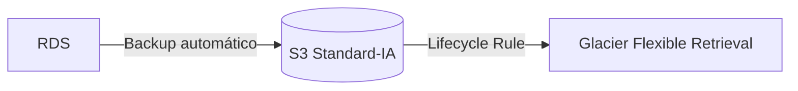
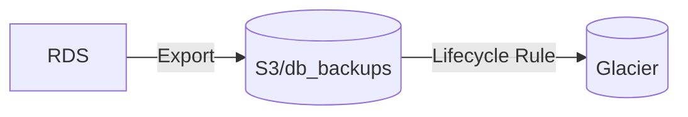
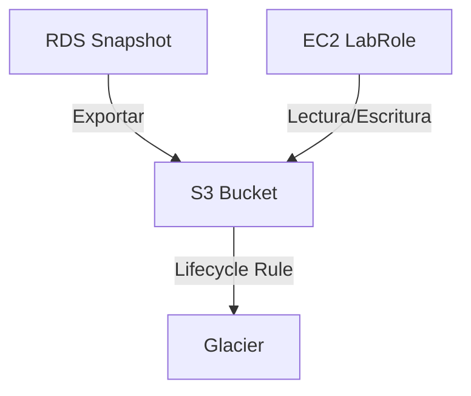
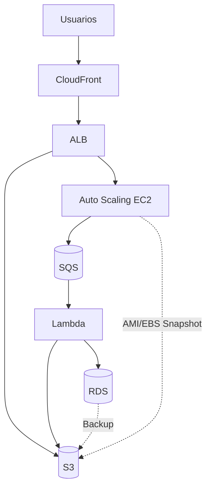
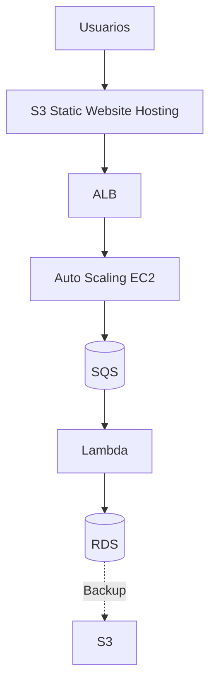

# 📄 Proyecto: Arquitecturas Cloud Básicas – Caso Resuelto (Versión Dual)

### 🏢 Situación Inicial
La empresa está modernizando su infraestructura y migrando servicios a la nube. Requiere diseños de arquitecturas cloud que garanticen escalabilidad, disponibilidad y eficiencia en costos, combinando modelos públicos, privados e híbridos, con balanceo de carga, escalabilidad automática y mensajería asíncrona.

---

## Objetivo
Diseñar arquitecturas cloud básicas aplicando buenas prácticas para garantizar:
- Escalabilidad  
- Disponibilidad  
- Eficiencia en costos  

Incluyendo componentes como almacenamiento, cómputo, red, mensajería y gestión de costos.

---

## Requerimientos
### Generales
- Aplicar buenas prácticas en diseño cloud.  
- Justificar elección de componentes.  
- Considerar costos, seguridad y disponibilidad.  

### Técnicos
1. **Almacenamiento**: Servicio de objetos (ej. AWS S3, Azure Blob Storage).  
2. **Respaldo**: Mecanismo de backup y recuperación (ej. Snapshots, AWS Backup).  
3. **Modelo de nube**: Elegir entre pública, privada o híbrida.  
4. **Escalabilidad**: Auto Scaling y balanceo de carga (ej. AWS ELB, Kubernetes).  
5. **Mensajería**: Servicio asíncrono (ej. AWS SQS, Azure Service Bus).  
6. **Costos**: Estimación detallada (ej. AWS Pricing Calculator).  

---

## 📋 Paso a Paso (8 Lecciones)

### Leccion 1. Almacenamiento de Objetos
- Tipos de "Storage Classes" en S3 (No confundir con "web hosting")**
AWS S3 ofrece **6 clases de almacenamiento** para diferentes casos de uso, diferenciadas por costo/rendimiento:

> Tipos de Almacenamiento en AWS S3: Elección Técnica para el Proyecto.

| Clase de Almacenamiento | Costo (US East, por GB/mes) | Caso de Uso Ideal | Acceso |
|-------------------------|----------------------------|--------------------|--------|
| **S3 Standard** | $0.023 | Datos accedidos frecuentemente (ej. imágenes de perfil, frontend web). | Milisegundos |
| **S3 Intelligent-Tiering** | $0.023 (primeros 50TB) | Datos con patrones de acceso impredecibles. | Milisegundos |
| **S3 Standard-IA** | $0.0125 | Datos accedidos menos frecuentemente (ej. backups mensuales). | Milisegundos |
| **S3 One Zone-IA** | $0.01 | Datos no críticos que pueden recrearse (ej. thumbnails). | Milisegundos |
| **S3 Glacier Instant Retrieval** | $0.004 | Archivos raramente accedidos pero que requieren acceso rápido (ej. historial médico). | Milisegundos |
| **S3 Glacier Flexible Retrieval** | $0.0036 | Backups a largo plazo (ej. copias anuales de BD). | Minutos-horas |
| **S3 Glacier Deep Archive** | $0.00099 | Archivos casi nunca accedidos (ej. compliance legal >7 años). | Horas |

---

### Eleccion de clase correcta para el proyecto:
- S3 Standard-IA
- Glacier Flexible Retrieval


---

### 2. Respaldo y Recuperación

[Precios de Amazon S3](https://aws.amazon.com/es/s3/pricing/)





> [!CAUTION] NO SE PUEDE POR LIMITACIONES DE AWS ACADEMY

---

### 3. Modelo de Nube
- **Ideal:** Nube Pública AWS en `us-east-1` / `us-west-2`.
- **Academy:** Igual, el entorno ofrece estas regiones.

### 4. Escalabilidad y Balanceo
- **Ideal:** Auto Scaling Group (t2.micro/t3.micro) + ALB; máx. 9 instancias/región y 32 vCPU totales.
- **Academy:** Coincide con los límites reales del lab.

### 5. Alta Disponibilidad
- **Ideal:** 2 Zonas de Disponibilidad con ALB distribuyendo tráfico.
- **Academy:** Igual, manteniendo bajo el número de instancias.

### 6. Disponibilidad de Contenidos (CDN)
- **Ideal:** CloudFront como CDN para distribución global.
- **Academy:** Si CloudFront no está disponible, usar:
  - S3 Static Website Hosting + HTTP cache control.
  - Route 53 con TTL bajos para simular distribución.

### 7. Mensajería Asíncrona y Lambda
- **Ideal:** Amazon SQS → Lambda → Backend (desacoplamiento).
- **Límite real AWS:** LambdaConcurrency = 1,000 ejecuciones concurrentes por región.
- **Academy:** Igual, respetando el límite.

### 8. Administración de Costos
- AWS Cost Explorer, Trusted Advisor, tagging, instancias pequeñas, detener recursos inactivos, evitar NAT Gateway.

---

## 🗺️ Arquitectura Ideal (Mermaid)


---

## 🗺️ Arquitectura Adaptada (AWS Academy Learner Lab)


- Reemplazo de CloudFront por S3 Static Website Hosting (o Route 53) para cumplir con disponibilidad.
- Se mantienen ASG, ALB, SQS, Lambda, RDS y respaldos.

---

# 📋 Paso a Paso (Construccion de la Infraestructura)

## 1. **VPC**: Virtual Private Cloud
### Configuracion
- **VPC settings**: VPC and more
- **Name**: artema
- **IPv4 CIDR block**: 10.0.0.0/16
- **IPv6 CIDR block**: No IPv6 CIDR block
- **Number of Availability Zones**: 2
- **Customize AZs**:
  - us-east-1a
  - us-east-1b
- **Number of public subnets**: 2
- **Number of private subnets**: 2
- **Customize subnets CIDR blocks**:
  - **Public subnet CIDR block in us-east-1a**: 10.0.0.0/20
  - **Public subnet CIDR block in us-east-1b**: 10.0.16.0/20
  - **Private subnet CIDR block in us-east-1a**: 10.0.128.0/20
  - **Private subnet CIDR block in us-east-1b**: 10.0.144.0/20
- **NAT gateways**: In 1 AZ
- **VPC endpoints**: S3 Gateway
- **Enable DNS hostnames**: check
- **Enable DNS resolution**: check

### Enrutar subredes privadas por un solo camino
```bash
Private Route tables
└── artema-rtb-private1-us-east-1a rename to ==> artema-rtb-private
    └── Subnet associations
        └── Edit subnet associations
            ├── Selected subnets
            │   ├── artema-subnet-private1-us-east-1a     
            │   └── artema-subnet-private2-us-east-1b
            └── Save associations
```

```bash
Public Router Table
    ├── artema-rtb-public
    │   ├── Routes
    │   │   ├── igw 0.0.0.0/0
    │   │   └── local 10.0.0.0/16
    │   └── Subnet associations
    │       ├── artema-subnet-public1-us-east-1a 10.0.0.0/20
    │       └── artema-subnet-public2-us-east-1b 10.0.16.0/20
    └── artema-rtb-private
        ├── Routes
        │   ├── nat 0.0.0.0/0
        │   └── local 10.0.0.0/16
        └── Subnet associations
            ├── artema-subnet-private1-us-east-1a 10.0.128.0/20
            └── artema-subnet-private2-us-east-1b 10.0.144.0/20    
```

---

## 2.**Seciruty Group**:

### artema-sg-bastion
- **Name**: artema-sg-bastion
- **Description**: Acceso Bastion
- **VPC**: artema-vpc
- **Inbound rules**:
  - SSH
    - Type: SSH
    - Protocol: TCP
    - Port range: 22
    - Destination type: Anywhere-IPv4
    - Destination: 0.0.0.0/0 (MyIP)
    - Description: Acceso SSH 
  - HTTP
    - Type: HTTP
    - Protocol: TCP
    - Port range: 443
    - Destination type: Anywhere-IPv4
    - Destination: 0.0.0.0/0
    - Description: Acceso web    
  - PostgreSQL
    - Type: PostgreSQL
    - Protocol: TCP
    - Port range: 5432
    - Destination type: Custom
    - Destination: 0.0.0.0/0
    - Description: Acceso PostgreSQL 
- **Outbound rules**:
  - Outbound
    - Type: All traffic
    - Protocol: all
    - Port range: all
    - Destination type: Custom
    - Destination: 0.0.0.0/0
    - Description:

### artema-sg-rds
- **Name**: artema-sg-rds
- **Description**: Acceso para RDS
- **VPC**: artema-vpc
- **Inbound rules**:
  - PostgreSQL
    - Type: PostgreSQL
    - Protocol: TCP
    - Port range: 5432
    - Destination type: Custom
    - Destination: 0.0.0.0/0
    - Description: Acceso PostgreSQL
- **Outbound rules**:
  - Outbound
    - Type: All traffic
    - Protocol: all
    - Port range: all
    - Destination type: Custom
    - Destination: 0.0.0.0/0
    - Description:

---

## 3. **S3 Bucket**: Almacenamiento Estático
### Estructura Optimizada del Bucket S3
```bash
artema-s3-storage/
├── web/                  # Contenido estático para EC2
│   ├── css/              # ✅ EC2 montará este bucket via IAM Role
│   ├── img/              # ✅ (No necesita acceso público)
│   └── index.html        # ✅ Servido por NGINX/Apache en EC2
├── docs/                 # ✅ Documentos privados (Standard-IA)
└── db_backups/           # ✅ Backups → Glacier (Lifecycle Rule)
```

### Bucket
- **Region**: us-east-1
- **Name**: artema-s3-storage
- **Object Ownership**: ACLs desactivados
- **Block all public access**: check
- **Versioning**: Disable
- **Encryption**: SSE-S3
- **Bucket Key**: Disable

### Management - Create lifecycle rule (Opcional mover a Glacier)
- **Name**: artema-s3-pgdb-to-glacier
- **Choose a rule scope**: Limit the scope of this rule using one or more filters
- **Prefix**: db_backups/
- **Lifecycle rule actions**: Transition current versions of objects between storage classes
- **Choose storage class transitions**: Glacier Flexible Retrieval
- **Days after object creation**: 30

### Permissions - Bucket Policy
```json
{
    "Version": "2012-10-17",
    "Statement": [
        {
            "Sid": "EC2AccessViaIAMRole",
            "Effect": "Allow",
            "Principal": {
                "AWS": "arn:aws:iam::992136605746:role/LabRole"
            },
            "Action": [
                "s3:GetObject",
                "s3:ListBucket",
                "s3:PutObject"  // Necesario si EC2 sube archivos
            ],
            "Resource": [
                "arn:aws:s3:::artema-s3-storage",
                "arn:aws:s3:::artema-s3-storage/*"
            ]
        },
        {
            "Sid": "GlacierBackups",
            "Effect": "Allow",
            "Principal": {
                "AWS": "arn:aws:iam::992136605746:role/LabRole"
            },
            "Action": [
                "s3:PutObject",
                "s3:RestoreObject"  // Para recuperar de Glacier
            ],
            "Resource": "arn:aws:s3:::artema-s3-storage/db_backups/*"
        },
        {
            "Sid": "AllowRDSExportToS3",
            "Effect": "Allow",
            "Principal": {
                "Service": "export.rds.amazonaws.com"
            },
            "Action": [
                "s3:PutObject*",
                "s3:ListBucket",
                "s3:GetBucketLocation" // Para ecportar desde RDS
            ],
            "Resource": [
                "arn:aws:s3:::artema-s3-storage",
                "arn:aws:s3:::artema-s3-storage/db_backups/*"
            ]
        }        
    ]
}
```

---

## 4. **RDS**: Relational Database Service
### DRS Subnet Group
- **Name**: artema-rds-sng
- **Description**: Private subnet group para PostgreSQL
- **VPC**: artema-vpc
- **Availability Zones**:
    - us-east-1a
    - us-east-1b
- **Subnets**:
    - artema-subnet-private1-us-east-1a
    - artema-subnet-private2-us-east-1b

### PostgreSQL
- **Creation method**: Standard create
- **Engine type**: PostgreSQL
- **Templates**: Dev/Test
- **Availability and durability**: Multi-AZ DB instance deployment (2 instances)
- **DB instance**: artema-pgdb
- **Master username**: postgres
- **Credentials management**: ********
- **Instance configuration**:
    - Burstable classes (includes t classes)
    - db.t3.micro
- **Allocated storage**: 20 GiB
- **Enable storage autoscaling**: check
- **Connectivity**: none
- **Compute resource**: none
- **VPC**: artema-vpc
- **DB subnet group**: artema-rds-sng
- **Public access**: No
- **Security groups**: artema-sg-rds
- **Enhanced Monitoring**: Disabled  

### Snapshots respado manual en S3 (Opcional)
> [!CAUTION] NO SE PUEDE POR LIMITACIONES DE AWS ACADEMY

```sql
CREATE TABLE personajes_hxh (
    id SERIAL PRIMARY KEY,
    nombre VARCHAR(100) NOT NULL,
    tipo_nen VARCHAR(50) NOT NULL,
    edad INT NOT NULL,
    descripcion TEXT,
    img VARCHAR(100)
);
```

```sql
INSERT INTO personajes_hxh 
    (nombre, tipo_nen, edad, descripcion, img)
VALUES
    ('Gon Freecss', 'Enhancer', 12, 'Protagonista, con gran talento natural para el Nen.', 'gon.webp'),
    ('Killua Zoldyck', 'Transmuter', 12, 'Hijo de la familia asesina Zoldyck, amigo cercano de Gon.', 'killua.webp'),
    ('Kurapika', 'Conjurer', 17, 'Último sobreviviente del clan Kurta, busca venganza.', 'kurapika.webp'),
    ('Leorio Paradinight', 'Emitter', 19, 'Aspira a ser médico, es valiente y decidido.', 'leorio.webp'),
    ('Hisoka Morow', 'Transmuter', 28, 'Antagonista impredecible, disfruta de la pelea.', 'hisoka.webp'),
    ('Chrollo Lucilfer', 'Specialist', 30, 'Líder de la banda de ladrones Fantasma.', 'chrollo.webp'),
    ('Biscuit Krueger', 'Enhancer', 30, 'Maestra experimentada con apariencia joven.', 'biscuit.webp');
```

---
