# 📄 Proyecto: Arquitecturas Cloud Básicas – Caso Resuelto (Versión Dual)

### 🏢 Situación Inicial
La empresa está modernizando su infraestructura y migrando servicios a la nube. Requiere diseños de arquitecturas cloud que garanticen escalabilidad, disponibilidad y eficiencia en costos, combinando modelos públicos, privados e híbridos, con balanceo de carga, escalabilidad automática y mensajería asíncrona.

---

## Objetivo
Diseñar arquitecturas cloud básicas aplicando buenas prácticas para garantizar:
- Escalabilidad  
- Disponibilidad  
- Eficiencia en costos  

Incluyendo componentes como almacenamiento, cómputo, red, mensajería y gestión de costos.

---

## Requerimientos
### Generales
- Aplicar buenas prácticas en diseño cloud.  
- Justificar elección de componentes.  
- Considerar costos, seguridad y disponibilidad.  

### Técnicos
1. **Almacenamiento**: Servicio de objetos (ej. AWS S3, Azure Blob Storage).  
2. **Respaldo**: Mecanismo de backup y recuperación (ej. Snapshots, AWS Backup).  
3. **Modelo de nube**: Elegir entre pública, privada o híbrida.  
4. **Escalabilidad**: Auto Scaling y balanceo de carga (ej. AWS ELB, Kubernetes).  
5. **Mensajería**: Servicio asíncrono (ej. AWS SQS, Azure Service Bus).  
6. **Costos**: Estimación detallada (ej. AWS Pricing Calculator).  

---

## 📋 Paso a Paso (8 Lecciones)

### Leccion 1. Almacenamiento de Objetos
- Tipos de "Storage Classes" en S3 (No confundir con "web hosting")**
AWS S3 ofrece **6 clases de almacenamiento** para diferentes casos de uso, diferenciadas por costo/rendimiento:

> Tipos de Almacenamiento en AWS S3: Elección Técnica para el Proyecto.

| Clase de Almacenamiento | Costo (US East, por GB/mes) | Caso de Uso Ideal | Acceso |
|-------------------------|----------------------------|--------------------|--------|
| **S3 Standard** | $0.023 | Datos accedidos frecuentemente (ej. imágenes de perfil, frontend web). | Milisegundos |
| **S3 Intelligent-Tiering** | $0.023 (primeros 50TB) | Datos con patrones de acceso impredecibles. | Milisegundos |
| **S3 Standard-IA** | $0.0125 | Datos accedidos menos frecuentemente (ej. backups mensuales). | Milisegundos |
| **S3 One Zone-IA** | $0.01 | Datos no críticos que pueden recrearse (ej. thumbnails). | Milisegundos |
| **S3 Glacier Instant Retrieval** | $0.004 | Archivos raramente accedidos pero que requieren acceso rápido (ej. historial médico). | Milisegundos |
| **S3 Glacier Flexible Retrieval** | $0.0036 | Backups a largo plazo (ej. copias anuales de BD). | Minutos-horas |
| **S3 Glacier Deep Archive** | $0.00099 | Archivos casi nunca accedidos (ej. compliance legal >7 años). | Horas |

---

### Eleccion de clase correcta para el proyecto:

```mermaid
flowchart LR
  RDS -->|Backup automático| S3[(S3 Standard-IA)]
  S3 -->|Lifecycle Rule| Glacier[Glacier Flexible Retrieval]
```


---


- **Ideal:** Amazon S3 (acceso completo), sin Glacier Vault, usado para archivos estáticos y respaldos.
- **Academy:** Igual, ya que S3 está disponible en AWS Academy Learner Lab.

### 2. Respaldo y Recuperación
- **Ideal:** RDS snapshots → S3; EC2 AMI/EBS snapshots → S3 (≤ 100 GB por volumen).
- **Academy:** Igual, cuidando de no exceder almacenamiento y presupuesto.

### 3. Modelo de Nube
- **Ideal:** Nube Pública AWS en `us-east-1` / `us-west-2`.
- **Academy:** Igual, el entorno ofrece estas regiones.

### 4. Escalabilidad y Balanceo
- **Ideal:** Auto Scaling Group (t2.micro/t3.micro) + ALB; máx. 9 instancias/región y 32 vCPU totales.
- **Academy:** Coincide con los límites reales del lab.

### 5. Alta Disponibilidad
- **Ideal:** 2 Zonas de Disponibilidad con ALB distribuyendo tráfico.
- **Academy:** Igual, manteniendo bajo el número de instancias.

### 6. Disponibilidad de Contenidos (CDN)
- **Ideal:** CloudFront como CDN para distribución global.
- **Academy:** Si CloudFront no está disponible, usar:
  - S3 Static Website Hosting + HTTP cache control.
  - Route 53 con TTL bajos para simular distribución.

### 7. Mensajería Asíncrona y Lambda
- **Ideal:** Amazon SQS → Lambda → Backend (desacoplamiento).
- **Límite real AWS:** LambdaConcurrency = 1,000 ejecuciones concurrentes por región.
- **Academy:** Igual, respetando el límite.

### 8. Administración de Costos
- AWS Cost Explorer, Trusted Advisor, tagging, instancias pequeñas, detener recursos inactivos, evitar NAT Gateway.

---

## 🗺️ Arquitectura Ideal (Mermaid)


---

## 🗺️ Arquitectura Adaptada (AWS Academy Learner Lab)


- Reemplazo de CloudFront por S3 Static Website Hosting (o Route 53) para cumplir con disponibilidad.
- Se mantienen ASG, ALB, SQS, Lambda, RDS y respaldos.

---

# 📋 Paso a Paso (Construccion de la Infraestructura)

## 1. VPC
### Configuracion
- VPC settings: VPC and more
- Name: artema
- IPv4 CIDR block: 10.0.0.0/16
- IPv6 CIDR block: No IPv6 CIDR block
- Number of Availability Zones: 2
- Customize AZs:
  - us-east-1a
  - us-east-1b
- Number of public subnets: 2
- Number of private subnets: 2
- Customize subnets CIDR blocks:
  - Public subnet CIDR block in us-east-1a: 10.0.0.0/20
  - Public subnet CIDR block in us-east-1b: 10.0.16.0/20
  - Private subnet CIDR block in us-east-1a: 10.0.128.0/20
  - Private subnet CIDR block in us-east-1b: 10.0.144.0/20
- NAT gateways: In 1 AZ
- VPC endpoints: S3 Gateway
- Enable DNS hostnames: check
- Enable DNS resolution check

### Enrutar subredes privadas por un solo camino
```
Private Route tables
└── artema-rtb-private1-us-east-1a rename to ==> artema-rtb-private
    └── Subnet associations
        └── Edit subnet associations
            ├── Selected subnets
            │   ├── artema-subnet-private1-us-east-1a     
            │   └── artema-subnet-private2-us-east-1b
            └── Save associations
```

```
Public Router Table
    ├── artema-rtb-public
    │   ├── Routes
    │   │   ├── igw 0.0.0.0/0
    │   │   └── local 10.0.0.0/16
    │   └── Subnet associations
    │       ├── artema-subnet-public1-us-east-1a 10.0.0.0/20
    │       └── artema-subnet-public2-us-east-1b 10.0.16.0/20
    └── artema-rtb-private
        ├── Routes
        │   ├── nat 0.0.0.0/0
        │   └── local 10.0.0.0/16
        └── Subnet associations
            ├── artema-subnet-private1-us-east-1a 10.0.128.0/20
            └── artema-subnet-private2-us-east-1b 10.0.144.0/20    
```
