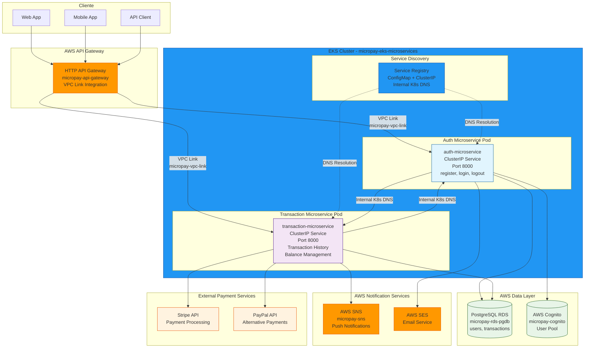
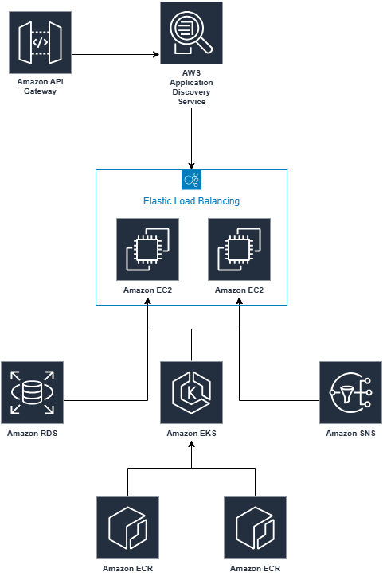

# Evaluación del Módulo 7 - Microservicios Orquestados

## 📋 Resumen del Proyecto

### Situación Inicial
El sistema monolítico actual de la fintech **MicroPay** presenta problemas de agilidad y escalabilidad. Se decide migrar a una arquitectura de microservicios orquestados en AWS.

### Objetivo
Diseñar e implementar una arquitectura basada en microservicios con:
- Contenedores Docker y Orquestación con Kubernetes (EKS).
- API Gateway con autenticación JWT.
- Service Discovery, Circuit Breaker y mensajería asíncrona.
- Alta disponibilidad, escalabilidad y resiliencia.

### Producto Esperado
- Microservicios desplegados en EKS.
- API Gateway con autenticación JWT.
- Uso de AWS Cloud Map, Resilience4j, SNS y SQS.
- Diagrama en Cloudcraft con estimación de costos.
- Documentación con evidencias de TDD, pruebas y refactorizaciones.

---

## ✅ Requerimientos Técnicos

| Componente              | Tecnología/Tool       |
|-------------------------|-----------------------|
| Contenedores            | Docker + Amazon ECR   |
| Orquestación            | Amazon EKS            |
| API Gateway             | AWS API Gateway       |
| Service Discovery       | AWS Cloud Map         |
| Circuit Breaker         | Resilience4j          |
| Mensajería              | SNS + SQS             |
| Diagrama                | Cloudcraft            |
| Pruebas                 | JUnit 5 + JaCoCo      |
| Mocking                 | Mockito               |

---

## 📊 Métricas a Cumplir

| Métrica                  | Mínimo | Máximo |
|--------------------------|--------|--------|
| Funcionalidades CRUD     | 4      | 5      |
| Tests unitarios          | 8      | 16     |
| Cobertura JaCoCo         | 80%    | -      |
| Ciclos TDD               | 12     | -      |
| Refactorizaciones        | 3      | 5      |
| Dependencias mockeadas   | 1      | -      |

---

## 🧩 Paso a Paso por Lección

### Lección 1: Fundamentos de Microservicios y TDD
- ✅ Instalar herramientas: VS Code, JDK 17, JUnit 5, JaCoCo.
- ✅ Crear estructura de proyecto para microservicio de Usuarios.
- ✅ Iniciar repositorio Git.
- ✅ Realizar al menos 1 ciclo TDD (commit RED).
- ✅ Documentar primera prueba RED.

### Lección 2: Patrones Arquitectónicos Clave
- ✅ Implementar API Gateway con autenticación JWT.
- ✅ Configurar AWS Cloud Map.
- ✅ Integrar Circuit Breaker con Resilience4j en microservicio de Pagos.
- ✅ Crear pruebas unitarias con Mockito para capa de seguridad.

### Lección 3: Orquestación con Kubernetes (EKS)
- ✅ Crear Dockerfiles y subir imágenes a ECR.
- ✅ Aprovisionar cluster EKS con eksctl (3 nodos, 2 AZ).
- ✅ Definir Pods, Services y Deployments en YAML.
- ✅ Configurar HPA e Ingress Controller.
- ✅ Capturar métricas de CPU y escalado.

### Lección 4: Representación Cloud y Costos
- ✅ Diagramar arquitectura en Cloudcraft:
  - VPC y subredes.
  - EKS, API Gateway, bases de datos.
  - SNS, SQS, Cloud Map.
- ✅ Etiquetar microservicios y subredes.
- ✅ Calcular costo mensual estimado.
- ✅ Exportar diagrama y añadir al documento Word.

---

## ✅ Checklist Final

- [ ] Microservicios en EKS con auto-escalado.
- [ ] Patrones aplicados: API Gateway, JWT, Service Discovery, Circuit Breaker.
- [ ] Métricas de CRUD, pruebas, TDD y refactor cumplidas.
- [ ] Documentación clara con capturas.
- [ ] Diagrama Cloudcraft y costos justificados.
- [ ] Buenas prácticas de seguridad y resiliencia.

---

# Desarrollo Paso a Paso

### Structure
```
AWS_Payment_Microservices_Python/
│
│── auth_microservice/
│   ├── .env
│   ├── .env.dev
│   ├── Dockerfile
│   ├── dockerrun.aws.json
│   ├── main.py
│   ├── README.md
│   └── requirements.txt
│
│── transaction_microservice/
│   ├── .env
│   ├── .env.dev
│   ├── Dockerfile
│   ├── dockerrun.aws.json
│   ├── main.py
│   ├── README.md
│   └── requirements.txt
│
│── .dockerignore
│── .gitignore
│── docker-compose.yml
│── kubernetes_auth.yaml
│── kubernetes_transaction.yaml
│── LICENSE.txt
│── PostgreSQL.sql
│── README.md
└── run_docker_local.bat
```





---

## Preparing Microservice
- auth_microservice
```sh
cd auth_microservice
python -m venv venv
venv\Scripts\activate
pip list
pip install fastapi uvicorn[standard] sqlalchemy psycopg2-binary boto3 python-dotenv pydantic[email]
pip freeze > requirements.txt
uvicorn main:app --reload
curl http://127.0.0.1:8000  # curl http://127.0.0.1:8000/docs
pip install -r requirements.txt
deactivate
```
- transaction_microservice
```sh
cd transaction_microservice
python -m venv venv
venv\Scripts\activate
pip list
pip install fastapi uvicorn[standard] sqlalchemy psycopg2-binary boto3 python-dotenv pydantic[email]
pip freeze > requirements.txt
uvicorn main:app --reload
curl http://127.0.0.1:8000  # curl http://127.0.0.1:8000/docs
pip install -r requirements.txt
deactivate
```

# AWS
## **Seciruty Group**:
### micropay-sg-rds
- **Name**: micropay-sg-rds
- **Description**: Acceso RDS
- **VPC**: default
- **Inbound rules**:
  - PostgreSQL
    - Type: PostgreSQL
    - Protocol: TCP
    - Port range: 5432
    - Destination type: Anywhere-IPv4
    - Destination: 0.0.0.0/0
    - Description: Acceso PostgreSQL
- **Outbound rules**:
  - Outbound
    - Type: All traffic
    - Protocol: All
    - Port range: All
    - Destination type: Custom
    - Destination: 0.0.0.0/0
    - Description:

### micropay-sg-web
- **Name**: micropay-sg-web
- **Description**: Acceso Web
- **VPC**: default
- **Inbound rules**:
  - HTTP
    - Type: HTTP
    - Protocol: TCP
    - Port range: 80
    - Destination type: Anywhere-IPv4
    - Destination: 0.0.0.0/0
    - Description: Acceso Web
  - Custom TCP
    - Type: Custom TCP
    - Protocol: TCP
    - Port range: 8000
    - Destination type: Anywhere-IPv4
    - Destination: 0.0.0.0/0
    - Description: Acceso Web
  - PostgreSQL
    - Type: PostgreSQL
    - Protocol: TCP
    - Port range: 5432
    - Destination type: Anywhere-IPv4
    - Destination: 0.0.0.0/0
    - Description: Acceso PostgreSQL
- **Outbound rules**:
  - Outbound
    - Type: All traffic
    - Protocol: All
    - Port range: All
    - Destination type: Custom
    - Destination: 0.0.0.0/0
    - Description:

---

## **SNS**: Simple Notification Service 
### Topics
- **Topics**: Standard
- **Name**: micropay-sns

---

## **RDS**: Relational Database Service
### PostgreSQL
- **Creation method**: Standard create
- **Engine type**: PostgreSQL
- **Templates**: Sandbox
- **Availability and durability**: Single-AZ DB instance deployment (1 instance)
- **DB instance**: micropay-rds-pgdb
- **Master username**: postgres
- **Credentials management**: ********
- **Instance configuration**:
    - Burstable classes (includes t classes)
    - db.t3.micro
- **Allocated storage**: 20 GiB
- **Enable storage autoscaling**: check
- **Compute resource**: Don’t connect to an EC2 compute resource
- **VPC**: default
- **DB subnet group**: default
- **Public access**: Yes
- **Security groups**: micropay-sg-rds
- **Monitoring**: Database Insights - Standard
- **Enable Performance insights**: Disabled  

### [PostgreSQL.sql](PostgreSQL.sql)

---

## **Cognito**:
### Create user pool
- **Application type**: Machine-to-machine application
- **Name**: micropay-cognito

### Cognito - User Pool
- User pool ID

### Cognito - App clients - micropay-cognito
- Client ID
- Client secret

### Cognito - App clients - micropay-cognito - edit
- **Sign in with username and password: ALLOW_USER_PASSWORD_AUTH**: check
- **Sign in with server-side administrative credentials: ALLOW_ADMIN_USER_PASSWORD_AUTH**: check

---

## **ECR**: Elastic Container Registry
### Repositorio - products-service-repo
- **Repository name**: micropay-auth-service-repo
- **Image tag mutability**: Mutable
- **Mutable tag exclusions**:
- **Encryption configuration**: AES-256
- **View push commands**

## **ECR**: Elastic Container Registry
### Repositorio - products-service-repo
- **Repository name**: micropay-transaction-service-repo
- **Image tag mutability**: Mutable
- **Mutable tag exclusions**:
- **Encryption configuration**: AES-256
- **View push commands**

---

## **CloudShell**:
### Consola CloudShell
```sh
docker system prune -a --volumes -f
docker builder prune -f
df -h
```
```sh
git clone https://github.com/TheNefelin/AWS_Payment_Microservices_Python.git
cd AWS_Payment_Microservices_Python
```
```sh
aws ecr get-login-password --region us-east-1 | docker login --username AWS --password-stdin 123.dkr.ecr.us-east-1.amazonaws.com
```
```sh
docker build -f auth_microservice/Dockerfile -t micropay-auth-service-repo ./auth_microservice
docker tag micropay-auth-service-repo:latest 123.dkr.ecr.us-east-1.amazonaws.com/micropay-auth-service-repo:latest
docker push 123.dkr.ecr.us-east-1.amazonaws.com/micropay-auth-service-repo:latest
```
```sh
docker build -f transaction_microservice/Dockerfile -t micropay-transaction-service-repo ./transaction_microservice
docker tag micropay-transaction-service-repo:latest 123.dkr.ecr.us-east-1.amazonaws.com/micropay-transaction-service-repo:latest
docker push 123.dkr.ecr.us-east-1.amazonaws.com/micropay-transaction-service-repo:latest
```
```sh
docker images
cd ..
rm -rf AWS_Payment_Microservices_Python
```

---

## **EKS**: Elastic Kubernetes Service
### Clusters
- **Configuration options**: Custom configuration
- **Use EKS Auto Mode**_ uncheck
- **Name**: micropay-eks-microservices
- **Cluster IAM role**: LabEksClusterRole
- **EKS API**: check
- **ARC Zonal shift**: disabled
- **VPC**: default
- **Subnets**: default
- **Additional security groups**: micropay-sg-web
- **Cluster endpoint access**: Public and private

### Clusters - Compute - Add node group
- **Name**: ng-general
- **Node IAM role**: LabRole
- **AMI type**: Amazon Linux 2023 (x86_64)
- **Instance types**: t3.medium
- **Disk size**: 20 GiB
- **Desired size**: 2
- **Minimum size**: 2
- **Maximum size**: 4
- **Subnets** default

---

## **CloudShell**:
### Consola CloudShell
- Uploda Kunernetes file (kubernetes_auth.yaml) (kubernetes_transaction.yaml)
- Update Kubernetes Config (Connect kubectl to EKS)
```sh
aws eks update-kubeconfig --name micropay-eks-microservices --region us-east-1
```
```sh
kubectl get nodes
```
```sh
kubectl apply -f kubernetes_auth.yaml
kubectl apply -f kubernetes_transaction.yaml
```
```sh
kubectl get all
```
- Opcional
```sh
kubectl delete all --all
kubectl delete configmap --all
kubectl delete secret --all
```
- Cómo obtener estas URLs en tu cluster
- http://<nombre-servicio>.<namespace>.svc.cluster.local:<puerto>
```sh
# Ver todos los servicios en todos los namespaces
kubectl get svc --all-namespaces
# Ver servicios en el namespace default (donde tienes tus microservicios)
kubectl get svc -n default
# Ver detalles específicos de un servicio
kubectl describe svc auth-microservice -n default
kubectl describe svc transaction-microservice -n default
```
- Auth Microservice
http://auth-microservice.default.svc.cluster.local:8000
- Transaction Microservice  
http://transaction-microservice.default.svc.cluster.local:8000
---

## **Api Gateway**:
- **Choose an API type**: HTTP API
- **API name**: micropay-api-gateway

### Api Gateway - VPC links
- **Choose a VPC link version**: VPC link for HTTP APIs
- **Name**: micropay-vpc-link
- **VPC**: default
- **Subnets**: default
- **Security groups**: micropay-sg-web

### Api Gateway - Integrations
- **Attach this integration to a route**: http://10.100.127.183:8000
- **Integration type**: Private resource
- **VPC link**: micropay-vpc-link

---

## **EB**: Elastic Beanstalk (opcional 2)
- auth_microservice
[ECR + EB + auth microservice](/auth_microservice/Dockerfile)
[Dockerrun.aws.json](/auth_microservice/Dockerrun.aws.json)

- transaction_microservice
[ECR + EB + transaction microservice](/transaction_microservice/Dockerfile)
[Dockerrun.aws.json](/transaction_microservice/Dockerrun.aws.json)

---
